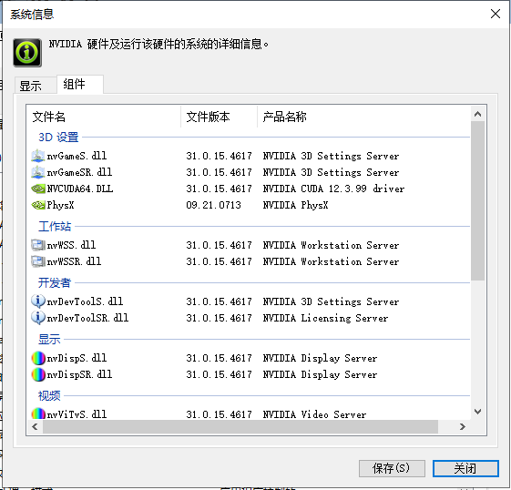
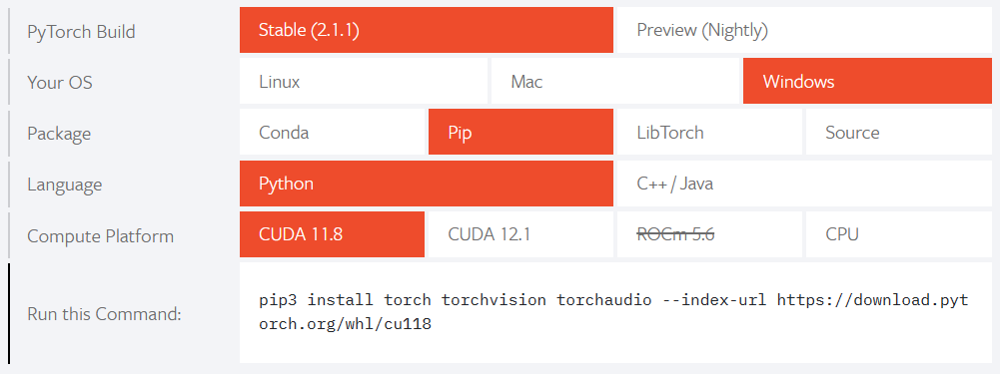
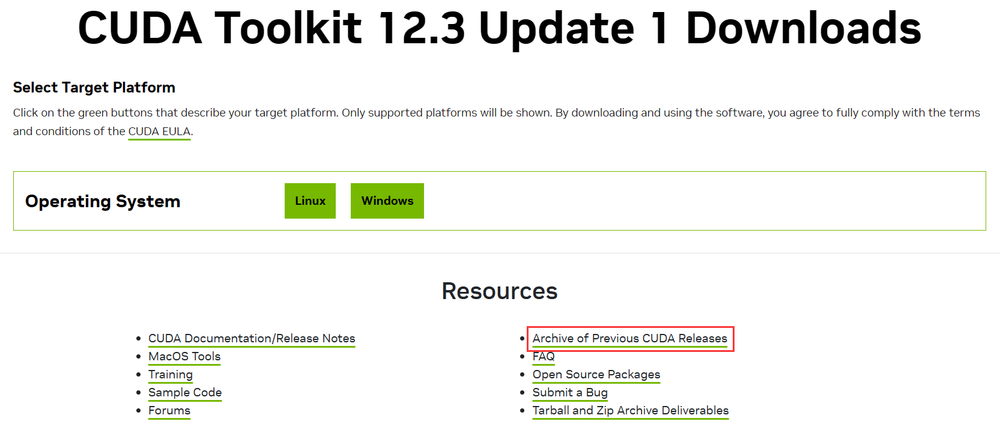
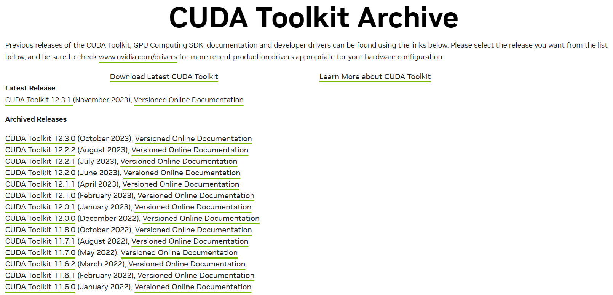
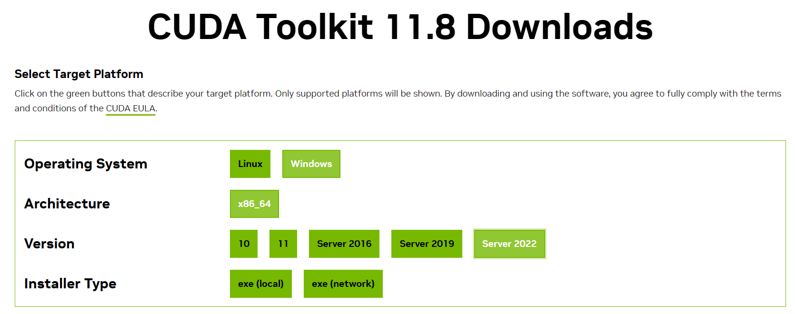
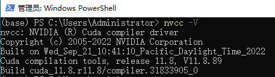
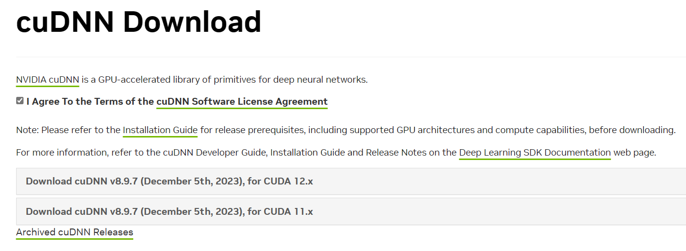
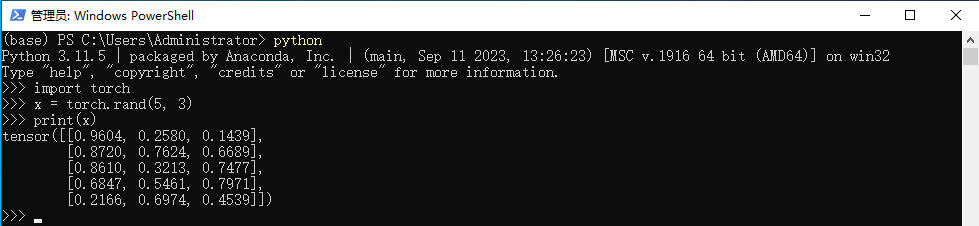

# YOLOv8 入门指南：（1）环境配置

[TOC]

## 什么是 YOLO

YOLO（You Only Look Once）模型是一种基于深度学习的目标检测算法，它可以在一张图片中识别出多个物体的类别和位置。YOLO 的特点是速度快，准确率高，而且只需要看一次图片就可以做出预测，不需要像其他算法那样先提取候选区域再进行分类。YOLO 的原理是将图片划分为网格，每个网格预测一定数量的边界框和类别概率，然后根据置信度和非极大值抑制筛选出最终的检测结果。YOLO 目前有多个版本，最新的是 YOLOv8，在2023年1月10日开源，提供了更多的模型选择和更好的性能。

## 确定环境版本

1. 确定 CUDA、cuDNN 版本；
    在 NVIDIA 控制面板中点击`帮助`-`系统信息`-`组件`中查看显卡支持的最高版本。
    
2. 确定 PyTorch 支持的 CUDA 最高版本。
    进入 [PyTorch](https://pytorch.org/) 官网。
    

## 安装 CUDA Tookit

CUDA 是建立在 NVIDIA GPU 上的一个通用并行计算平台和编程模型，它提供了 GPU 编程的简易接口，基于 CUDA 编程可以构建基于GPU计算的应用程序，利用 GPU 的并行计算引擎来更加高效地解决比较复杂的计算难题。

1. 进入 [CUDA](https://developer.nvidia.com/cuda-toolkit) 下载页，找到合适的版本下载；
    
    
    
2. 下载完成后，运行 exe 文件安装即可；
3. 验证安装结果，在命令行中运行命令，查看 CUDA 的信息：
    ```shell
    nvcc -V
    ```
    

## 安装 cuDNN

cuDNN 是一个深度学习加速库，提供了一套标准的 API，通过 cuDNN 来加速深度学习框架在 NVIDIA GPU 上的运算。

1. 注册 NVIDIA 开发者账号并登录；
2. 进入 [cuDNN](https://developer.nvidia.com/rdp/cudnn-download) 下载页，找到对应的 CUDA 版本下载；
    
3. 解压复制到 CUDA 安装的文件夹中。

## 安装 PyTorch

PyTorch 是一个开源的 Python 机器学习框架，YOLO 使用了 PyTorch 框架。

1. 在命令行中运行命令，更新 `pip` 镜像源:
    ```shell
    pip config set global.index-url https://mirror.nju.edu.cn/pypi/web/simple
    ```
2. 进入 [PyTorch](https://pytorch.org/) 官网；
3. 复制安装命令:
    ```shell
    pip install torch torchvision torchaudio --index-url https://download.pytorch.org/whl/cu118
    ```
4. 在命令行中运行命令。

## 验证

在 Python 环境中，输入下面三行，看打印结果

