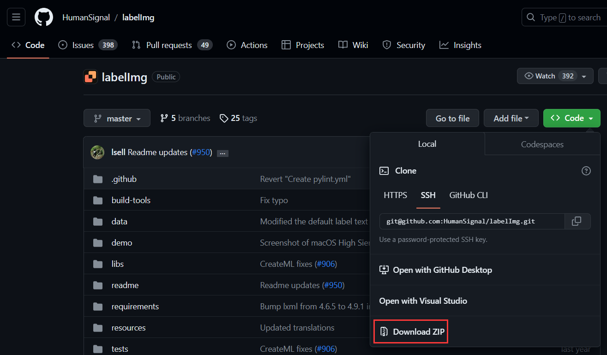
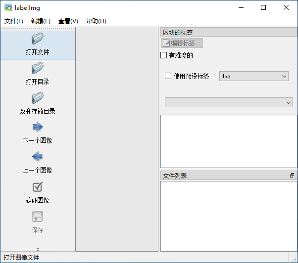
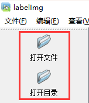
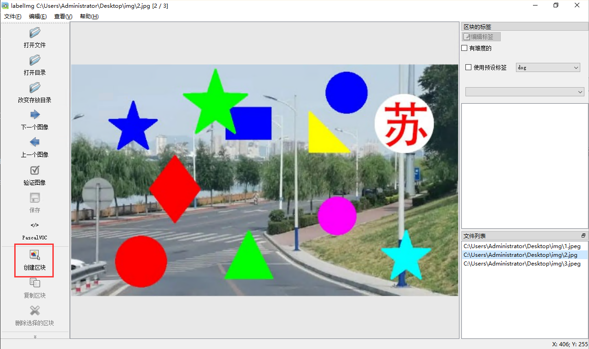
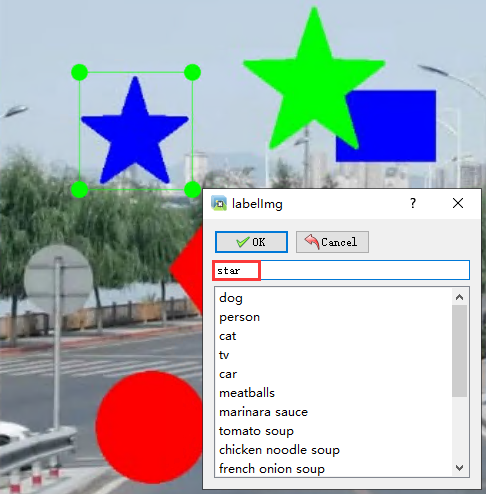
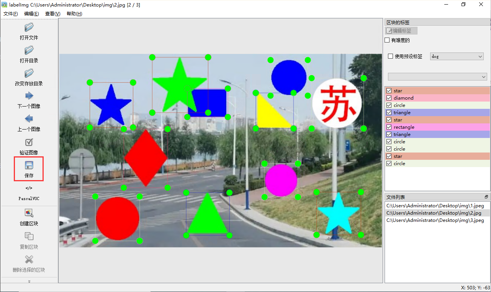

# YOLOv8 入门指南：（2）图像标注

[TOC]

## 安装图像标注工具 LabelImg

1. 打开 [LabelImg](https://github.com/tzutalin/labelImg) 网站，使用 git 命令或下载 zip 的形式，将代码保存到本地；
    ```shell
    git clone git@github.com:HumanSignal/labelImg.git
    ```
    
2. 打开命令行，并切换到 LabelImg 文件夹；
    ```shell
    cd [代码保存的路径]\labelImg
    ```
3. 在命令行中运行命令，安装 PyQt5、lxml；
    ```shell
    pip install PyQt5 lxml
    ``` 
4. 在命令行中运行命令，启动 LabelImg。
    ```shell
    pyrcc5 -o libs/resources.py resources.qrc  # 只需执行一次
    python labelImg.py
    ```
    

## 图像标注

1. 标注的第一步要在 LabelImg 中打开图像，可以打开单个图像，也可以打开图像所在的文件夹；
    
2. 点击 `创建区块` 按钮开始标注；
    
3. 标注框不要大于或小于物体，标注完成后选择或输入物体的标签，点击 `OK` 按钮完成标注；
    
4. 直到标注完图像中所有的物体，点击 `保存` 按钮存储标签，标签会保存在图像的位置，文件名为 `图像名.xml`。
    