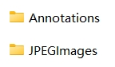

# YOLOv8 入门指南：（3）数据集准备

[TOC]

## 整理数据集

将数据集图像与标签分别放至单独的文件夹，如图像存放至 `JPEGImages` 文件夹，标签存放至 `Annotations` 文件夹。



## 生成训练集与测试集

运行下面的 Python 代码划分数据集
```python
import xml.etree.ElementTree as ET
import os
import random
from shutil import copyfile

def convert(size, box):
    dw = 1./size[0]
    dh = 1./size[1]
    x = (box[0] + box[1])/2.0
    y = (box[2] + box[3])/2.0
    w = box[1] - box[0]
    h = box[3] - box[2]
    x = x*dw
    w = w*dw
    y = y*dh
    h = h*dh
    return (x,y,w,h)

def convert_annotation(image_id, annotation_dir, yolo_labels_dir):
    in_file = open(annotation_dir + '/%s.xml' %image_id)
    out_file = open(yolo_labels_dir + '/%s.txt' %image_id, 'w')
    tree=ET.parse(in_file)
    root = tree.getroot()
    size = root.find('size')
    w = int(size.find('width').text)
    h = int(size.find('height').text)

    for obj in root.iter('object'):
        difficult = obj.find('difficult').text
        cls = obj.find('name').text
        if cls not in classes or int(difficult) == 1:
            continue
        cls_id = classes.index(cls)
        xmlbox = obj.find('bndbox')
        b = (float(xmlbox.find('xmin').text), float(xmlbox.find('xmax').text), float(xmlbox.find('ymin').text), float(xmlbox.find('ymax').text))
        bb = convert((w,h), b)
        out_file.write(str(cls_id) + " " + " ".join([str(a) for a in bb]) + '\n')
    in_file.close()
    out_file.close()

# 数据集的标签
classes=['blue_qr', 'green_qr', 'red_qr']
# 训练比例，即将70%的数据划分为训练集
TRAIN_RATIO = 70
# 数据集路径
work_sapce_dir = "D:\\GitHub\\yolov5-docker\\assets\\qr"
# 数据集图像文件夹路径
image_dir = os.path.join(work_sapce_dir, "JPEGImages/")
# 数据集标签文件夹路径
annotation_dir = os.path.join(work_sapce_dir, "Annotations/")

# 划分后的数据集文件夹路径
yolo_dataset_dir = os.path.join(work_sapce_dir, "YoloDataset/")
if not os.path.isdir(yolo_dataset_dir):
    os.mkdir(yolo_dataset_dir)
yolo_images_dir = os.path.join(yolo_dataset_dir, "images/")
if not os.path.isdir(yolo_images_dir):
    os.mkdir(yolo_images_dir)
yolo_labels_dir = os.path.join(yolo_dataset_dir, "labels/")
if not os.path.isdir(yolo_labels_dir):
    os.mkdir(yolo_labels_dir)
yolo_images_train_dir = os.path.join(yolo_images_dir, "train/")
if not os.path.isdir(yolo_images_train_dir):
    os.mkdir(yolo_images_train_dir)
yolo_images_test_dir = os.path.join(yolo_images_dir, "val/")
if not os.path.isdir(yolo_images_test_dir):
    os.mkdir(yolo_images_test_dir)
yolo_labels_train_dir = os.path.join(yolo_labels_dir, "train/")
if not os.path.isdir(yolo_labels_train_dir):
    os.mkdir(yolo_labels_train_dir)
yolo_labels_test_dir = os.path.join(yolo_labels_dir, "val/")
if not os.path.isdir(yolo_labels_test_dir):
    os.mkdir(yolo_labels_test_dir)

train_file = open(os.path.join(yolo_dataset_dir, "yolo_train.txt"), 'w')
test_file = open(os.path.join(yolo_dataset_dir, "yolo_val.txt"), 'w')
train_file.close()
test_file.close()
train_file = open(os.path.join(yolo_dataset_dir, "yolo_train.txt"), 'a')
test_file = open(os.path.join(yolo_dataset_dir, "yolo_val.txt"), 'a')
list_imgs = os.listdir(image_dir) # list image files
prob = random.randint(1, 100)
print("Probability: %d" % prob)
for i in range(0,len(list_imgs)):
    path = os.path.join(image_dir,list_imgs[i])
    if os.path.isfile(path):
        image_path = image_dir + list_imgs[i]
        voc_path = list_imgs[i]
        (nameWithoutExtention, extention) = os.path.splitext(os.path.basename(image_path))
        (voc_nameWithoutExtention, voc_extention) = os.path.splitext(os.path.basename(voc_path))
        annotation_name = nameWithoutExtention + '.xml'
        annotation_path = os.path.join(annotation_dir, annotation_name)
        label_name = nameWithoutExtention + '.txt'
        label_path = os.path.join(yolo_labels_dir, label_name)
    prob = random.randint(1, 100)
    print("Probability: %d" % prob)
    if(prob < TRAIN_RATIO): # train dataset
        if os.path.exists(annotation_path):
            train_file.write(image_path + '\n')
            convert_annotation(nameWithoutExtention, annotation_dir, yolo_labels_dir) # convert label
            copyfile(image_path, yolo_images_train_dir + voc_path)
            copyfile(label_path, yolo_labels_train_dir + label_name)
    else: # test dataset
        if os.path.exists(annotation_path):
            test_file.write(image_path + '\n')
            convert_annotation(nameWithoutExtention, annotation_dir, yolo_labels_dir) # convert label
            copyfile(image_path, yolo_images_test_dir + voc_path)
            copyfile(label_path, yolo_labels_test_dir + label_name)
train_file.close()
test_file.close()
```

划分后的数据集会存放在 `YoloDataset` 文件夹中。
