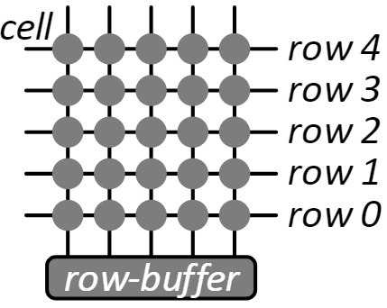

今天看了一篇 IT 之家关于 [AMD 处理器受 RowHammer 内存攻击影响](https://www.ithome.com/0/758/339.htm)的报道，心血来潮了解了一下 RowHammer 攻击的原理，把了解到的知识记录下来。

**RowHammer 攻击**是一种相对较新的攻击方式，它利用了现代动态随机存取存储器（DRAM）的物理缺陷，这种攻击方式不同于传统的软件漏洞利用，它直接针对硬件的弱点。这种攻击利用了 DRAM 在运行过程中产生的意外电荷泄漏效应，可能导致存储器单元泄露电荷并造成比特翻转。这个问题主要是由于现在 DRAM 存储单元高密度排列造成的。通过在一定模式下的高频率反复内存访问，攻击者可以在其原本无权访问的内存区域引发存储值的变化。这种攻击可以导致权限提升、数据泄漏和拒绝服务等安全问题。

要理解 RowHammer 攻击，首先需要了解 DRAM 的工作原理。DRAM 通过**存储电荷在电容中**来保存信息，每个电容与一个访问晶体管相连，共同构成一个**存储单元**（Cell，如下图所示）。电容充满电，存储单元就是 1，电容放完电，存储单元就是 0，晶体管用来控制电容充放电。

这些存储单元被组织成多行多列，形成一个二维阵列（Bank，如下图所示）。当读取或写入内存数据时，一个存储单元行会被激活，**整行的数据会被加载到行缓冲器**（row-buffer）中，同时存储单元中的电容放电，在行缓冲器内完成数据的读写操作。在操作完成后，行缓冲器内的数据会写入原来的存储单元行之中，同时存储单元中的电容充电。所以，不论是读还是写数据，存储单元都会充放电。

在内存如“白菜”价的今天，不改变内存电路板面积大小的前提下，为了能存储更多的数据，只能将存储单元排列的越来越近，密度大幅度增加。虽然芯片的制程有所提升，但每个电容之间的隔离不是完全的。当一个行被频繁激活时，**相邻行的电容可能会受到电磁干扰，导致存储的比特从 1 翻转为 0，或者相反**。这种比特翻转可以被恶意利用，攻击者可以通过精心设计的内存访问模式来控制比特翻转的位置和结果。**通过高频率地读取 DRAM 中的某一行，可以影响到相邻行中的数据，这种现象被称为 RowHammer，因为它就像用锤子反复敲击内存行一样**。如下图所示，第 1、3 行是攻击行，这两行中间是被攻击行，攻击行不停地充放电，中间行大概率会出现比特翻转。

即使理解了 RowHammer 攻击的原理，如果不知道哪些存储单元里隐藏着关键数据，毫无目的的去攻击也没有意义。更何况程序在访问内存数据时，并不会直接使用内存中的真实地址，而是使用**虚拟地址映射**的方式进行访问。这使得找到数据的真实地址变得更加困难，所以很长时间以来，对于 RowHammer 攻击的研究只停留在理论阶段，解决这个问题的关键在于如何实现**逆向 DRAM 地址映射**。由百度安全所研究设计的逆向工具 DRAMDig 能够在平均 7 ~ 8 分钟时间，快速、可靠地逆向出 DRAM 地址映射，解决了这一复杂的问题。感兴趣的朋友可以阅读这篇论文<u>《DRAMDig: A Knowledge-assisted Tool to Uncover DRAM Address Mapping》（DOI: 10.1109/DAC18072.2020.9218599）</u>。

尽管 RowHammer 攻击非常强大，但也不是无法防御的。从硬件层面，新的 DRAM 芯片中实现了各种缓解措施，如目标行刷新（Target Row Refresh, TRR），或者使用支持 ECC 的 DRAM 内存。软件层面的解决方案包括增加内存访问的随机性，以减少连续访问同一行的可能性。