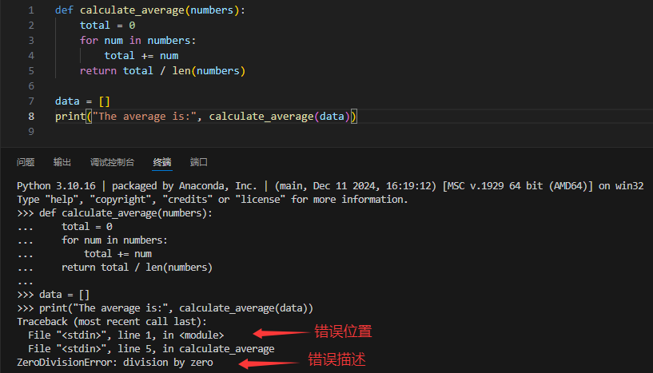

[TOC]

在软件开发中，调试是程序从“能运行”到“能正确运行”的关键步骤。调试是指通过对程序、硬件或系统的错误进行定位、分析和修复的过程，可以帮助开发人员发现并解决程序中的逻辑错误、语法错误、运行时错误等问题，保证软件的正确性和可靠性。让我们从一段简单的 Python 代码开始，这段代码的功能是计算一组数字的平均值。

```python
def calculate_average(numbers):
    total = 0
    for num in numbers:
        total += num
    return total / len(numbers)

data = [10, 20, 30, 40, 50]
print("The average is:", calculate_average(data))
```

这段程序看起来一切正常，但如果我们将 `data` 改为一个空列表：

```python
data = []
```

再次运行程序时，会发现出现了一个错误：`ZeroDivisionError: division by zero`。

```shell
Traceback (most recent call last):
  File "<stdin>", line 1, in <module>
  File "<stdin>", line 5, in calculate_average
ZeroDivisionError: division by zero
```

这个错误是因为我们试图用零来除以一个数，程序在处理空列表时没有考虑边界情况。虽然代码逻辑看似简单，但隐藏的问题可能在特定条件下暴露出来。这时，调试就显得尤为重要。通过调试，我们可以深入分析问题根源，确保程序在各种输入下都能正确运行。

## 学会查看报错信息

有的同学经常会拿着一个无法运行的程序来问我：“老师，这个程序没办法运行。” 我通常会问：“为什么没法运行？你看过报错信息吗？” 大部分同学会摇头。所以这个问题我通常无法直接回答，因为缺少最基本的调试信息。而如果你把调试信息提供到位，基本也就不需要我回答了。归根结底，是从来没有人告诉过初学者，你得先调试。其实，报错信息就是程序的“病历”，它能告诉我们程序哪里出错了，为什么出错了。



让我们再回到上面的例子。只需要仔细阅读这些信息，就能找到问题所在。`ZeroDivisionError: division by zero` 说明我们在除数为零的情况下进行了除法运算。`File "<stdin>", line 5, in calculate_average` 提供了出错的代码位置，在 `calculate_average` 方法内，`line 5` 第五行。

很多同学因为英语不好而害怕看报错信息，这种情况我也能理解。因为报错信息通常是英文的，而且有些单词比较复杂。但是，报错信息其实是有规律可循的。即使英语不好，也尝试着去看，关注的信息无非是“为什么报错，哪里错了”，看几次大概就熟悉了。还可以将报错信息复制到搜索引擎或者大模型中，搜索一下，看看有没有人遇到过类似的问题。大部分情况下，都会有人遇到过类似的问题，并且已经解决了。


代码编辑器提示的错误信息也很重要。不少同学遇到的都是一些低级问题，比如语法错误、变量拼写错误、函数调用时传递的参数不对、使用中文标点符号等。这些人眼很难一下发现的错误，代码编辑器可以在写代码的时候就提示出来。比如在 VS Code 中，鼠标悬停在波浪线（报错）的地方，就会提示错误信息。

## 调试的方法

调试的本质是程序执行的**可控干预**，通过暂停代码执行、观察状态、修改变量或强制路径，还原程序运行的真实场景。调试的方式有很多种，下面介绍几种常用的方法。

### 打印调试

打印调试是最常用的调试方法之一，是一种很基本但却很灵活很有效的调试方式。通过在代码中插入打印语句，可以观察变量的值、函数的返回值等信息，从而帮助定位问题。例如我们观察下面的代码，计算 `result` 的值。

```python
x, y, result = [1, 1, 0]
for _ in range(2):
    x += 1
    y += 1
    result = x + y
```

初学者对于 `+=` 运算符的理解不够深刻，可能会在 `result` 的值上卡住。我们可以在代码中插入 `print()` 打印语句，观察每次循环中 `x`、`y` 和 `result` 的值：

```python
x, y, result = [1, 1, 0]
for _ in range(2):
    x += 1
    print(f"x: {x}")
    y += 1
    print(f"y: {y}")
    result = x + y
    print(f"result: {result}")
```

通过打印出错语句涉及到的相关变量的值和类型，可以帮助分析出错原因。尽可能多的输出一些标记、变量值，看看和预期是否一致。也可以利用打印确定程序的运行路径，一个函数有没有被调用，一个 if 块有没有被执行，一个 while 循环执行了几次，到了哪一步中断了，都可以通过打印出相关信息来查看。

### 断点调试

断点调试是通过设置断点来暂停程序的执行，允许开发人员逐行检查代码的状态和变量的值。大部分 IDE 都支持断点调试功能，比如 PyCharm、VS Code 等。通过设置断点，可以在特定行暂停程序执行，然后查看变量的值、调用栈等信息。在断点调试中有这样几个关键概念：
- **断点（Breakpoint）**：程序在特定代码位置暂停，允许开发者检查变量、堆栈或内存状态。
- **单步执行（Step Execution）**：逐行或逐函数执行代码，观察每一步的输入输出变化，追踪逻辑分支。
- **变量监视（Watch）**：实时跟踪关键变量的值，识别异常波动或未预期的赋值。
- **条件断点（Conditional Breakpoint）**：仅在满足特定条件时触发断点（如 for 循环中 count > 1000），避免重复调试无关流程。

下面使用“计算偶数平方和”的程序进行断点调试，以 VS Code 为例，介绍如何使用断点调试。

```python
def calculate_even_square_sum(numbers):
    total = 0
    for num in numbers:
        if num % 2 == 0:  # 检查是否为偶数
            total += num ** 2  # 累加平方值
    return total

data = [1, 2, 3, 4, 5, 6]
result = calculate_even_square_sum(data)
print("The sum of squares of even numbers is:", result)
```

在代码行号的左侧单击，可以设置一个断点。


然后点击左侧的“运行和调试”图标，选择“Python Debugger”，即可开始断点调试。


在调试过程中，程序会在断点处暂停。可以使用“单步执行”按钮逐行执行代码，观察变量的值和状态。


“工欲善其事，必先利其器”。把调试工具熟悉之后，对开发效率将会有很大提升。当然，比调试工具更重要的，还是调试的思路。遇到错误时，读懂报错信息，分析出错原因，并逐步定位问题所在，而不是盲目地修改代码、无意义地重复运行，才是解决问题的关键。
