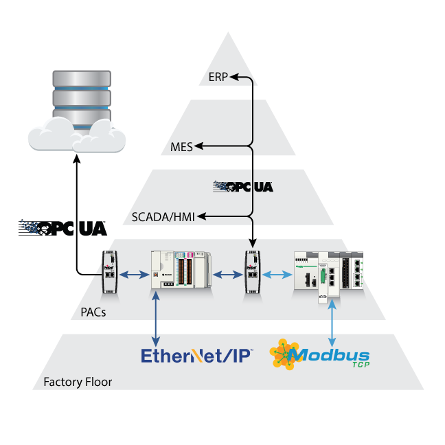
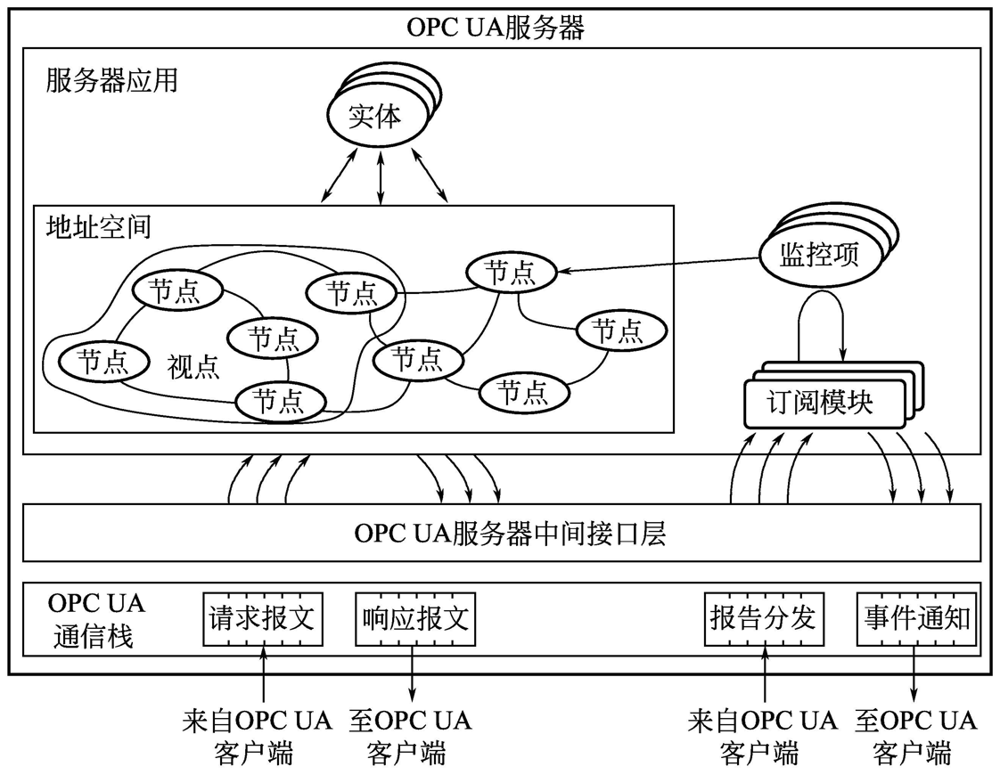
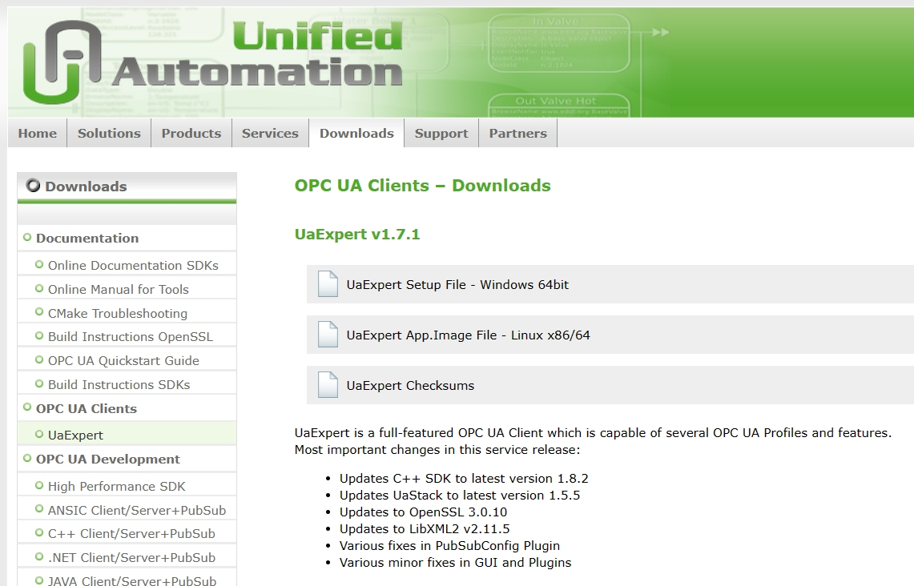
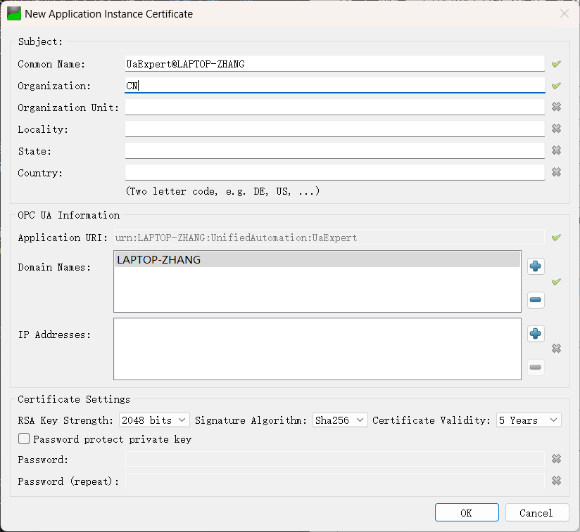
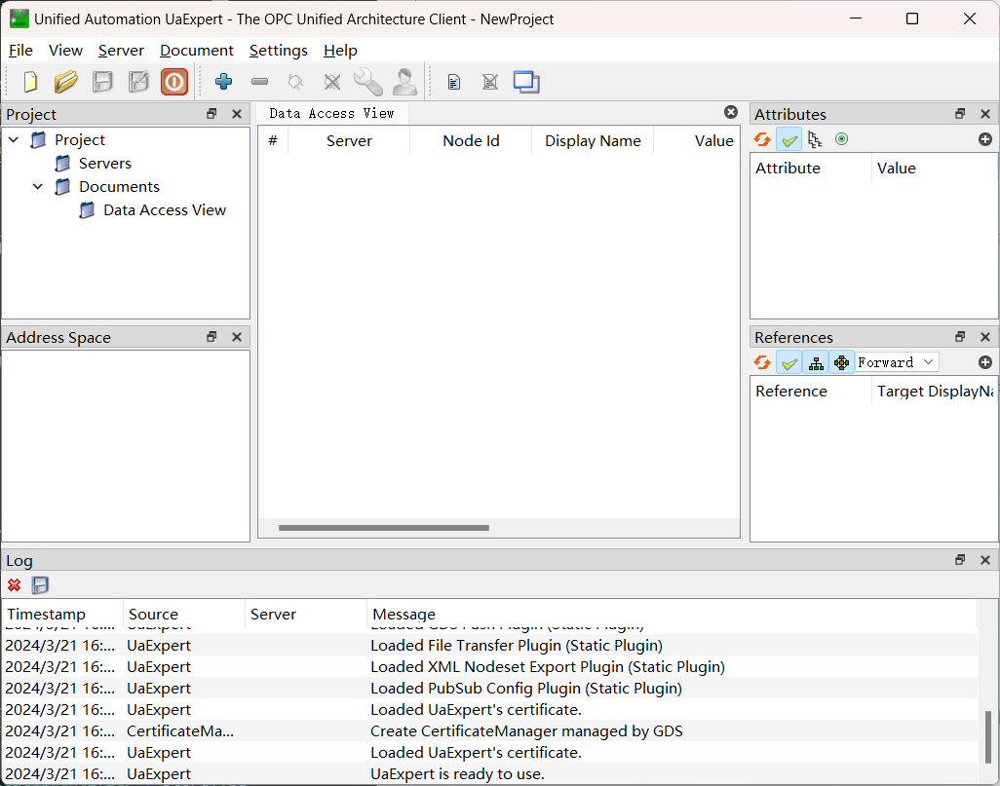
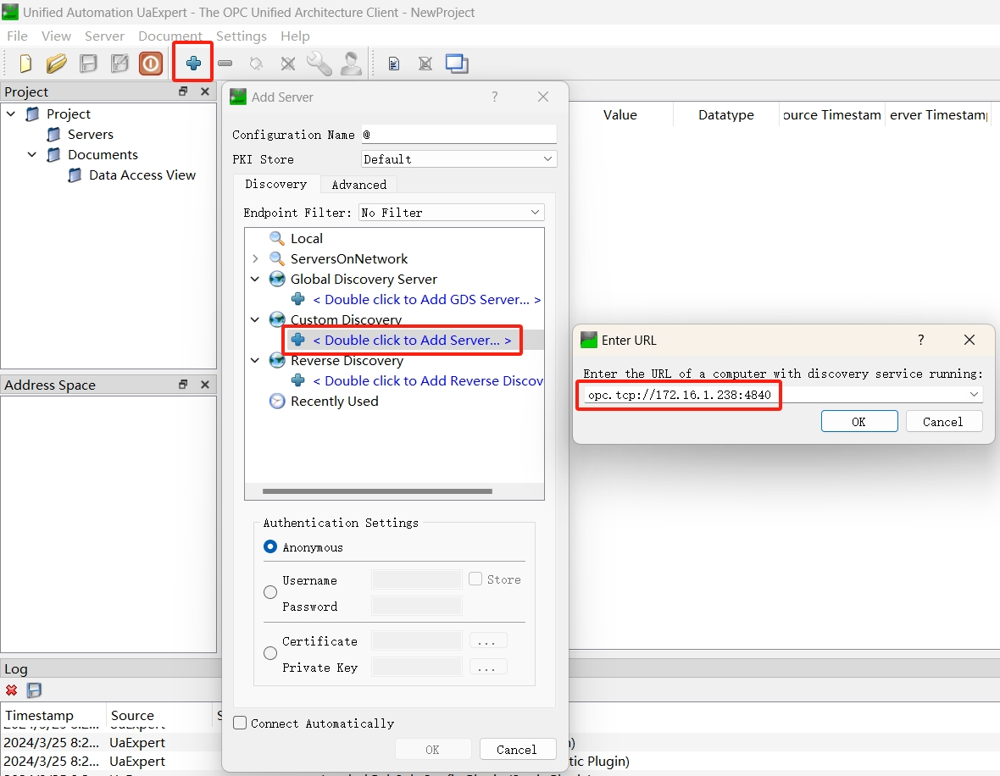
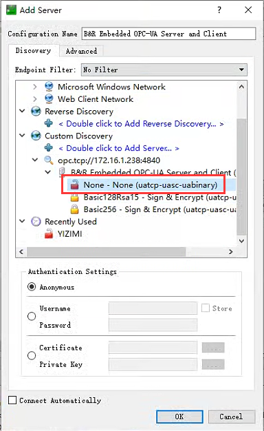
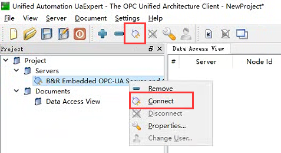
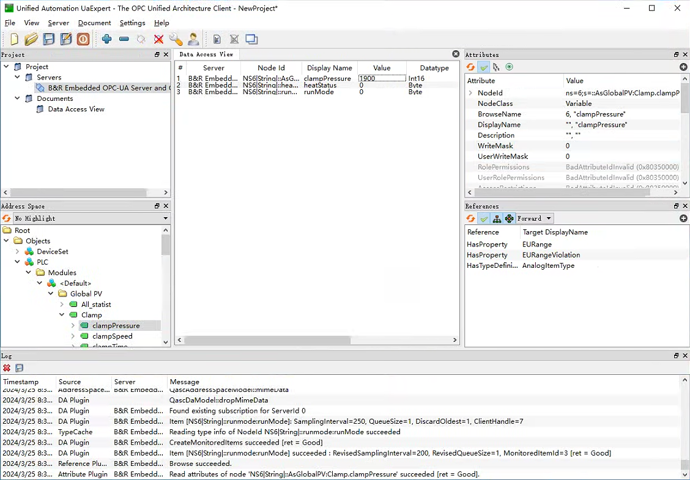
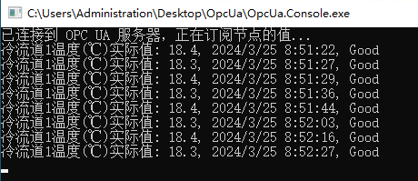

[TOC]

## 什么是 OPC UA

**OPC UA**（OPC Unified Architecture，开放平台通信统一架构）是 OPC 基金会应用在自动化技术的机器对机器网络传输协定。OPC UA 不依赖于特定的操作系统或平台，可以在 Windows、Mac、Linux 等多种系统上运行，而传统的 OPC（如 OPC DA）通常只能在 Windows 上使用。该协议提供了一个更为先进、安全和灵活的解决方案，适用于现代工业自动化和物联网环境中的设备间通信。



OPC UA 通过一个统一的**信息模型**来实现设备间的无缝数据交换，信息模型来源于面向对象编程，使用了**对象**作为过程系统表示数据和活动的基础。这个模型由**节点**组成，节点可以是对象、变量或方法，它们通过**引用**相互连接，构成了一个复杂的网络。每个节点都有一组属性和引用，用于描述数据和定义节点间的关系。OPC UA 的**地址空间**就是这样一个节点网络，它为客户端提供了一种标准化的方式来访问服务器上的对象。OPC UA 还提供了一系列服务，使客户端能够执行读取、写入和订阅等操作。安全性也是 OPC UA 设计的核心，内置了多种安全机制，包括认证、授权、加密和消息签名，以确保数据传输的安全性。



## UaExpert 的使用

UaExpert 是一款 OPC UA 客户端软件，用于连接 OPC UA 服务器并与之交互。UaExpert 支持 OPC UA 的所有特性，包括数据视图、报警视图、历史趋势视图和诊断视图等功能。用户可以通过 UaExpert 访问服务器上的节点，如设备和传感器，以及它们的属性，例如温度、压力等数据。UaExpert 还提供了仿真、配置、历史功能测试和导出节点的功能，大多数功能都是免费使用的。

### 下载 UaExpert

访问 [Unified Automation](https://www.unified-automation.com/downloads/opc-ua-clients/uaexpert.html) 的官网下载 UaExpert，未注册用户则需要先注册才能下载。



### 首次启动

安装完成后，首次运行 UaExpert 会提示创建一个应用程序证书，填写一些相关信息即可。



启动后的界面如下。



### 添加 OPC UA 服务器

依次单击菜单栏 `Server` - `Add`，或者直接单击工具栏的 `➕` 图标，会弹出添加服务器对话框。双击 `Custom Discovery` 下面的文字，输入 OPC UA 服务器的地址和端口号。



完成后会看到新添加的 OPC UA 服务器信息，选中开锁状 `🔓` 图标，并单击 `OK` 按钮，即完成服务器添加的操作。



### 连接 OPC UA 服务器

服务器添加完成后，在左侧项目树的 `Servers` 会显示相关信息，此时服务器尚未连接。单击工具栏的插头 `🔌` 图标，或者右击服务器点击 `Connect`，即可连接服务器。



### 查看 PLC 数据

成功连接后，会在界面左下侧 `Address Space` 显示 PLC 中的相关数据。找到想要监控（订阅）的数据，将其直接拖放到界面中间的 `Data Access View` 就可以实时观察数据的变化。界面右侧 `Attributes` 可以显示选中节点的相关属性。



## 使用 C# 读写 OPC UA 数据

首先需要在项目中引用 NuGet 包 `OPCFoundation.NetStandard.Opc.Ua`。

### 连接到 OPC UA 服务器

1. 创建一个应用配置对象，用于设置应用名称、唯一标识、类型、证书和安全策略；
    ```csharp
    // 创建一个应用配置对象，用于设置应用名称、唯一标识、类型、证书和安全策略
    var config = new ApplicationConfiguration()
    {
        ApplicationName = "MyClient",
        ApplicationUri = Utils.Format(@"urn:{0}:MyClient", System.Net.Dns.GetHostName()),
        ApplicationType = ApplicationType.Client,
        SecurityConfiguration = new SecurityConfiguration
        {
            ApplicationCertificate = new CertificateIdentifier { StoreType = @"Directory", StorePath = @"%CommonApplicationData%\OPC Foundation\CertificateStores\MachineDefault", SubjectName = "MyClientSubjectName" },
            TrustedIssuerCertificates = new CertificateTrustList { StoreType = @"Directory", StorePath = @"%CommonApplicationData%\OPC Foundation\CertificateStores\UA Certificate Authorities" },
            TrustedPeerCertificates = new CertificateTrustList { StoreType = @"Directory", StorePath = @"%CommonApplicationData%\OPC Foundation\CertificateStores\UA Applications" },
            RejectedCertificateStore = new CertificateTrustList { StoreType = @"Directory", StorePath = @"%CommonApplicationData%\OPC Foundation\CertificateStores\RejectedCertificates" },
            AutoAcceptUntrustedCertificates = true,
            RejectSHA1SignedCertificates = false,
            MinimumCertificateKeySize = 1024,
            NonceLength = 32,
        },
        TransportConfigurations = new TransportConfigurationCollection(),
        TransportQuotas = new TransportQuotas { OperationTimeout = 15000 },
        ClientConfiguration = new ClientConfiguration { DefaultSessionTimeout = 60000 },
        TraceConfiguration = new TraceConfiguration()
    };

    // 验证应用配置对象
    await config.Validate(ApplicationType.Client);

    // 设置证书验证事件，用于自动接受不受信任的证书
    if (config.SecurityConfiguration.AutoAcceptUntrustedCertificates)
    {
        config.CertificateValidator.CertificateValidation += (s, e) => { e.Accept = (e.Error.StatusCode == StatusCodes.BadCertificateUntrusted); };
    }
    ```
2. 检查应用实例对象的证书;
    ```csharp
    // 创建一个应用实例对象，用于检查证书
    var application = new ApplicationInstance(config);

    // 检查应用实例对象的证书
    bool check = await application.CheckApplicationInstanceCertificate(false, 2048);
    ```
3. 创建一个会话对象，用于连接到 OPC UA 服务器；
    ```csharp
    // 创建一个会话对象，用于连接到 OPC UA 服务器
    EndpointDescription endpointDescription = CoreClientUtils.SelectEndpoint("opc.tcp://192.168.0.100:4840", true);
    EndpointConfiguration endpointConfiguration = EndpointConfiguration.Create(config);
    ConfiguredEndpoint endpoint = new ConfiguredEndpoint(null, endpointDescription, endpointConfiguration);
    Session session = await Session.Create(config, endpoint, false, false, "DataCollector", 60000, new UserIdentity(), null);
    ```

### 获取节点的值

1. 单次读取节点的值
    ```csharp
    DataValue value = session.ReadValue(nodeId: "ns=6;s=::MyNode");
    Console.WriteLine("{0}, {1}, {2}", value.Value, value.SourceTimestamp, value.StatusCode);
    ```
2. 订阅读取节点的值
    ```csharp
    // 创建一个订阅对象，用于订阅节点的值
    var subscription = new Subscription(session.DefaultSubscription) { PublishingInterval = 1000 };
    session.AddSubscription(subscription);
    subscription.Create();

    // 创建一个监视项对象，用于指定要订阅的节点
    MonitoredItem monitoredItem = new MonitoredItem()
    {
        DisplayName = "MyNode",
        StartNodeId = "ns=6;s=::MyNode"
    };

    // 添加一个通知事件，用于处理节点值的变化
    monitoredItem.Notification += (item, e) =>
    {
        foreach (var value in item.DequeueValues())
        {
            Console.WriteLine("{0}: {1}, {2}, {3}", item.DisplayName, value.Value, value.SourceTimestamp, value.StatusCode);
        }
    };

    // 将监视项对象添加到订阅对象中
    subscription.AddItem(monitoredItem);

    // 应用订阅的变化
    subscription.ApplyChanges();
    ```



### 写入节点的值

```csharp
// 写入数据到节点
WriteValue value = new WriteValue()
{
    NodeId = "ns=6;s=::MyNode",
    Value = new DataValue(new Variant(123))
};

ResponseHeader response = session.Write(null, new WriteValueCollection { value }, out StatusCodeCollection statuses, out DiagnosticInfoCollection diagnostics);
```
