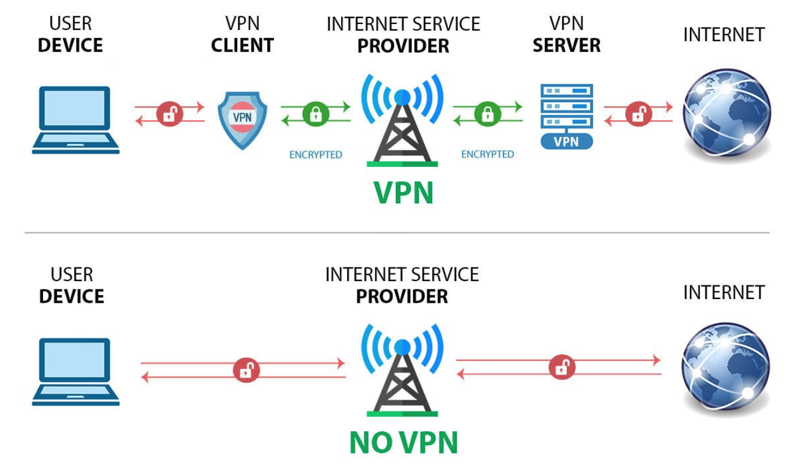
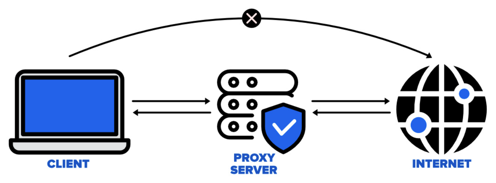
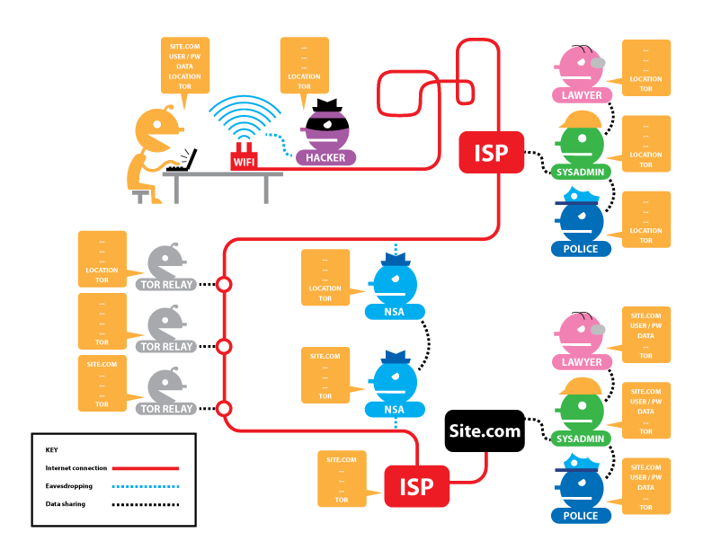

当你深夜在浏览器中输入 www.baidu.com 时有没有想过，除了月黑风高的夜和本机的浏览记录，还有谁知道你访问了它呢？要搞清楚这件事，首先我们要了解一下访问网站时，这其中发生了什么。

如果你在 10 年之前访问网站，大概率会在浏览器的地址栏中看到这样的网址 http://www.baidu.com ，这其中网址前面的 `http` 表明访问网站使用的是 **HTTP** 协议。当你按下回车键↩︎，访问网站也拉开了序幕。我们知道 **IP 地址**是设备在互联网上的唯一标识，而要访问的网站是部署在互联网上的某一台设备中（服务器），那么这台设备会有一个固定的 IP 地址。那么怎么将网址和 IP 地址建立起联系呢？访问网站的第一步就是使用 **DNS 服务**把网址转换成服务器的 IP 地址。DNS（Domain Name System）即域名系统，就是提供域名（网址）与 IP 地址相互映射的服务，方便人们访问网站。当浏览器知道了 IP 地址后，会通过**端口 80** 向该 IP 地址发送 TCP 连接请求，最终给你呈现出网站的内容。简单来说，使用 HTTP 访问网站有这样几步：

1. 浏览器向 DNS 服务器请求将网址解析为 IP 地址；
2. 浏览器通过端口 80 向该 IP 地址发送 TCP 连接请求；
3. 浏览器发送 HTTP 请求，接收服务器 HTTP 响应并渲染网页。

那么哪些环节会泄露隐私呢？由于 HTTP 协议不加密🔓数据，任何人都可以在数据传输过程中截获和查看信息。你的底裤会在网络出口被扒的一干二净。

如果你现在访问网站，基本上会在浏览器的地址栏中看到这样的网址 https://www.baidu.com ，这其中网址前面的 `https` 表明访问网站使用的是 **HTTPS** 协议。HTTPS 协议简单来说 `HTTPS = HTTP + TLS`。前面提到了 HTTP 是一种不加密的协议，数据在网络中是以明文传输的，所以并不安全。而 TLS（Transport Layer Security）是一种安全协议，可以将浏览器与服务器的通信进行加密🔐，从而向第三方隐藏网站的内容。简单来说，使用 HTTPS 访问网站有这样几步：

1. 浏览器向 DNS 服务器请求将网址解析为 IP 地址；
2. 浏览器通过**端口 443** 向该 IP 地址发送 TCP 连接请求，并开始 TLS 握手过程；
3. 浏览器验证服务器的安全证书，和服务器协商加密算法和交换加密密钥；
4. 浏览器发送加密的 HTTP 请求，接收服务器加密的 HTTP 响应，解密并渲染网页。

那么使用 HTTPS 后就安全了吗？虽然 HTTPS 本身是加密的，但是在访问网站的过程中还是有可能暴露你访问的网址。例如：
* **DNS 查询**：即使是 HTTPS，DNS 查询默认情况下也是未加密的，这意味着在网络出口仍然能知道你访问的是哪个网站；
* **流量分析**：即使使用 HTTPS 对数据进行加密，在不知道传输内容的情况下可以对数据包的特征进行分析，当访问一些特定的网站时，可能出现大小和顺序相似的数据包，这种方式也可能暴露你访问的网站。

那么如何安全地访问互联网呢？流量识别技术的提高，网络中不断增加的监视节点，导致没有绝对的匿名性👁️。但是通常可以使用下面的技术提高访问过程中的安全性。

**VPN（Virtual Private Network）即虚拟专用网络**，是一种加密通讯技术。它允许用户通过加密的通道发送和接收数据，从而保护数据不被未授权的人访问或窃取。其工作原理是通过远程服务器重定向网络流量，这样真实的 IP 地址就被隐藏起来，使得网络请求对可能的监视者变得不可见。**这好比将你的设备加入到另一个网络中，同时分配个另一个网络的 IP 地址**。VPN 是一个统称，它有很多的具体实现，常见的协议包括 PPTP、L2TP、IPSec 和 GRE。目前，绝大部分 VPN 协议的流量特征均能被精确识别。

<small>VPN 的传输过程</small>

**Proxy 即代理**，是一种网络服务，它充当客户端和服务器之间的中介。代理服务器的主要功能是代理网络用户去获取网络信息。在客户端和目标服务器之间建立一个中介，使得客户端可以通过代理服务器的 IP 地址和位置信息来发送请求，从而隐藏客户端的真实 IP 地址和位置信息。**代理就相当于一位中间人，只提供了匿名服务，并不加密传输的数据**。所以还需要使用一些其他的技术对数据进行加密，例如**流量混淆**。流量混淆通过改变数据包的外观和行为，使得网络流量难以被识别和追踪。可以通过随机改变数据包的大小、时间间隔等特征，使流量看起来更像是随机数据，而不是特定类型的通信。也可以模仿其他常见的网络协议或应用的流量特征，使混淆后的流量看起来像是正常的网络流量。随着时间的推移，混淆特征也最终会被识别。

<small>代理的传输过程</small>

代理有两种常见的技术，一个是 **SOCKS5**，一个是 **Tor**。SOCKS5 是 SOCKS 协议的第五个版本，位于 OSI 模型中的第五层会话层，因此可以处理任何类型的网络流量。由于数据是以明文传输的，SOCKS5 更多用在本地代理，即同一网段下的所有设备都可以共用一个代理网络出口。Tor（The Onion Router）即洋葱路由，是一种由上千台中继服务器组成的分布式网络，用来转发网络请求，从而保护隐私性。

<small>Tor 的传输过程</small>

网络请求在进入 Tor 网络之前会被加密三次，然后通过选择的三个节点（入口节点、中间节点和出口节点）传输（如上图的 `TOR RELAY`），请求在传入下一个节点之前会被去除一次加密。每个节点只能解密一层加密，从而无法单独确定用户的身份和访问的内容。在三个节点中，第一个能够看到来自用户设备的加密 Tor 流量，但它不知道用户正在用 Tor 做什么，它仅仅能看到“这个 IP 地址正在使用 Tor”。第三个节点能够看到用户发送的 Tor 流量，但它不知道是谁发送的这些流量，如果使用了加密传输（例如 HTTPS 协议），它仅能知道目标网址。当然 Tor 也有缺点，经过了多次加密和节点的转发网络速度会变得很慢。Tor 也不能提供绝对的安全，如果监听者能够同时监测入口和出口节点，对流量进行计时关联也是可能的（如上图的 `NSA`美国国家安全局🫵）。

安全地访问互联网需要采取适当的措施，例如使用 HTTPS、VPN、代理等技术，但每种技术都有其优势和局限性，切记没有绝对的安全😶‍🌫️。
