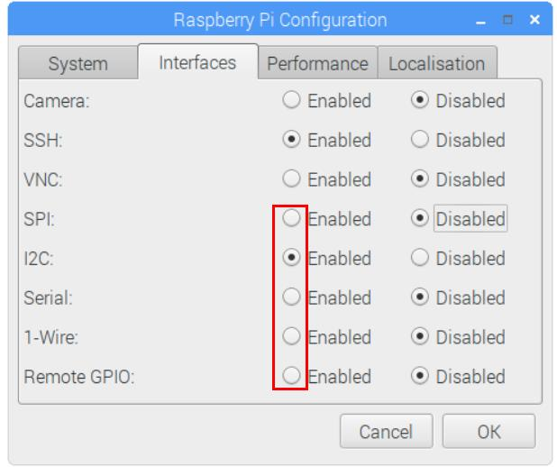
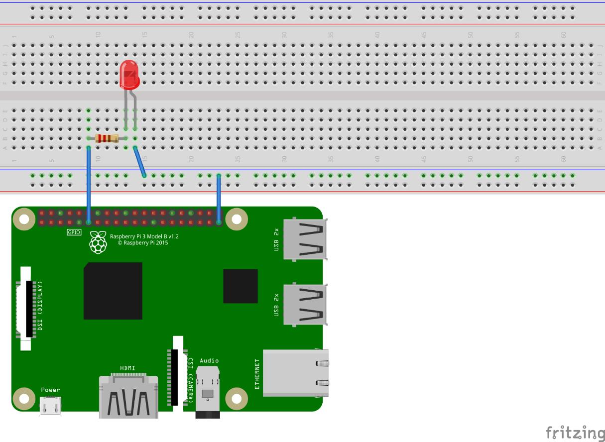
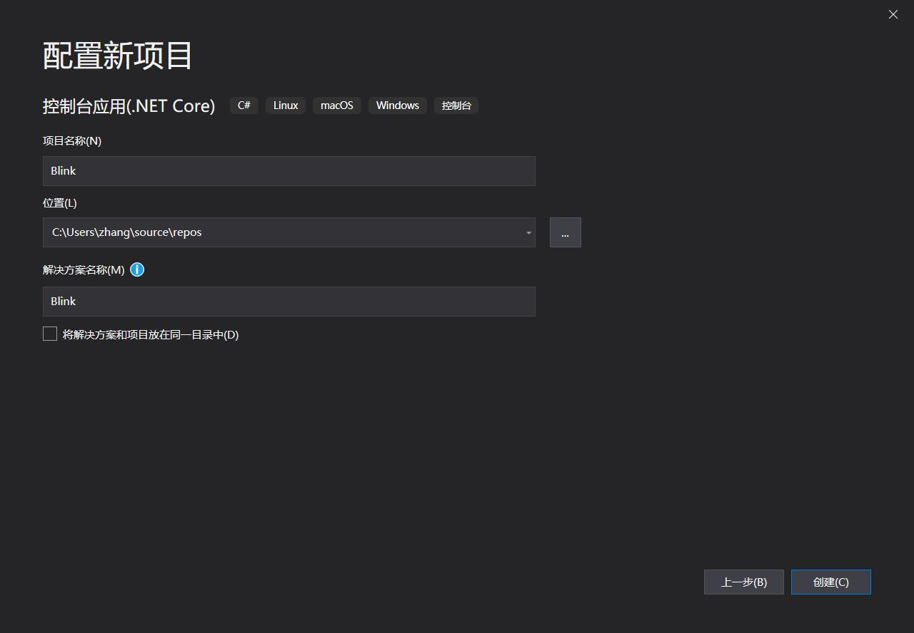
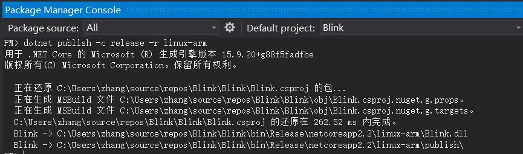
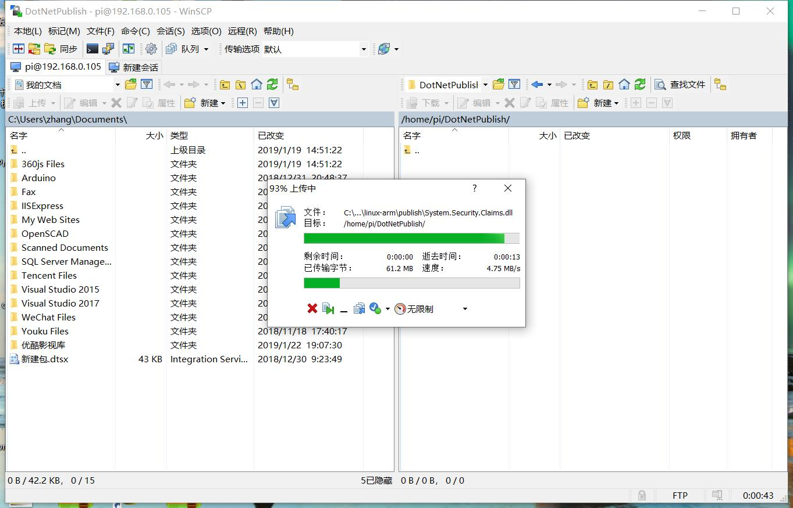
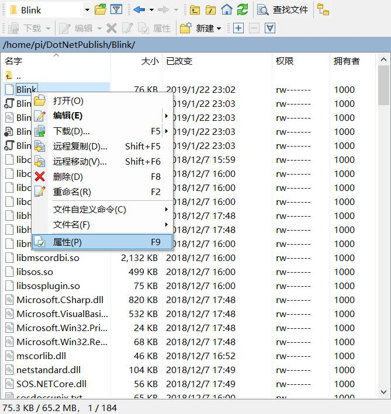
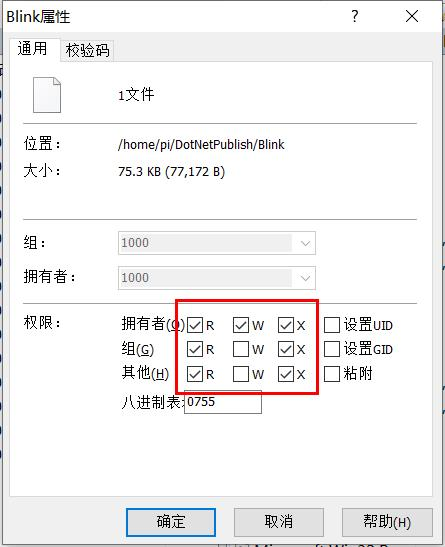
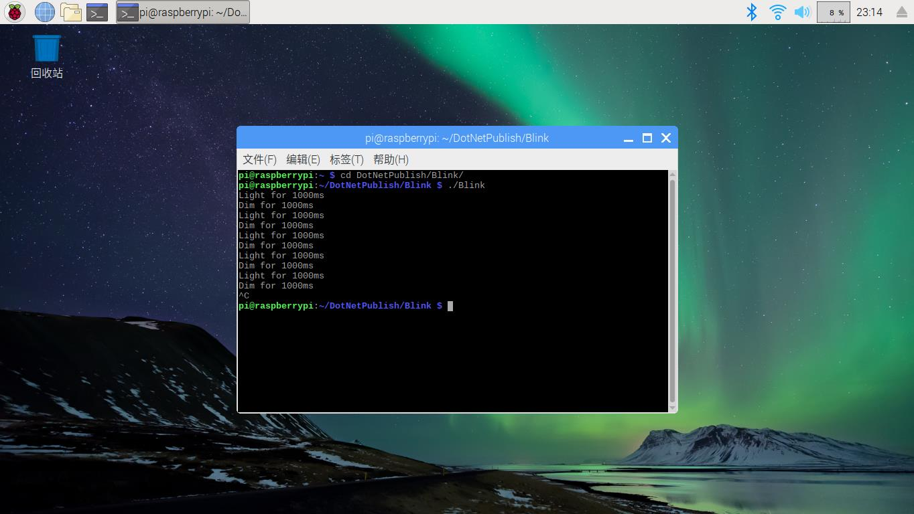

## 写在前面

距离 .NET Core 1.0 发布已经过去 6 年的时间，这段时间里 .NET 也逐渐发展，构建起 WEB 应用、桌面应用、移动 APP 以及游戏一个跨平台的开发环境。对硬件操作的 IoT 应用也是其中的一个重要组成，**System.Device.Gpio** NuGet 包的出现使 .NET 程序员参与硬件开发成为可能。在此之前更多的是使用 Mono 去进行跨平台开发，现在有了更简单的、社区更加活跃的新的解决方案。我在向 .NET IoT 提交了很多代码后萌生了写一套入门硬件开发博客的想法，对硬件进行编程是一件很酷的事情，通过传感器的角度去重新感知这个世界，感知这个世界的光与热、声音、位置等等一系列要素。

《张高兴的 .NET IoT 入门指南》包括了探索硬件所需要的大部分基础知识，并不要求具有硬件的编程经验，但需要熟悉 .NET 与 C#。本系列博客的目的在于帮助 .NET 程序员快速的熟悉硬件开发，或许你的脑海中有一个伟大的想法，但是没有相关的硬件知识去实现它，本系列博客的每一章都配有一个小例子，帮助你学习编写相关代码所需要的知识。你不需要阅读每一篇博客，博客的内容是按照特定的功能进行划分的，随用随查即可。《张高兴的 .NET IoT 入门指南》中所介绍的内容都是最新的技术，其中 .NET 版本只要大于 2.1 即可。本系列博客一共包含七篇文章，具体的目录如下：

1. [环境配置、Blink、部署]()
   * [环境配置]()
   * [Blink]()
   * [部署]()
2. [GPIO 的使用]()
   * [什么是 GPIO]()
   * [相关类]()
   * [人体红外传感器实验]()
3. [使用 I2C 进行通信]()
   * [什么是 I<sup>2</sup>C 总线]()
   * [相关类]()
   * [I<sup>2</sup>C 总线的通信步骤]()
   * [温湿度传感器读取实验]()
4. [使用 SPI 进行通信]()
   * [什么是 SPI]()
   * [相关类]()
   * [SPI 的通信步骤]()
   * [加速度传感器读取实验]()
5. [PWM 信号输出]()
   * [什么是 PWM]()
   * [相关类]()
   * [PWM 的使用步骤]()
   * [使用硬件 PWM 控制 LED 的亮度]()
   * [使用软件 PWM 控制 RGB LED]()
6. [串口通信入门]()
   * [什么是串口]()
   * [相关类]()
   * [串口通信的步骤]()
   * [USB 串口通信实验]()
7. [制作一个气象站]()
   * [硬件需求]()
   * [准备工作]()
   * [编写代码]()
   * [部署应用]()
   * [后续工作]()

本人并非硬件相关专业出身，《张高兴的 .NET IoT 入门指南》这一系列博客只是将我知道的东西写出来罢了，我对这些内容的评价是够用，希望能够帮助你快速掌握硬件开发的基础，之后根据遇到的问题再学习其他的内容。当然欢迎批评与指正，有任何的问题都可以通过邮件或者评论的方式与我交流。

<p align="right">张高兴</br>2022年2月16日</p>

---

* [环境配置、Blink、部署]()
   * [环境配置]()
   * [Blink]()
   * [部署]()

如何在 Raspberry Pi 的 Raspbian 上构建使用 GPIO 引脚的 IoT 程序？你可能会回答使用 C++ 或 Python 去访问 Raspberry Pi 的引脚。现在，C# 程序员可以使用 .NET 在 Linux 上构建 IoT 应用程序。只需要引入 **System.Device.Gpio** NuGet 包即可。

<div style="display: block;position: relative;border-radius: 8px;padding: 1rem;background-color: #d2f9d2;color: #094409;margin: 10px">
    <p style="margin-top:0;font-weight: bold">💡&nbsp;提示</p>
    <p>因为 .NET Core JIT 依赖于 ARMv7 指令集，因此处理器架构新于 ARMv7 的 Linux 开发板都可以使用此包进行硬件操作。当然，一些特殊的硬件操作除外，比如对 GPIO 引脚进行上拉，这需要对处理器的寄存器进行访问，而 System.Device.Gpio 对不支持的硬件仅实现了通用操作。</p>
</div>

若要继续阅读下面的内容，你需要准备：

1. 安装有 Linux 的 Raspberry Pi 2B/3B/3A+/3B+
2. Visual Studio 2019 及以上
3. 用于构建程序的 .NET SDK （版本大于 2.1）

## 环境配置

1. 首先获取 Raspberry Pi 的硬件接口的访问权限：

    

    

    <div style="display: block;position: relative;border-radius: 8px;padding: 1rem;background-color: #d2f9d2;color: #094409;margin: 10px">
        <p style="margin-top:0;font-weight: bold">💡&nbsp;提示</p>
        <p><span>远程访问 Raspbian 可以使用 putty 通过 SSH 进行访问，也可以使用 apt 安装 xrdp ，通过 Windows 远程桌面进行访问。</span></p>
        <p><span>对于没有桌面环境的 Raspbian Lite，可以通过执行 sudo raspi-config 进行配置。</span></p>
    </div>

2. 使用二进制文件安装 .NET 运行时：

   1. 下载
       ```
       wget https://download.visualstudio.microsoft.com/download/pr/8c34904d-88e8-4dc1-af91-fc1e5cb64a25/6ae9f205eb54fdd03e12e04daa43c015/dotnet-runtime-6.0.2-linux-arm.tar.gz
       ```
   2. 解压
       ```
       mkdir ~/dotnet && tar -xvf dotnet-runtime-6.0.2-linux-arm.tar.gz -C ~/dotnet
       ```
   3. 创建链接
       ```
       sudo ln -s ~/dotnet/dotnet /usr/bin/dotnet
       ```

## Blink

熟悉 Arduino 的朋友都知道，Blink 是默认烧写进 Arduino 的初始程序，控制板载连接 13 号引脚的 LED 闪烁，是一种类似于“Hello World”的存在。这里我们将 LED 小灯连接至 Raspberry Pi 的 GPIO 17 引脚。 

### 硬件需求

| 名称 | 数量 |
| :--- | ---: |
| LED 小灯 | x1 |
| 220 Ω 电阻 | x1 |
| 杜邦线 | 若干 |

* LED 正极 - GPIO 17 (Pin 11)
* LED 负极 - GND

### 电路



### 使用 Docker 运行示例
示例地址：<https://github.com/ZhangGaoxing/dotnet-core-iot-demo/tree/master/src/Blink>

```
docker build -t iot-blink -f Dockerfile .
docker run --rm -it --device /dev/gpiomem iot-blink
```

### 代码

1. 打开 Visual Studio ，新建一个 .NET Core 控制台应用程序，项目名称为“Blink”。
   
    

2. 打开 “工具”——“NuGet包管理器”——“程序包管理器控制台”，运行如下命令，以获取程序包。

    ```
    PM> Install-Package System.Device.Gpio
    ```

3. 在 Program.cs 中，替换如下代码：
   
    ```C#
    using System;
    using System.Device.Gpio;
    using System.Threading;

    namespace Blink
    {
        class Program
        {
            static void Main(string[] args)
            {
                // 定义引脚
                int pinNumber = 17;
                // 定义延迟时间
                int delayTime = 1000;

                // 获取 GPIO 控制器
                using (GpioController controller = new GpioController(PinNumberingScheme.Logical))
                {
                    // 打开引脚 17
                    controller.OpenPin(pinNumber, PinMode.Output);

                    // 循环
                    while (true)
                    {
                        Console.WriteLine($"Light for {delayTime}ms");
                        // 打开 LED
                        controller.Write(pinNumber, PinValue.High);
                        // 等待 1s
                        Thread.Sleep(delayTime);

                        Console.WriteLine($"Dim for {delayTime}ms");
                        // 关闭 LED
                        controller.Write(pinNumber, PinValue.Low);
                        // 等待 1s
                        Thread.Sleep(delayTime);
                    }
                }
            }
        }
    }
    ```

## 部署

1. 在“程序包管理器控制台”运行发布命令：
   
    ```
    dotnet publish -c release -r linux-arm
    ```

    

    <div style="display: block;position: relative;border-radius: 8px;padding: 1rem;background-color: #d2f9d2;color: #094409;margin: 10px">
        <p style="margin-top:0;font-weight: bold">💡&nbsp;提示</p>
        <p><span>可以使用 -o 来指定发布路径，如：-o D:\BlinkPublish ，这将会发布在 D 盘的 BlinkPublish 文件夹下。</span></p>
    </div>

2. 使用 FTP 工具将生成的发布文件夹复制到 Raspberry Pi 上，这里使用的是 WinSCP 。

    

    <div style="display: block;position: relative;border-radius: 8px;padding: 1rem;background-color: #d2f9d2;color: #094409;margin: 10px">
        <p style="margin-top:0;font-weight: bold">💡&nbsp;提示</p>
        <p><span>Raspbian 使用 FTP 服务，请使用 apt 安装 vsftpd 。</span></p>
    </div>

3. 更改程序权限。使用 cd 命令切换到发布的文件夹，运行：
   
    ```
    sudo chmod 755 ./Blink
    ```

    或使用 FTP 工具进行变更

    

    

4. 执行 ./Blink 运行程序，此时 LED 小灯应该一闪一闪的了。

    

## 参考
1. dotnet/iot Documentation：<https://github.com/dotnet/iot/blob/master/Documentation/README.md>
2. .NET Core on Raspberry Pi：<https://github.com/dotnet/core/blob/master/samples/RaspberryPiInstructions.md>
