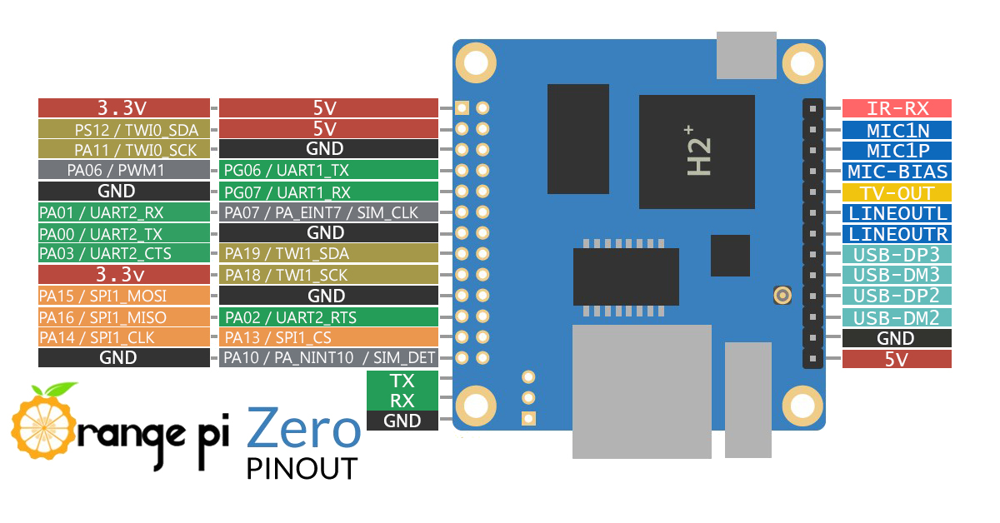
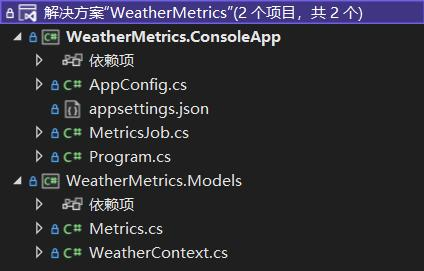
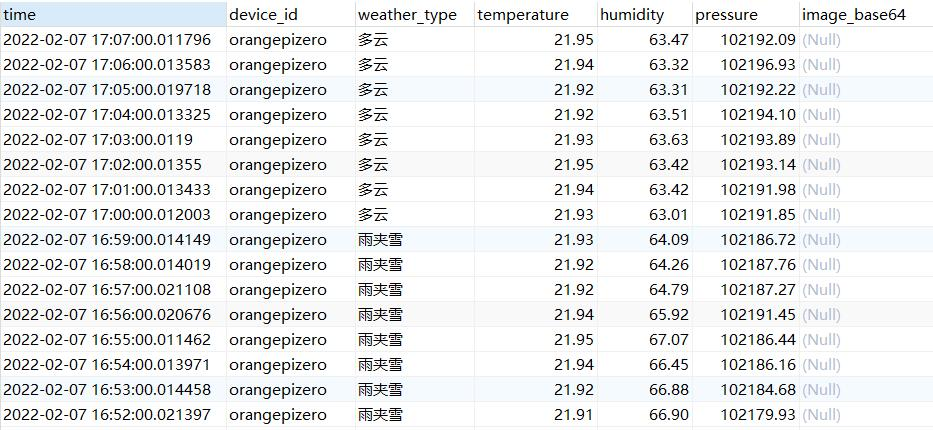

距离上一篇《张高兴的 .NET Core IoT 入门指南》系列博客的发布已经过去 2 年的时间了，2 年的时间 .NET 版本发生了巨大的变化，.NET Core 也已不复存在，因此本系列博客更名为 《张高兴的 .NET IoT 入门指南》，我也重新审阅了之前的内容进行了相应的更改以保证内容的时效性。

和单片机不同，使用 Linux 开发板、现成的传感器套件以及合适的后端技术几乎可以做成任何东西。为了更好的整合前面章节介绍的内容，本文将制作一个简单的气象站（也许叫环境信息收集装置更合适），至于为何选择制作一个气象站，因为难度不高制作不复杂，并且温湿度传感器花费较低的价格即可获得，可以以低廉的价格换取一个 cool stuff。本文将使用 .NET 6 编写一个控制台应用程序，通过本文你可以学到：
1. I2C `I2cDevice` 类的使用；
2. 摄像头设备 `VideoDevice` 类的使用；
3. `Iot.Device.Bindings` NuGet 包的使用；
4. 时序数据库 `TimescaleDB` 的简单使用；
5. `Quartz` 定时任务的使用；
6. 在控制台应用中进行依赖注入；
7. 使用 `Docker` 拉取镜像、部署应用。

* [硬件需求]()
* [电路]()
* [准备工作]()
  * [配置 TimescaleDB 数据库]()
  * [安装摄像头的依赖库]()
* [编写代码]()
  * [项目结构]()
  * [项目依赖]()
  * [数据库上下文与实体类]()
  * [配置文件]()
  * [初始化与依赖注入配置]()
  * [配置定时任务]()
* [部署应用]()
  * [发布到文件]()
  * [构建 Docker 镜像]()
* [后续工作]()

## 硬件需求

| 名称 | 描述 | 数量 |
| :-: | :-: | :-: |
| Orange Pi Zero | Linux 开发板 | x1 |
| BME280 | 提供温度、湿度以及气压数据 | x1 |
| USB 摄像头 | 提供环境图像 | x1 |
| 杜邦线 | 传感器与开发板的连接线 | 若干 |

## 电路



| 传感器 | 接口 | 开发板接口 |
| :-: | :-: | :-: |
| BME280 | SDA | TWI0_SDA (Pin 3) |
| | SCL | TWI0_SCK (Pin 5) |
| | VCC | 5V (Pin 4) |
| | GND | GND (Pin 6) |
| USB 摄像头 | USB | USB |

## 准备工作

### 配置 TimescaleDB 数据库

TimescaleDB 是一款基于 PostgreSQL 插件的时序数据库。考虑到收集的环境数据是按时间进行索引，并且数据基本上都是插入，没有更新的需求，因此选用了时序数据库作为数据存储。TimescaleDB 是 PostgreSQL 的一款插件，可以通过先安装 PostgreSQL 之后再安装插件的形式部署 TimescaleDB，这里直接使用 TimescaleDB 的 Docker 镜像进行部署。

1. 拉取 TimescaleDB 镜像：
```
docker pull timescale/timescaledb:latest-pg14
```
2. 创建卷，用于持久化数据库数据：
```
docker volume create tsdb_data
```
3. 运行镜像，端口映射为 `54321`，密码配置为弱密码 `@Passw0rd`：
```
docker run -d --name timescaledb -p 54321:5432 --restart=always -e POSTGRES_PASSWORD='@Passw0rd' -e TZ='Asia/Shanghai' -e ALLOW_IP_RANGE=0.0.0.0/0 -v tsdb_data:/var/lib/postgresql timescale/timescaledb:latest-pg14
```
4. 使用熟悉的数据库管理工具（如 Navicat）创建数据库 `WeatherMetrics`：
```sql
CREATE DATABASE "WeatherMetrics"
WITH OWNER = postgres ENCODING = 'UTF8';

CREATE TABLE metrics (
   time TIMESTAMP WITHOUT TIME ZONE NOT NULL DEFAULT 'now()',
   device_id VARCHAR(50) NULL,
   weather_type VARCHAR(50) NULL,
   temperature DECIMAL(5, 2) NULL,
   humidity DECIMAL(5, 2) NULL,
   pressure DECIMAL(8, 2) NULL,
   image_base64 TEXT NULL
);

SELECT create_hypertable('metrics', 'time');
```

`time` 表示采集数据的时间，`device_id` 记录采集设备的 id，`weather_type` 记录从心知天气获取的天气名，`temperature` 记录传感器获取的温度，`humidity` 记录传感器获取的湿度，`pressure` 记录传感器获取的气压，`image_base64` 记录摄像头采集的图像。

<div style="display: block;position: relative;border-radius: 8px;padding: 1rem;background-color: #d2f9d2;color: #094409;margin: 10px">
    <p style="margin-top:0;font-weight: bold">💡&nbsp;提示</p>
    <p><span>在数据库中存储任何字符类型以外的数据都是愚蠢的，这里是为了演示，并且只是低分辨率的图像。</span></p>
</div>

超表（hypertable）是 TimescaleDB 的一个重要概念，由若干个块（chunks）组成，将超表中的数据按照时间列（即 `metrics` 表中的 `time` 字段）分成若干个块存储，而使用 PostgreSQL 层面上的表（table）实现 SQL 接口的暴露，因此使用 `create_hypertable()` 将表转换为超表。上面创建的 `metrics` 表并不是真正意义上的表，表中不存在主键字段，而是类似视图（view）一样的抽象结构。

### 安装摄像头的依赖库

[VideoDevice](https://github.com/ZhangGaoxing/v4l2.net) 类是使用 PInvoke 操作实现的，依赖于 Video for Linux 2（V4L2），因此还需要安装 V4L2 工具：
```
sudo apt install v4l-utils
```
实现时还引用了 `System.Drawing` NuGet 包，因此还需要安装 `System.Drawing` 的前置依赖：
```
sudo apt install libc6-dev libgdiplus libx11-dev
```

## 编写代码

项目地址：https://github.com/ZhangGaoxing/weather-metrics

### 项目结构

创建一个控制台应用和类库，项目结构如下：



### 项目依赖

`WeatherMetrics.ConsoleApp` 添加如下 NuGet 包引用：

```xml
<ItemGroup>
   <PackageReference Include="Iot.Device.Bindings" Version="2.0.0" />
   <PackageReference Include="Microsoft.Extensions.Configuration.Json" Version="6.0.0" />
   <PackageReference Include="Microsoft.Extensions.DependencyInjection" Version="6.0.0" />
   <PackageReference Include="Newtonsoft.Json" Version="13.0.1" />
   <PackageReference Include="Quartz" Version="3.3.3" />
   <PackageReference Include="System.Device.Gpio" Version="2.0.0" />
</ItemGroup>
```

`WeatherMetrics.Models` 添加如下 NuGet 包引用：

```xml
<ItemGroup>
   <PackageReference Include="Npgsql.EntityFrameworkCore.PostgreSQL" Version="6.0.3" />
</ItemGroup>
```

### 数据库上下文与实体类

TimescaleDB 本质上就是一个 PostgreSQL 数据库，因此数据库访问使用 Npgsql 驱动。首先添加实体类 `Metrics.cs`：
```csharp
public class Metrics
{
    [Column("time")]
    public DateTime Time { get; set; } = DateTime.Now;

    [Column("device_id")]
    public string DeviceId { get; set; }

    [Column("weather_type")]
    public string WeatherType { get; set; }

    [Column("temperature")]
    public double Temperature { get; set; }

    [Column("humidity")]
    public double Humidity { get; set; }

    [Column("pressure")]
    public double Pressure { get; set; }

    [Column("image_base64")]
    public string ImageBase64 { get; set; }
}
```

接着添加数据库上下文 `WeatherContext.cs`：
```csharp
public class WeatherContext : DbContext
{
    private readonly string _connectString;

    public WeatherContext(string connectString)
    {
        _connectString = connectString;
    }

    protected override void OnConfiguring(DbContextOptionsBuilder optionsBuilder)
    {
        AppContext.SetSwitch("Npgsql.EnableLegacyTimestampBehavior", true);
        optionsBuilder.UseNpgsql(_connectString);
    }

    protected override void OnModelCreating(ModelBuilder modelBuilder)
    {
        modelBuilder.Entity<Metrics>()
            .ToTable("metrics")
            .HasNoKey();
    }
}
```

这里使用了一个传递数据库连接字符串的构造函数，连接字符串从 `appsettings.json` 文件中读取。由于 `metrics` 表是无主键的，还需要使用 `HasNoKey()` 进行标记。EF Core 由于使用了实体跟踪，因此无法对无主键的表进行修改，只能通过执行 SQL 的方式插入数据，在 `Metrics.cs` 中新增方法：
```csharp
public static bool Insert(DbContext context, Metrics metrics)
{
   int row = context.Database.ExecuteSqlRaw("INSERT INTO metrics VALUES ({0}, {1}, {2}, {3}, {4}, {5}, {6})", metrics.Time, metrics.DeviceId, metrics.WeatherType, metrics.Temperature, metrics.Humidity, metrics.Pressure, metrics.ImageBase64);

   return row > 0;
}
```

<div style="display: block;position: relative;border-radius: 8px;padding: 1rem;background-color: #ffdacc;color: #651b01;margin: 10px">
    <p style="margin-top:0;font-weight: bold">⚠️&nbsp;警告</p>
    <p><span>请不要在 SQL 中使用字符串内插。</span></p>
</div>

### 配置文件

在 `appsettings.json` 中添加如下内容：
```json
{
  // 数据库连接字符串 
  "ConnectionString": "Server=localhost;Port=54321;Database=WeatherMetrics;User Id=postgres;Password=@Passw0rd;",
  // 定时任务设置
  "QuartzCron": "0 0/1 * * * ? *",
  // 心知天气的配置
  "Xinzhi": {
    "Key": "",
    "Location": "34.24:117.16"
  }
}
```

### 初始化与依赖注入配置

新建一个静态类 `AppConfig`，用于保存依赖注入的 `ServiceProvider` 变量：
```csharp
public static class AppConfig
{
    public static IServiceProvider ServiceProvider { get; set; }
}
```

在 `Program.cs` 中添加初始化代码：
```csharp
// 读取配置文件
var config = new ConfigurationBuilder()
    .AddJsonFile("appsettings.json")
    .Build();

// 实例化数据库上下文
using WeatherContext context = new WeatherContext(config["ConnectionString"]);

// 配置 I2C，实例化传感器
I2cConnectionSettings i2cSettings = new I2cConnectionSettings(busId: 0, deviceAddress: Bmx280Base.SecondaryI2cAddress);
using I2cDevice i2c = I2cDevice.Create(i2cSettings);
using Bme280 bme = new Bme280(i2c);

// 实例化摄像头
VideoConnectionSettings videoSettings = new VideoConnectionSettings(busId: 0, captureSize: (640, 480));
using VideoDevice video = VideoDevice.Create(videoSettings);

// 配置依赖注入
AppConfig.ServiceProvider = new ServiceCollection()
    .AddSingleton(config)
    .AddSingleton(context)
    .AddSingleton(bme)
    .AddSingleton(video)
    .BuildServiceProvider();
```

### 配置定时任务

定时任务通过 `appsettings.json` 中的 `QuartzCron` 字段设置。Cron 表达式分为 7 个部分，从左至右分别代表：Seconds、Minutes、Hours、DayofMonth、Month、DayofWeek 以及 Year。`*` 出现的部分表示任意值都会触发定时任务，`/` 左侧表示触发的起始时间，右侧表示触发间隔，以 `appsettings.json` 中的为例，表示从每小时的第 0 分开始触发，每一分钟触发一次。

新建 `MetricsJob` 类，用于实现定时任务：
```csharp
public class MetricsJob : IJob
{
    public Task Execute(IJobExecutionContext context)
    {
        return Task.Run(async () =>
        {
            // TODO：在此处实现定时任务
            // 需要完成传感器的读取，心知天气的请求，数据库的插入
        });
    }
}
```

#### 传感器的读取

在 `MetricsJob` 类中添加方法：
```csharp
private Metrics GetMetrics()
{
    // 获取依赖注入的 Bme280 对象
    Bme280 bme = (Bme280)AppConfig.ServiceProvider.GetService(typeof(Bme280));

    // 设置传感器的电源模式
    bme.SetPowerMode(Bmx280PowerMode.Normal);

    // 设置读取精度
    bme.PressureSampling = Sampling.UltraHighResolution;
    bme.TemperatureSampling = Sampling.UltraHighResolution;
    bme.HumiditySampling = Sampling.UltraHighResolution;

    // 读取数据
    bme.TryReadPressure(out UnitsNet.Pressure p);
    bme.TryReadTemperature(out UnitsNet.Temperature t);
    bme.TryReadHumidity(out UnitsNet.RelativeHumidity h);

    // 传感器休眠
    bme.SetPowerMode(Bmx280PowerMode.Sleep);

    return new Metrics
    {
        DeviceId = Dns.GetHostName(),
        Temperature = Math.Round(t.DegreesCelsius, 2),
        Humidity = Math.Round(h.Percent, 2),
        Pressure = Math.Round(p.Pascals, 2)
    };
}
```

#### 摄像头捕获图像

在 `MetricsJob` 类中添加方法：
```csharp
private string GetImage()
{
    VideoDevice video = (VideoDevice)AppConfig.ServiceProvider.GetService(typeof(VideoDevice));

    byte[] image = video.Capture();
    return Convert.ToBase64String(image);
}
```

#### 心知天气 API 请求

通过请求心知天气 API 获得当前位置的天气名称，需要提前在 https://www.seniverse.com/api 申请 API Key。在 `MetricsJob` 类中添加方法：
```csharp
private async Task<string> GetXinzhiWeatherAsync()
{
    IConfigurationRoot config = (IConfigurationRoot)AppConfig.ServiceProvider.GetService(typeof(IConfigurationRoot));

    using HttpClient client = new HttpClient();

    try
    {
        var json = await client.GetStringAsync($"https://api.seniverse.com/v3/weather/now.json?key={config["Xinzhi:Key"]}&location={config["Xinzhi:Location"]}&language=zh-Hans&unit=c");
        return (string)JsonConvert.DeserializeObject<dynamic>(json).results[0].now.text;
    }
    catch (Exception)
    {
        return string.Empty;
    }
}
```

#### 完善定时任务

```csharp
public Task Execute(IJobExecutionContext context)
{
    return Task.Run(async () =>
    {
        var metrics = GetMetrics();
        metrics.WeatherType = await GetXinzhiWeatherAsync();
        metrics.ImageBase64 = GetImage();

        WeatherContext context = (WeatherContext)AppConfig.ServiceProvider.GetService(typeof(WeatherContext));

        Metrics.Insert(context, metrics);
    });
}
```

#### 创建定时任务触发器

在 `Program.cs` 中添加：
```csharp
// 创建一个触发器
var trigger = TriggerBuilder.Create()
    .WithCronSchedule(config["QuartzCron"])
    .Build();

// 创建任务
var jobDetail = JobBuilder.Create<MetricsJob>()
    .WithIdentity("job", "group")
    .Build();

// 绑定调度器
ISchedulerFactory factory = new StdSchedulerFactory();
var scheduler = await factory.GetScheduler();
await scheduler.ScheduleJob(jobDetail, trigger);
await scheduler.Start();
```

这样一个一分钟采集一次数据的简易气象站就完成了。

## 部署应用

### 发布到文件

1. 切换到 `WeatherMetrics.ConsoleApp` 项目运行发布命令：
```
dotnet publish -c release -r linux-arm
```
2. 将发布后的文件通过 FTP 等方式复制到 Linux 开发板；
3. 为 `WeatherMetrics.ConsoleApp` 文件增加可执行权限
```
sudo chmod +x WeatherMetrics.ConsoleApp
```
4. 运行程序
```
sudo ./WeatherMetrics.ConsoleApp
```

### 构建 Docker 镜像

1. 查看 TimescaleDB 容器的 IP，并修改 `appsettings.json` 的数据库连接字符串：
```
docker inspect -f '{{range .NetworkSettings.Networks}}{{.IPAddress}}{{end}}' timescaledb
```
2. 在项目的根目录中创建 `Dockerfile`，并将整个项目复制到 Linux 开发板中：
```Dockerfile
FROM mcr.microsoft.com/dotnet/core/sdk:6.0-focal-arm32v7 AS build
WORKDIR /app

# publish app
COPY src .
WORKDIR /app/WeatherMetrics.ConsoleApp
RUN dotnet restore
RUN dotnet publish -c release -r linux-arm -o out

## run app
FROM mcr.microsoft.com/dotnet/core/runtime:6.0-focal-arm32v7 AS runtime
WORKDIR /app
COPY --from=build /app/WeatherMetrics.ConsoleApp/out ./

# install native dependencies
RUN apt update && \
    apt install -y --allow-unauthenticated v4l-utils libc6-dev libgdiplus libx11-dev

ENTRYPOINT ["dotnet", "WeatherMetrics.ConsoleApp.dll"]
```
3. 切换到项目目录，构建镜像：
```
docker build -t weather-metrics -f Dockerfile .
```
4. 运行镜像：
```
docker run --rm -it --device /dev/video0 --device /dev/i2c-0 weather-metrics
```

## 后续工作

程序运行一段时间后，使用标准的 SQL 查询一下数据：
```sql
SELECT * FROM metrics
ORDER BY time DESC
```



硬件是软件的基础，对收集到的数据后续可以使用其他技术进行处理，比如可以使用 ASP.NET 编写 WEB 应用对数据进行展示，或者可以使用 ML.NET 构建机器学习模型对天气进行预测等等。