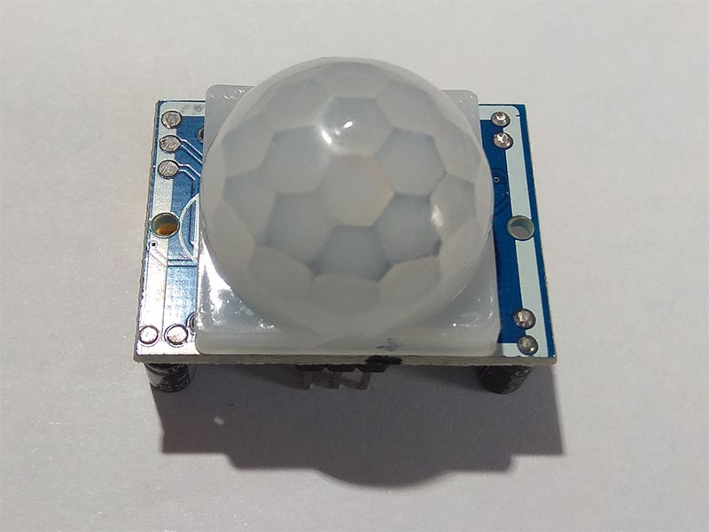
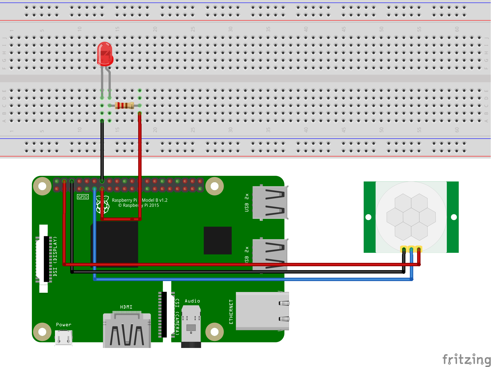
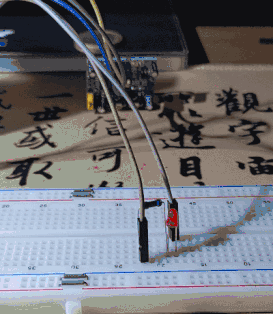
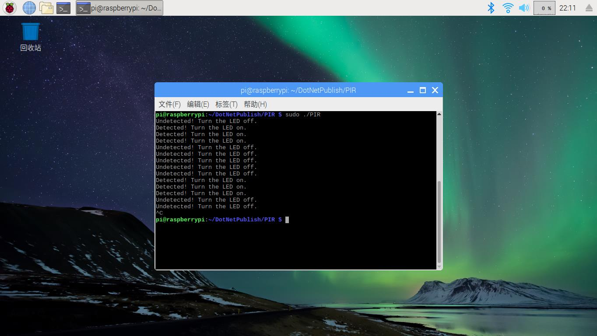

* [GPIO 的使用]()
   * [什么是 GPIO]()
   * [相关类]()
   * [人体红外传感器实验]()

## 什么是 GPIO

GPIO 是 General Purpose Input Output 的缩写，即“通用输入输出”。 Raspberry Pi 有两列 GPIO 引脚， Raspberry Pi 通过这两行引脚进行一些硬件上的扩展，与传感器进行交互等等。


<p style="text-align:center;margin-bottom:25px;color:gray"><small>Raspberry Pi B+/2B/3B/3B+/Zero 引脚图</small></p>

简单的讲，每一个 GPIO 引脚都有两种模式：输出模式（OUTPUT）和输入模式（INPUT）。输出模式类似于一个电源，Raspberry Pi 可以控制这个电源是否向外供电，比如打开外部的 LED 小灯，当然最有用的还是向外部设备发送信号。和输出模式相反，输入模式是接收外部设备发来的信号。其中还包含两种特殊的输入模式：上拉输入（INPUT_PULLUP）和下拉输入（INPUT_PULLDOWN）。上拉输入就是内部的上拉电阻接 VCC ，将该引脚设置为高电平，下拉输入则相反。

GPIO 通常采用标准逻辑电平，即高电平和低电平，用二进制 0 和 1 表示。在这两值中间还有阈值电平，即高电平和低电平之间的界限。Arduino 会将 -0.5 ~ 1.5 V 读取为低电平，3 ~ 5.5 V 读取为高电平， Raspberry Pi 未查到相关资料。GPIO 还可用于中断请求，即设置 GPIO 为输入模式，值达到相应的要求时进行中断。

## 相关类

GPIO 操作主要依赖于 `GpioController` 类  。这个类位于 **System.Device.Gpio** 名称空间下。

### GpioController

```C#
// GpioController 即 GPIO 控制器
// GPIO 引脚依靠 GpioController 初始化
public class GpioController : IGpioController, IDisposable
{
    // 构造函数
    public GpioController();
    // PinNumberingScheme 即引脚编号方案，是一个枚举类型，包含 Board 和 Logical 两个值。 
    // 可以看上方的 Raspberry Pi 引脚图，以 GPIO 17 为例，如果实例化时选 Logical ，那么打开引脚时需要填写 17。
    // 如果实例化时选 Board ，那么打开引脚时需要填写右侧灰色方框内的值，即 11 。
    public GpioController(PinNumberingScheme numbering);
    // GpioDriver 用于指定要使用的 GPIO 驱动，比如 libgpiod 或 sysfs
    public GpioController(PinNumberingScheme numberingScheme, GpioDriver driver);


    // 方法
    // 打开 GPIO 引脚
    // pinNumber 需要填写和 PinNumberingScheme 相对应的值。
    // PinMode 是设置 GPIO 的模式，如输入、输出、上拉、下拉
    public void OpenPin(int pinNumber, PinMode mode);
    // 关闭 GPIO 引脚
    public void ClosePin(int pinNumber);
    // 判断某个引脚是否打开
    // 注意：引脚连续打开会抛出异常
    public bool IsPinOpen(int pinNumber); 

    // 读取指定引脚的值
    public PinValue Read(int pinNumber);
    // 向指定的引脚写入值
    public void Write(int pinNumber, PinValue value);

    // 为指定引脚的值改变时注册回调（即上文中提到的 GPIO 中断）
    // PinEventTypes 是值改变的类型，包括上升沿（Rising，0->1）和下降沿（Falling，1->0），注意当设置为 None 时不会触发
    // PinChangeEventHandler 为回调事件
    public void RegisterCallbackForPinValueChangedEvent(int pinNumber, PinEventTypes eventTypes, PinChangeEventHandler callback);
    // 为指定引脚的值改变时注销回调
    public void UnregisterCallbackForPinValueChangedEvent(int pinNumber, PinChangeEventHandler callback);
}
```

## 人体红外传感器实验

人体红外传感器是基于周围区域的红外热来检测运动的，也称被动红外传感器（Passive Infra-Red, PIR）。这里使用的是 HC-SR501 。当传感器检测到人体时，LED 小灯亮，当传感器未检测到人体时，LED 小灯灭。

### 传感器图像


<p style="text-align:center;margin-bottom:25px;color:gray"><small>HC-SR501</small></p>

### 硬件需求

| 名称 | 数量 |
| :--- | ---: |
| HC-SR501 | x1 |
| LED 小灯 | x1 |
| 220 Ω 电阻 | x1 |
| 杜邦线 | 若干 |

### 电路



HC-SR501
* VCC - 5V
* GND - GND
* OUT - GPIO 17 (Pin 11)

LED
* VCC & 220 Ω resistor - GPIO 27 (Pin 14)
* GND - GND

### 使用 Docker 运行示例
示例地址：<https://github.com/ZhangGaoxing/dotnet-core-iot-demo/tree/master/src/Hcsr501>

```
docker build -t pir-sample -f Dockerfile .
docker run --rm -it --device /dev/gpiomem pir-sample
```

### 代码

1. 打开 Visual Studio ，新建一个 .NET Core 控制台应用程序，项目名称为“PIR”。
2. 引入 **System.Device.Gpio** NuGet 包。
3. 新建类 **Hcsr501**，替换如下代码：

    ```C#
    public class Hcsr501 : IDisposable
    {
        private GpioController _controller;
        private readonly int _outPin;

        /// <summary>
        /// 构造函数
        /// </summary>
        /// <param name="pin">OUT Pin</param>
        public HCSR501(int outPin, PinNumberingScheme pinNumberingScheme = PinNumberingScheme.Logical)
        {
            _outPin = outPin;

            _controller = new GpioController(pinNumberingScheme);
            _controller.OpenPin(outPin, PinMode.Input);
        }

        /// <summary>
        /// 是否检测到人体
        /// </summary>
        public bool IsMotionDetected => _controller.Read(_outPin) == PinValue.High;

        /// <summary>
        /// Cleanup
        /// </summary>
        public void Dispose()
        {
            _controller?.Dispose();
            _controller = null;
        }
    }
    ```

4. 在 **Program.cs** 中，将主函数代码替换如下：

    ```C#
    static void Main(string[] args)
    {
        // HC-SR501 OUT Pin
        int hcsr501Pin = 17;
        // LED Pin
        int ledPin = 27;

        // 获取 GPIO 控制器
        using GpioController ledController = new GpioController(PinNumberingScheme.Logical);
        // 初始化 PIR 传感器
        using Hcsr501 sensor = new Hcsr501(hcsr501Pin, PinNumberingScheme.Logical);
        // 打开 LED 引脚
        ledController.OpenPin(ledPin, PinMode.Output);

        while (true)
        {
            // 检测到了人体
            if (sensor.IsMotionDetected == true)
            {
                ledController.Write(ledPin, PinValue.High);
                Console.WriteLine("Detected! Turn the LED on.");
            }
            else
            {
                ledController.Write(ledPin, PinValue.Low);
                Console.WriteLine("Undetected! Turn the LED off.");
            }

            Thread.Sleep(1000);
        }
    }
    ```

5. 发布、拷贝、更改权限、运行

### 效果图





<div style="display: block;position: relative;border-radius: 8px;padding: 1rem;background-color: #d2f9d2;color: #094409;margin: 10px">
    <p style="margin-top:0;font-weight: bold">💡&nbsp;如何改进？</p>
    <p><span>剔除主函数循环，尝试使用 RegisterCallbackForPinValueChangedEvent() 注册一个回调进行检测。</span></p>
</div>

## 参考
1. General-purpose input/output - Wikipedia：<https://en.wikipedia.org/wiki/General-purpose_input/output>
2. GPIO - Raspberry Pi Documentation：<https://www.raspberrypi.org/documentation/usage/gpio/>
3. GPIO source code：<https://github.com/dotnet/iot/tree/master/src/System.Device.Gpio/System/Device/Gpio>