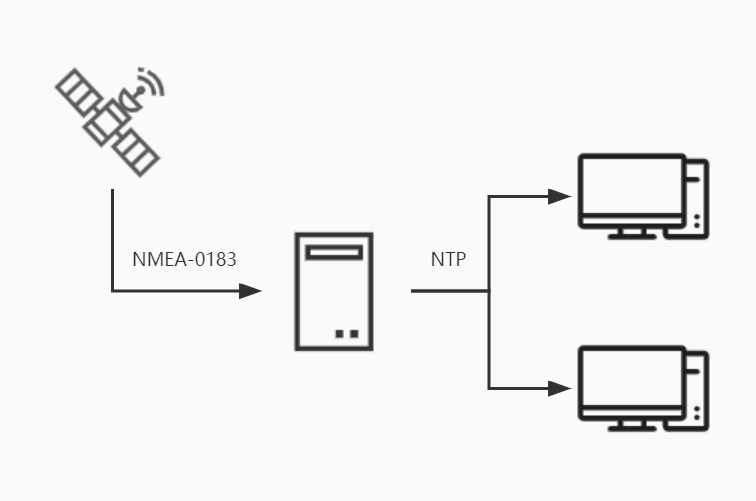
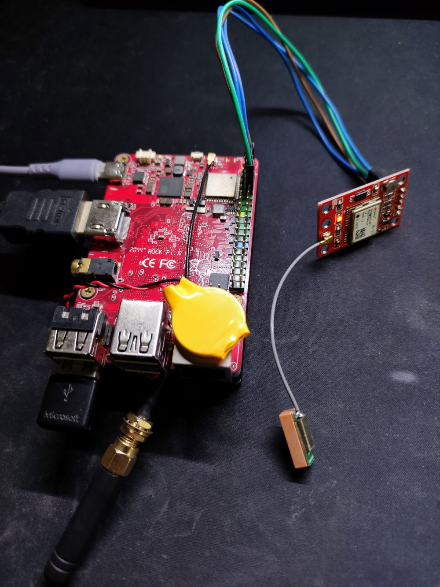
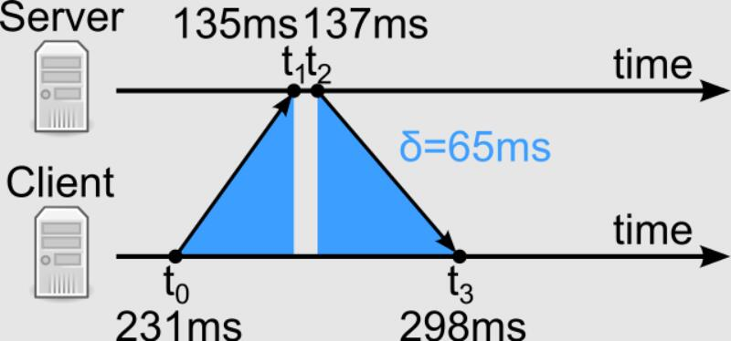
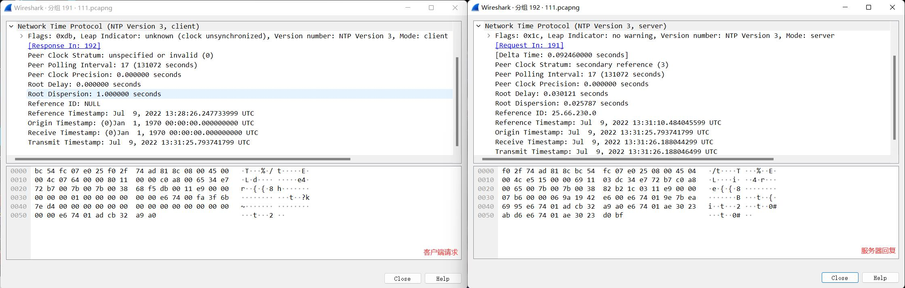
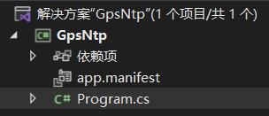
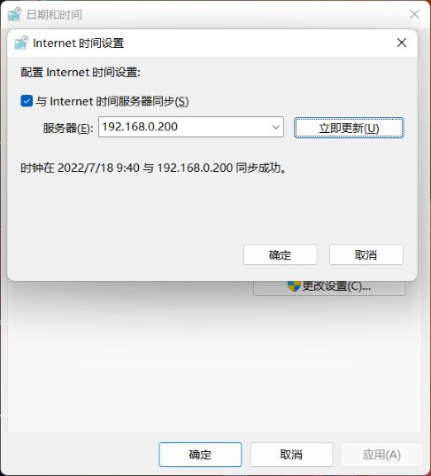

时间究竟是什么？这既可以是一个哲学问题，也可以是一个物理问题。古人对太阳进行观测，利用太阳的投影发明了日晷，定义了最初的时间。随着科技的发展，天文观测的精度也越来越准确，人们发现地球的自转并不是完全一致的，这就导致每天经过的时间是不一样的。这点误差对于基本生活基本没有影响，但是对于股票交易、火箭发射等等要求高精度时间的场景就无法忍受了。科学家们开始把观测转移到了微观世界，找到了一种运动高度稳定的原子——铯，最终定义出了准确的时间：铯原子电子跃迁 9192631770 个周期所持续的时间长度定义为 1 秒。基于这个定义制造出了高度稳定的原子钟。

时间在计算机中又是如何定义的呢？通常使用 Unix 时间戳进行表示，记录的是自公元 1970 年 1 月 1 日 0 时 0 分 0 秒以来的秒数。计算机为了维持时钟的走时，硬件层面使用晶体振荡器保障时钟的精确性（也是石英钟的原理），操作系统层面使用时钟中断去更新时间的流逝。现代计算机的硬件设计通常有独立的时钟（RTC），这源于 Intel 和微软创立的标准 High Precision Event Timer（HPET），标准指定了 10 MHz 的时钟速度，因此时钟可以获得 100 纳秒的分辨率。这也是 .NET 时间有关的类型中 Ticks 属性的由来，1秒 = 10000000 Ticks。虽然计算机的时钟已经足够精准，但也会受到环境温度的影响造成过快或者过慢的问题。为了对计算机的时钟进行校准，通常使用 NTP 协议与网络中的时间服务器进行同步。时间服务器的时间又会使用 GPS 接收机、无线电或者是原子钟进行校准。

本文将从 GPS 时间的获取、NTP 报文的编写实现一个“玩具”级别的时间同步服务器，使用 .NET 6 编写一个控制台应用程序，通过本文你可以学到：
1. 串口 `SerialPort` 类的使用；
2. 使用 `Socket` 类实现 UDP 的监听与回复；
3. 在程序中使用 `Process` 类执行命令行指令；
4. 了解 GPS 数据报文的 `NMEA-0183` 协议；
5. 了解 NTP 协议报文。



* [硬件需求]()
* [电路]()
* [GPS 数据报文的 NMEA-0183 协议]()
* [NTP 协议报文]()
* [编写代码]()
  * [项目结构]()
  * [项目依赖]()
  * [配置串口读取 GPS 数据]()
  * [实现 NTP 服务]()
* [部署应用]()
  * [发布到文件]()
  * [构建 Docker 镜像]()
* [后续工作]()

## 硬件需求

| 名称 | 描述 | 数量 |
| :-: | :-: | :-: |
| 计算机 | 可以是运行 Linux 的开发板，也可以是运行 Windows 的电脑 | x1 |
| NEO-6M | GPS 模块 | x1 |
| USB 串口 | 可选，使用 USB 串口将 GPS 模块与计算机相连 | x1 |
| 杜邦线 | 传感器与开发板的连接线 | 若干 |

## 电路



| 传感器 | 接口 | 开发板接口 |
| :-: | :-: | :-: |
| NEO-6M | TX | 开发板或 USB 串口的RX |
| | RX | 开发板或 USB 串口的TX |
| | VCC | 5V |
| | GND | GND |

## GPS 数据报文的 NMEA-0183 协议

NMEA-0183 是 GPS 设备输出信息的标准格式，是由美国国家海洋电子协会（National Marine Electronics Association）定制的标准。NMEA-0183 有多种不同的数据报文，每种都是独立的 ASCII 字符串，使用逗号隔开数据，数据流长度从 30-100 字符不等，通常以每秒间隔选择输出。NMEA-0183 协议定义的语句非常多，但是常用的或者说兼容性最广的语句只有 `$GPGGA`、`$GPGSA`、`$GPGSV`、`$GPRMC`、`$GPVTG` 等。下面给出这些常用 NMEA-0183 语句的解释。

| 帧名称 | 说明 | 最大帧长 |
| :-: | :-: | :-: |
| $GPGGA | 全球定位数据 | 72 |
| $GPGSA | 卫星 PRN 数据 | 65 |
| $GPGSV | 卫星状态信息 | 210 |
| $GPRMC | 推荐最小数据 | 70 |
| $GPVTG | 地面速度信息 | 34 |

由于我们只需要从 GPS 中获取时间信息，选择包含时间信息的 “`$GPRMC` 推荐最小数据”帧进行解析：
| $GPRMC | <1> | <2> | <3> | <4> | <5> | <6> | <7> | <8> | <9> | <10> | <11> | <12>*<13> |
| :-: | :-: | :-: | :-: | :-: | :-: | :-: | :-: | :-: | :-: | :-: | :-: | :-: |
| 帧头 | UTC 时间 | 定位状态 | 纬度 | 纬度半球 | 经度 | 经度半球 | 地面速率 | 地面航向 | UTC 日期 | 磁偏角 | 磁偏角方向 | 模式 * 校验和 |

下面以一个真实的数据帧为例 `$GPRMC,013717.00,A,3816.57392,N,10708.73951,E,0.467,,050722,,,A*78`：
| $GPRMC | 013717.00 | A | 3816.57392 | N | 10708.73951 | E | 0.467 |  | 050722 |  |  | A*78 |
| :-: | :-: | :-: | :-: | :-: | :-: | :-: | :-: | :-: | :-: | :-: | :-: | :-: |
| 帧头 | UTC 时间 01:37:17 | A=有效定位，V=无效定位 | 纬度 38 度 16.57392 分 | 北纬 | 经度 107 度 8.73951 分 | 东经 | 地面速率 0.467 节 | 航向 度 | UTC 日期 2022/07/05 | 磁偏角 度 | 磁偏角方向 | A=自主定位，N=数据无效 |

因此，通过串口读取 `$GPRMC` 数据帧后，需要解析 `<1>` 和 `<9>` 字段的值，并将其转换为 UTC 时间。

细心的你也许会发现获取到的时间信息只精确到秒，GPS 明明使用的是原子钟，这是为什么？仔细观察手中的 GPS 模块，还有一个 PPS 针脚没有使用。PPS（Pulse Per Second）是秒脉冲，一般是由 GPS 接收机或原子钟按秒发出的、宽度小于1秒、有着急升或突降边沿的脉冲信号，通常用于精确计时和测量时间。PPS 信号能精确地（亚毫秒级）指示每一秒的开始时间，但不能指示对应现实时间的哪一秒，因此只能作为辅助信号，与卫星导航信息组合使用，提供低延迟、低抖动的授时服务。很遗憾，.NET 目前没法直接操作 PPS 引脚，我们只能实现一个“玩具”级的时间同步服务器了。

## NTP 协议报文

NTP（Network Time Protocol），网络时间协议，是一种使用 UDP 的计算机之间进行时间同步的网络协议，位于 OSI 7 层网络模型中的应用层，默认使用的端口为 123。那么使用 NTP 是如何进行时间同步的呢？简单的说将发送的报文打上本机的时间戳，配合报文来回传输的时延修正本机的时间。如下图所示，可以计算出网络传输时延 $\delta$，以及客户端与服务端的时间偏移 $\theta$：



$\delta=(t_3-t_0)-(t_2-t_1)$

$\theta=\frac{(t_1-t_0)+(t_2-t_3)}{2}$

其中，$t_0$ 是请求报文传输的客户端时间戳，$t_1$ 是请求报文接收的服务器时间戳，$t_2$ 是回复报文传输的服务器时间戳，$t_3$ 是回复报文接收的客户端时间戳。客户端和服务端都有一个时间轴，分别代表着各自系统的时间，当客户端想要同步服务端的时间时，客户端会构造一个 NTP 报文发送到服务端，客户端会记下此时发送的时间 $t_0$，经过一段网络延时传输后，服务器在 $t_1$ 时刻收到报文，经过一段时间处理后在 $t_2$ 时刻向客户端返回报文，再经过一段网络延时传输后客户端在 $t_3$ 时刻收到服务器报文。这样客户端就可以校准自己的本机时间了。

在了解 NTP 同步时间的过程后，下面解析 NTP 报文具体包含的字段，一般的 NTP 报文长度为 48 字节：

| 字段 | 说明 |
| :-: | :-: |
| LI | 闰秒指示，2bit |
| Version | NTP 版本，3bit |
| Mode | 工作模式，3bit ，客户端=0b011，服务器=0b100|
| Stratum | 时钟层数，8bit，层数为 0 的设备为高精度的时钟（如原子钟），层数为 1 的设备与层数 0 的设备直接相连，…… |
| Poll Interval | 轮询时间，8bit，连续 NTP 报文之间的最大时间间隔 |
| Precision | 时钟精度，8bit |
| Root Delay | 根时延，32bit，表示在主参考源之间往返的总共时延 |
| Root Dispersion | 根离散，32bit，相对于主参考源的标称误差 |
| Reference ID | 参考源的标识，32bit，4 个字符或 IP 地址 |
| Reference Timestamp | 参考时间戳，64bit，本地时钟最后一次被更新的时间 |
| Originate Timestamp | 原始时间戳 $t_0$，64bit，客户端发送的时间 |
| Receive Timestamp | 接受时间戳 $t_1$，64bit，服务端接受到的时间 |
| Transmit Timestamp | 传送时间戳 $t_2$，64bit，服务端发送的时间 |

**其中要注意的是 NTP 时间戳的起始时间是 `1900-01-01 00:00:00`，而不是 Unix 时间戳的起始时间 `1970-01-01 00:00:00`。**

下面是使用 Wireshark 抓取的 Windows 时钟同步的 NTP 报文：



## 编写代码

项目地址：https://github.com/ZhangGaoxing/gps-ntp

### 项目结构

创建一个控制台应用和类库，项目结构如下：



### 项目依赖

添加如下 NuGet 包引用：

```xml
<ItemGroup>
   <PackageReference Include="System.IO.Ports" Version="6.0.0" />
</ItemGroup>
```

### 配置串口读取 GPS 数据

绝大部分 GPS 模块每秒会通过串口输出 NMEA-0183 协议报文，因此我们只需要通过串口读取需要的时间数据即可。此环节包含 3 个步骤：
1. 初始化串口；
2. 读取 `$GPRMC` 数据帧的内容，提取时间信息；
3. 更新系统时间。

#### 初始化串口

使用串口时最重要的属性是波特率，请查阅对应 GPS 模块的数据手册，这里使用的 NEO-6M 模块的波特率是 9600。串口的名称取决于你的连接方式，在 Linux 中串口对应的驱动文件在 `/dev` 目录下，使用内置串口可能的文件名称为 `ttySx`，使用 USB 串口可能的文件名称为 `ttyUSBx`，在 Windows 中串口的名称为 `COMx`，其中 `x` 表示的是数字编号。

```csharp
// 使用的串口名称
const string SERIAL_NAME = "/dev/ttyUSB0";
using SerialPort gps = new SerialPort(SERIAL_NAME)
{
    BaudRate = 9600,
    Encoding = Encoding.UTF8,
    ReadTimeout = 500,
    WriteTimeout = 500,
};
```

#### 从串口中获取数据

从串口中读取数据时使用的是 `SerialPort` 类中的 `DataReceived` 事件。事件（event）可以理解为一种广播，当完成某种操作后向外发送通知。即串口接收到数据后，触发数据处理事件。

```csharp
gps.DataReceived += GpsFrameReceived;

/// <summary>
/// GPS 报文处理
/// </summary>
void GpsFrameReceived(object sender, SerialDataReceivedEventArgs e)
{
    // TODO：读取 `$GPRMC` 数据帧；提取时间；更新系统时间
}
```

由于 GPS 模块输出的不只有 `$GPRMC` 数据帧，因此需要在处理事件中判断帧头以及帧的有效性。

```csharp
void GpsFrameReceived(object sender, SerialDataReceivedEventArgs e)
{
    string frame = gps.ReadLine();

    if (frame.StartsWith("$GPRMC"))
    {
        // $GPRMC,UTC 时间,定位状态,纬度,纬度半球,经度,经度半球,速度,航向,UTC 日期,磁偏角,磁偏角方向,指示模式*校验和
        // $GPRMC,013717.00,A,3816.57392,N,10708.73951,E,0.467,,050722,,,A*78
        string[] field = frame.Split(',');

        // 帧数据有效
        if (!field[12].StartsWith("N"))
        {
            // TODO：提取时间；更新系统时间
        }
    }
}
```

在验证 `$GPRMC` 数据帧有效后，根据帧解析提取对应字段的时间信息。

```csharp
void GpsFrameReceived(object sender, SerialDataReceivedEventArgs e)
{
    string frame = gps.ReadLine();

    if (frame.StartsWith("$GPRMC"))
    {
        string[] field = frame.Split(',');

        if (!field[12].StartsWith("N"))
        {
            // 获取 GPS 时间
            string time = field[1][0..6];
            string date = field[9];
            DateTime utcNow = DateTime.ParseExact($"{date}{time}", "ddMMyyHHmmss", CultureInfo.InvariantCulture);

            // TODO：更新系统时间
        }
    }
}
```

#### 更新系统时间

由于 .NET 并不提供修改系统时间的操作，因此我们要使用间接的方式修改系统时间。一种方式是使用 P/Invoke 调用 C++ 的函数，这种方式可以精确的修改时间，但涉及引用、数据类型转换，过于复杂，和本入门指南不符。这里使用的是运行命令行指令的方式修改系统的时间，但修改时间的精度只能精确到秒。在 Windows 中使用 `PowerShell` 的 `Set-Date` 命令，在 Linux 中使用 `date` 命令。

```csharp
/// <summary>
/// 更新系统时间
/// </summary>
void UpdateSystemTime(DateTime time)
{
    ProcessStartInfo processInfo;
    if (RuntimeInformation.IsOSPlatform(OSPlatform.Windows))
    {
        processInfo = new ProcessStartInfo
        {
            FileName = "powershell.exe",
            Arguments = $"Set-Date \"\"\"{time.ToLocalTime().ToString("yyyy-MM-dd HH:mm:ss")}\"\"\"",
            RedirectStandardOutput = true,
            UseShellExecute = false,
            CreateNoWindow = true,
        };
    }
    else
    {
        processInfo = new ProcessStartInfo
        {
            FileName = "date",
            Arguments = $"-s \"{time.ToLocalTime().ToString("yyyy-MM-dd HH:mm:ss")}\"",
            RedirectStandardOutput = true,
            UseShellExecute = false,
            CreateNoWindow = true,
        };
    }

    var process = Process.Start(processInfo);
    process.WaitForExit();
}
```

最终报文处理事件由以下代码构成：

```csharp
void GpsFrameReceived(object sender, SerialDataReceivedEventArgs e)
{
    string frame = gps.ReadLine();

    if (frame.StartsWith("$GPRMC"))
    {
        string[] field = frame.Split(',');

        if (!field[12].StartsWith("N"))
        {
            string time = field[1][0..6];
            string date = field[9];
            DateTime utcNow = DateTime.ParseExact($"{date}{time}", "ddMMyyHHmmss", CultureInfo.InvariantCulture);

            UpdateSystemTime(utcNow);

            // 记录时钟最后一次被更新的时间
            lastUpdatedTime = utcNow;
        }
    }
}
```

使用 `gps.Open();` 打开串口后就可以获取时间数据了。

### 实现 NTP 服务

下面使用 `Socket` 类实现一个简单的 UDP 服务器，用于监听和回复 NTP 报文。

#### 初始化 UDP 服务

```csharp
// NTP 服务初始化
using Socket ntpServer = new Socket(AddressFamily.InterNetwork, SocketType.Dgram, ProtocolType.Udp);
IPEndPoint ip = new IPEndPoint(IPAddress.Any, 123);
ntpServer.Bind(ip);
```

#### 监听和回复 NTP 报文

在后台新建一个进程用于监听 NTP 请求报文：

```csharp
new Thread(NtpFrameReceived)
{
    IsBackground = true
}.Start();

/// <summary>
/// NTP 报文接收与回复
/// </summary>
void NtpFrameReceived()
{
    // 存储接收到的 NTP 请求报文
    Span<byte> receiveFrame = stackalloc byte[48];

    while (true)
    {
        // 接收请求报文
        EndPoint clientPoint = new IPEndPoint(IPAddress.Any, 0);
        ntpServer.ReceiveFrom(receiveFrame, ref clientPoint);
        DateTime receiveTime = DateTime.UtcNow;

        // TODO：回复 NTP 报文
    }
}
```

根据帧解析生成 NTP 回复报文：

```csharp
/// <summary>
/// 生成 NTP 报文
/// </summary>
Span<byte> GenerateNtpFrame(Span<byte> receivedFrame, DateTime receiveTime)
{
    Span<byte> ntpFrame = stackalloc byte[48]
    {
        0x1c, 0x01, 0x11, 0xe9, 0x00, 0x00, 0x00, 0x00,
        0x00, 0x01, 0x00, 0x00, 0x00, 0x00, 0x00, 0x00,
        0x00, 0x00, 0x00, 0x00, 0x00, 0x00, 0x00, 0x00,
        0x00, 0x00, 0x00, 0x00, 0x00, 0x00, 0x00, 0x00,
        0x00, 0x00, 0x00, 0x00, 0x00, 0x00, 0x00, 0x00,
        0x00, 0x00, 0x00, 0x00, 0x00, 0x00, 0x00, 0x00,
    };

    // Client Transmit Timestamp => Server Origin Timestamp
    for (int i = 0; i < 8; i++)
    {
        ntpFrame[24 + i] = receivedFrame[40 + i];
    }

    // 本机时钟最后更新时间
    long referenceTicks = (lastUpdatedTime - ntpStart).Ticks;
    uint referenceTimeInt = (uint)(referenceTicks / TICK_2_SECOND);
    uint referenceTimeFract = (uint)(referenceTicks % TICK_2_SECOND);
    var referenceTimeIntByte = BitConverter.GetBytes(referenceTimeInt);
    var referenceTimeFractByte = BitConverter.GetBytes(referenceTimeFract);

    // 接收报文时间
    long receiveTicks = (receiveTime - ntpStart).Ticks;
    uint receiveTimeInt = (uint)(receiveTicks / TICK_2_SECOND);
    uint receiveTimeFract = (uint)(receiveTicks % TICK_2_SECOND);
    var receiveTimeIntByte = BitConverter.GetBytes(receiveTimeInt);
    var receiveTimeFractByte = BitConverter.GetBytes(receiveTimeFract);

    // 发送报文时间
    long transmitTicks = (DateTime.UtcNow - ntpStart).Ticks;
    uint transmitTimeInt = (uint)(receiveTicks / TICK_2_SECOND);
    uint transmitTimeFract = (uint)(receiveTicks % TICK_2_SECOND);
    var transmitTimeIntByte = BitConverter.GetBytes(receiveTimeInt);
    var transmitTimeFractByte = BitConverter.GetBytes(receiveTimeFract);

    if (BitConverter.IsLittleEndian)
    {
        for (int i = 0; i < 4; i++)
        {
            ntpFrame[19 - i] = referenceTimeIntByte[i];
            ntpFrame[23 - i] = referenceTimeFractByte[i];

            ntpFrame[35 - i] = receiveTimeIntByte[i];
            ntpFrame[39 - i] = receiveTimeFractByte[i];

            ntpFrame[43 - i] = transmitTimeIntByte[i];
            ntpFrame[47 - i] = transmitTimeFractByte[i];
        }
    }
    else
    {
        for (int i = 0; i < 4; i++)
        {
            ntpFrame[16 + i] = referenceTimeIntByte[i];
            ntpFrame[20 + i] = referenceTimeFractByte[i];

            ntpFrame[32 + i] = receiveTimeIntByte[i];
            ntpFrame[36 + i] = receiveTimeFractByte[i];

            ntpFrame[40 + i] = transmitTimeIntByte[i];
            ntpFrame[44 + i] = transmitTimeFractByte[i];
        }
    }

    return ntpFrame.ToArray();
}
```

最终报文请求与回复由以下代码构成：

```csharp
void NtpFrameReceived()
{
    Span<byte> receiveFrame = stackalloc byte[48];

    while (true)
    {
        EndPoint clientPoint = new IPEndPoint(IPAddress.Any, 0);
        ntpServer.ReceiveFrom(receiveFrame, ref clientPoint);
        DateTime receiveTime = DateTime.UtcNow;

        // 回复 NTP 报文
        Span<byte> sendFrame = GenerateNtpFrame(receiveFrame, DateTime.UtcNow);
        ntpServer.SendTo(sendFrame, clientPoint);
        DateTime sendTime = DateTime.UtcNow;
    }
}
```

将上述代码进行整合就构成了基于 GPS 的 NTP 时间同步服务器。

## 部署应用

### 发布到文件

1. 切换到 `GpsNtp` 项目运行发布命令：
```
dotnet publish -c release -r linux-x64 --no-self-contained
```
2. 将发布后的文件通过 FTP 等方式复制到 Linux 开发板；
3. 为 `GpsNtp` 文件增加可执行权限
```
sudo chmod +x GpsNtp
```
4. 运行程序
```
sudo ./GpsNtp
```

### 构建 Docker 镜像

1. 在项目的根目录中创建 `Dockerfile`，并将整个项目复制到 Linux 开发板中：
```Dockerfile
FROM mcr.microsoft.com/dotnet/core/sdk:6.0-focal AS build
WORKDIR /app

# publish app
COPY src .
WORKDIR /app/GpsNtp
RUN dotnet restore
RUN dotnet publish -c release -r linux-arm -o out

# run app
FROM mcr.microsoft.com/dotnet/core/runtime:6.0-focal AS runtime
WORKDIR /app
COPY --from=build /app/GpsNtp/out ./

ENTRYPOINT ["dotnet", "GpsNtp.dll"]
```
3. 切换到项目目录，构建镜像：
```
docker build -t gps-ntp -f Dockerfile .
```
4. 运行镜像：
```
docker run --rm -it --device /dev/ttySx gps-ntp
```

程序运行后，使用 Windows 时间同步服务进行一下测试。


