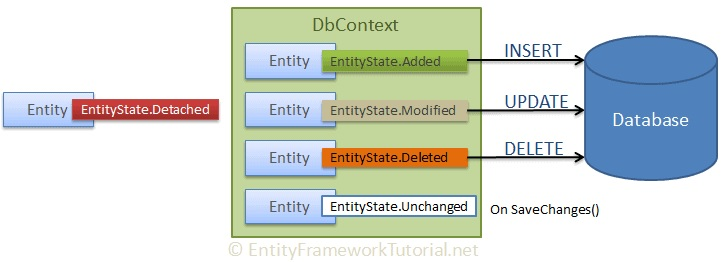

由于 EF Core 的实体跟踪特性，和其他 ORM 框架不同，使得实体数据在内存中具有“状态”（EntityState）这一属性，EF 对实体的更改并不会直接写入数据库中。本章将详细介绍实体在内存中的不同状态，并以实例的方式介绍 EF Core 中的增删改查操作。

[TOC]

## 实体的状态

在 EF Core 中每一条实体数据都拥有状态属性，使用 `Microsoft.EntityFrameworkCore.EntityState` 类枚举表示实体的状态：

1. `Detached`：实体尚未被 DbContext 跟踪；
2. `Unchanged`：实体从数据库中查询以来尚未进行更改；
3. `Added`：实体将要被新增；
4. `Modified`：实体从数据库中查询后已进行修改；
5. `Deleted`：实体将要从数据库中删除。

DbContext 在调用 `DbContext.SaveChanges()` 方法后，通过对实体状态的判断对数据库进行相应的操作，生成并执行 `INSERT`、`UPDATE` 和 `DELETE` 命令。对具有 `Added` 状态的实体执行新增操作，对具有 `Modified` 状态的实体执行更新操作，对具有 `Deleted` 状态的实体执行删除操作，对处于 `Detached` 和 `Unchanged` 状态的实体不做任何操作。



| 实体状态 | 由 `DbContext` 跟踪 | 存在于数据库中 | 实体被修改 | `SaveChanges()` 的操作 |
| :-: | :-: | :-: | :-: | :-: |
| Detached | 否 | - | - | - |
| Unchanged | 是 | 是 | 否 | - |
| Added | 是 | 否 | - | 新增 |
| Modified | 是 | 是 | 是 | 修改 |
| Deleted | 是 | 是 | - | 删除 |

## 增删改查（CRUD）


### 新增 Create


### 修改 Update


### 删除 Delete


### 查询 Query


### 将实体附加到数据库上下文

如果对 `DbContext` 配置不跟踪实体，查询到的实体对象 `DbContext` 都是不被跟踪的，这样做的唯一好处是可以获得更快的查询速度

```sql
UPDATE report_type SET created_dt = @p0, creator_id = @p1, description = @p2, is_deleted = @p3, modified_dt = @p4, modifier_id = @p5, name = @p6
WHERE cd = @p7;

UPDATE report_type SET name = @p0
WHERE cd = @p1;
```
