[TOC]

## 什么是 MicroPython

MicroPython 是一个基于 Python 3.4 的高效实现，它专为微控制器和嵌入式系统设计。它提供了一个小型的 Python 环境，包含了一些标准库的部分，并且能够在资源受限的设备上运行。MicroPython 支持交互式编程（REPL）、任意精度整数、列表解析、生成器、异常处理等高级功能，使开发者可以在边缘设备上编写和运行复杂的程序。

与 MicroPython 类似的 CircuitPython，也是一种运行在微控制器上的 Python 技术。它是由一家美国设计制造开源电子硬件的公司 Adafruit 推动的，基于 MicroPython 的 Folk 版本，所以 CircuitPython 的很多内容和 MicroPython 是相似的。关键的区别是 CircuitPython 对 Adafruit 的开发版以及传感器的支持更好，Adafruit 基本上对推出的每一款传感器都提供了相关的 CircuitPython 包，更方便初学者以及 DIY。但 MicroPython 的社区更大，设备支持的更广泛。至于学习哪一项技术，也就仁者见仁，智者见智了。

## 环境配置

支持 MicroPython 的微控制器有很多，这里使用 Raspberry Pi Pico。Raspberry Pi Pico 是树莓派基金会发布了首款微控制器级产品，基于 RP2040 芯片构建，售价仅 4 美元。Pico 家族目前由 Raspberry Pi Pico（最左），Pico H（左），Pico W（右）和 Pico WH（最右）组成。

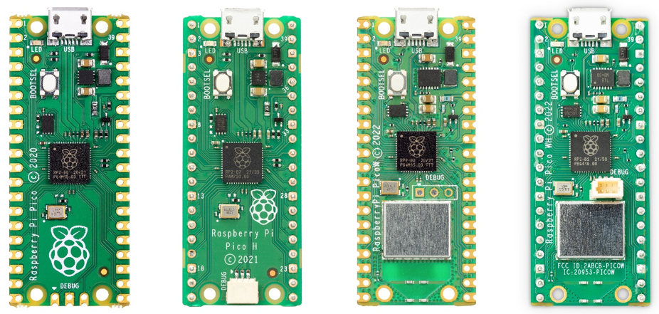

Pico 使用了一颗 RP2040 芯片：
* 采用 40nm 工艺制造，双核 Cortex-M0+ @ 133MHz
* 芯片内置 264KB SRAM 和 2MB 的板载闪存
* 30 个 GPIO 引脚，其中 4 个可用作模拟输入
* 2 个 UART、2 个 SPI 控制器、2 个 I2C 控制器、16 个 PWM 通道
* 支持 UF2 的 USB 大容量存储启动模式，用于拖放式编程
* ……

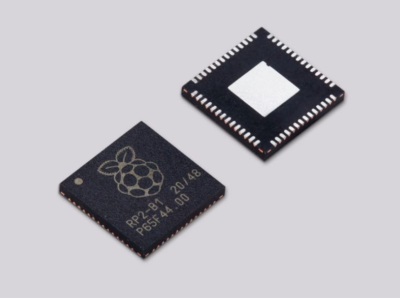

### 硬件部分

1. 在 MicroPython 官网下载适用于 Pico 的 `UF2` 文件：<https://micropython.org/download/RPI_PICO>
2. 按住 Pico 开发板上的 `BOOTSEL` 按钮，然后将 Pico 插入电脑的 USB 接口，然后松开 BOOTSEL 按钮。
3. Pico 会被识别为大容量存储设备。
4. 将下载的 MicroPython UF2 文件放入 RPI-RP2 卷上。Pico 将自动重启，然后 MicroPython 就会开始运行。


### 软件部分

MicroPython 的开发可以使用 Thonny IDE，但是作为一款开源软件其表明了开发者的政治立场，我是比较反感的。在这里使用 Visual Studio Code 配置一个最小开发环境。

1. 首先下载安装 Visual Studio Code：<https://code.visualstudio.com>
2. 选择 “扩展”，在 “扩展：商店” 的搜索栏中输入“RT-Thread MicroPython”，点击 “安装”。由于 MicroPython 是运行在微控制器上的，到这里最小开发环境就配置完成了。
    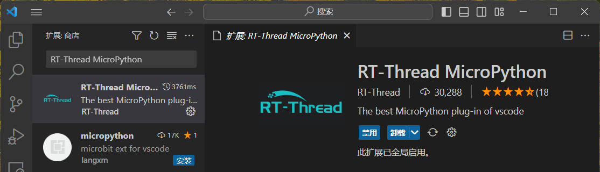
3. 如果想使用代码补全功能还需要 Python 环境。访问 Python 官网，下载 Python 安装包：<https://www.python.org/downloads>
4. 在 VS Code 中安装 Python 插件：“Python”、“Pylance”。
    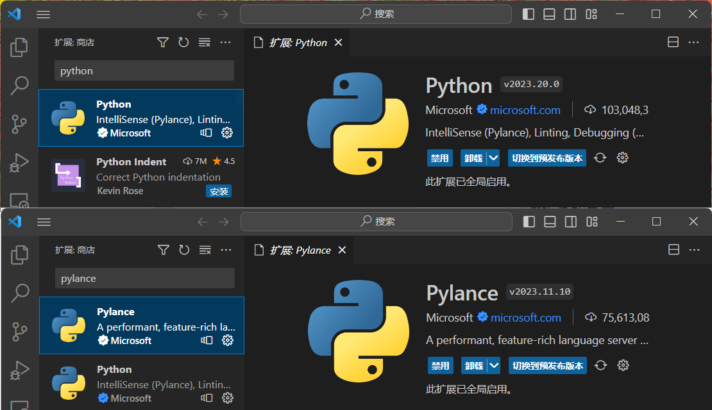

在安装完 MicroPython 插件后，VS Code 底部会出现几个按钮，其中：

1.  用于创建、打开 MicroPython 项目。
    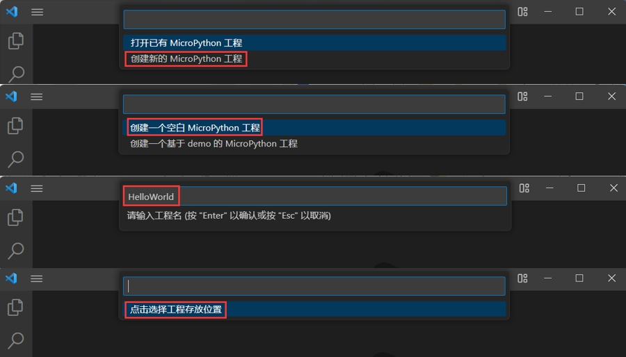
2.  用于连接 Pico 设备。
    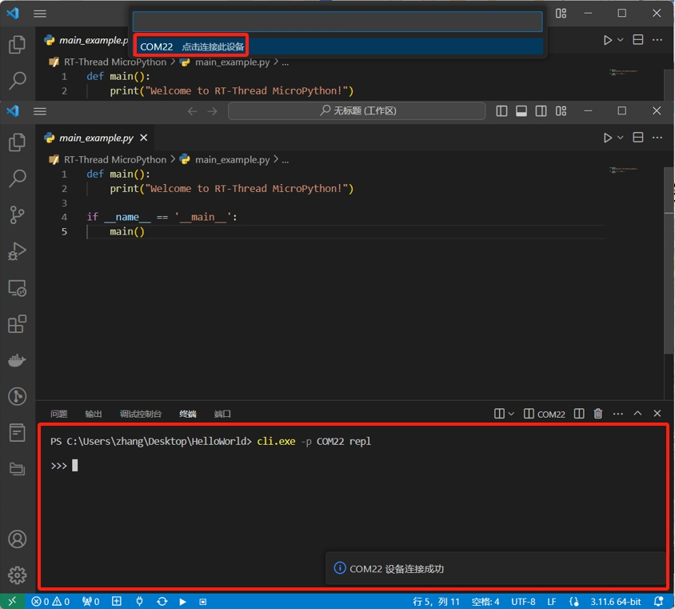
3.  用于运行 MicroPython 程序。
4.  用于停止运行 MicroPython 程序。
5.  用于将 MicroPython 项目下载至 Pico 设备。

### Hello World！

根据上面的步骤，新建一个 MicroPython 项目，打开 `main_example.py` 文件。

```py
def main():
    print("Welcome to RT-Thread MicroPython!")
    
if __name__ == '__main__':
    main()
```

与 C、Java、C# 等编译型语言不同，Python 是一种解释型脚本语言，运行时是从模块顶行开始，逐行进行翻译执行。所以 Python 中并不需要一个统一的 `main()` 作为程序的入口。`if __name__ == '__main__'` 是一个标志，象征着 Java 等语言中的程序主入口。

点击“运行”按钮后，第一个程序就在 Pico 开发板上运行了，在 Python 解释器中可以观察到运行结果。

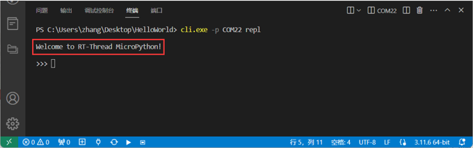

## Blink

当人们想到“编程”时，通常很自然地想到软件。然而，编程不仅仅是和软件有关，它还可以通过硬件编程影响现实物理世界。这也是所谓的 **物理计算**。顾名思义，物理计算就是用你的程序控制现实世界中的事物——硬件，而不是软件。比如在空调上设置程序，改变可编程恒温器上的温度；或者在微波炉上选择不同烹饪模式这些设备通常是由单片机控制的。

### Pico 的引脚

Pico 通过其边缘一系列的引脚与硬件通信。这些引脚大多是作为 **通用输入/输出（GPIO）** 引脚工作，它们可以被编程作为输入或输出，并没有自己的固定用途。有些引脚有额外的功能和与更复杂的硬件通信的模式，另一些则有一个固定的目的，比如供电和提供连接的功能。

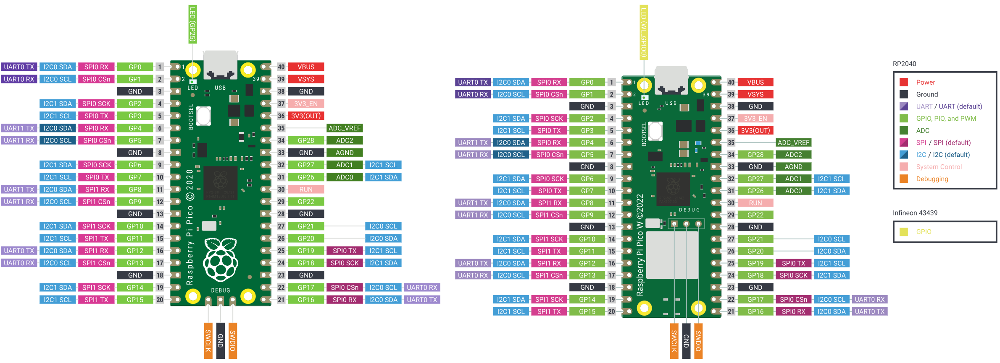

Pico 的 40 个引脚被标记在板的底部，这些标签帮助你记住编号是如何排序的。浅绿色标签的 `GPxx`，就是 GPIO 引脚，大多数情况下需要对其编程，对外部硬件进行操作。

| 引脚 | 作用 | 描述 |
| :-: | :-: | :-: |
| 3V3 | 3.3V 电源 | Pico 内部运行的电压相同 |
| VSYS | 2-5V 电源 | 直接连接到 Pico 内部电源的引脚 |
| VBUS | 5V 电源 | 从 Pico 的 USB 端口获取的 5V 电源 |
| GND | 0V 接地 | 接地连接 |
| GPxx | 通用输入/输出引脚 | 程序可以使用的GPIO引脚，标记为GP0-GP28 |
| ADCx | 模数转换引脚 | 既可以用作模拟输入，也可以用作数字输入或输出，但不能同时用作两者 |
| ADC_VREF | 模数转换器参考电压 | 模拟输入设置参考电压的特殊输入引脚 |
| AGND | 模数转换器 0V 参考电压 | 特殊的接地引脚 |
| UARTx | 串口协议引脚 | 与其他设备进行串口通信 |
| I2Cx | I2C总线协议引脚 | 与其他设备进行 I2C 通信 |
| SPIx | SPI 协议引脚 | 与其他设备进行 SPI 通信 |
| RUN | 启用或禁用 Pico | 其他微控制器可以通过此引脚控制 Pico |

### 常见电子元件

#### 面包板

面包板（breadboard）是搭建基础电路原型的试验产品。最初人们都是在类似于切面包的木板上做电路搭接试验，随着技术发展直到 1970 年无需焊接的插接板变得普及，面包板慢慢的变成了这种便捷电路原型实验产品的统称。面包板上下区是横向5位相通，一般用于接电源和接地，中间区域是纵向5位相通，通常用于放置电路元件和电路连接线。

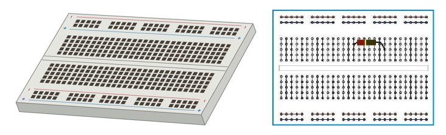

#### 跳线

跳线（Jumper Wire），也被称为杜邦线。有三种不同的类型：公对母线（M2F）、母对母线（F2F）以及公对公线（M2M）。如果不使用面包板，可以使用 F2F 将组件连接到 Pico，如果使用面包板，可以将组件插入到面包板中，使用 M2M 进行连接。

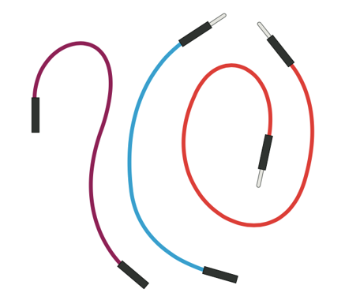

#### 开关

开关（Switch），也称为瞬时开关、轻触开关，通常有两条或四条脚可供选择，按下按钮时相当于导线被连通。按钮是一种输入设备，可以告诉程序它是否被按下，然后执行任务。另一种常见的开关类型是锁定开关，按下开关时一直保持活动状态，直到再次切换它。

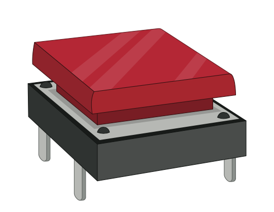

#### 发光二极管

发光二极管（LED）是输出设备，从洗衣机、微波炉等小家电的指示灯，到路边的路灯、房间的吊灯等，LED 灯随处可见。LED 有各种各样的形状、颜色、工作电压，为了防止其被击穿，通常会配合限流电阻使用。二极管具有单向导电性，只有在连接正确的电极方向时，才能正常工作。LED 的长端为阳极，接在电源正极，短端为阴极，接在电源负极。

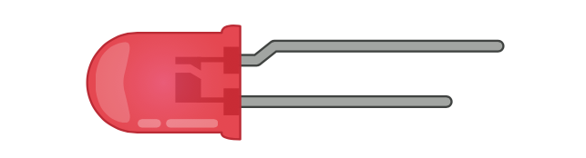

#### 电阻

电阻是控制电流流动的元件，使用欧姆 Ω 为单位，欧姆的值越大，提供的阻力就越大。

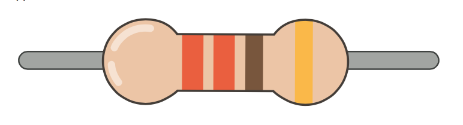

有些电阻的表面涂有一些带有颜色的环状标志，称为色环电阻。色环具有特殊的意义，即电阻的值。要读取电阻的值，从左侧第一个环开始，在表的 1st/2nd Band 列中查找它的颜色，得到第一个和第二个数字。例如下图电阻有两个橙色色环，橙色值为 3，总共为 33。第三个色环的颜色表示乘数，即需要用前两个色环得到的数乘以什么数才能得到电阻的实际值。例如下图电阻的棕色色环，意思是 ×10。前两个色环是 33，棕色色环是 x10，`33x10=330` 这样就得到了电阻的值。最后一个环是电阻的容差，表示实际阻值与标称阻值之间的偏离程度，对于大多数业余项目来说，容差并不是很重要。

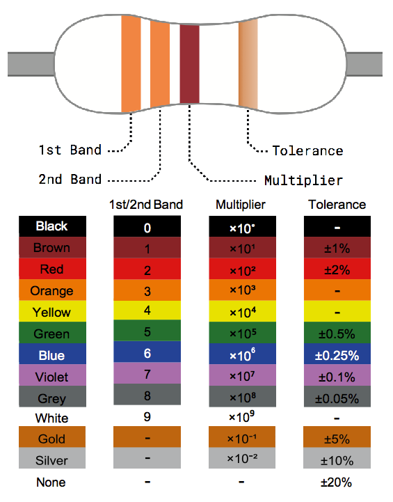

### 使你的 Pico 闪烁

就像在屏幕上打印“Hello, World!”是学习编程语言的第一步一样，在电路板上通过编程点亮 LED 灯是学习物理计算的经典入门方式。Blink 译为“眨眼、闪烁”，下面通过编程使 Pico 开发板上的 LED 灯不断闪烁，模拟“眨眼”的效果。

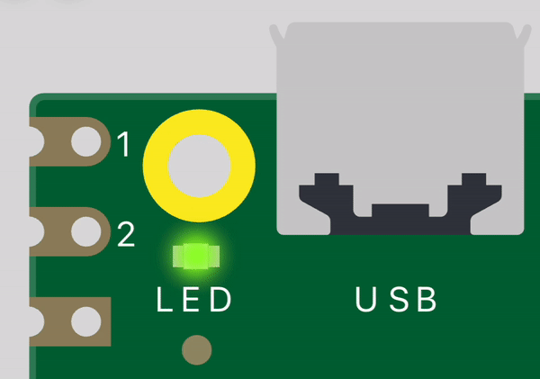

Pico 上的这颗 LED 连接到 GPIO 引脚之一的 GP25，正因为这个引脚已经用于在板上连接 LED，所以 Pico 边缘引出的 GPIO 引脚上就没有 GP25 了。这个 LED 的工作原理和其它任何 LED 一样:
* 通电时，它会发光
* 当它断电时，熄灭。

下面新建一个 MicroPython 项目来控制这颗 LED 的闪烁。首先导入 `machine` 包。

```py
import machine
```

这很短的一行代码对于在 Pico 上使用 MicroPython 是非常关键的，它包含了 MicroPython 与 Pico 通信所需的所有指令，扩展了用于物理计算的语言。如果没有这一行命令，我们是无法控制 Pico 的任何 GPIO 引脚，自然也无法使板载的 LED 点亮。

接着使用 `Pin()` 函数获取引脚。

```py
led = machine.Pin(25, machine.Pin.OUT)
```

这一行定义了一个名为 `led` 的对象，调用 `machine` 库中的 `Pin()` 函数，这个函数是专为处理 GPIO 引脚。第一个参数，25，是我们要设置的引脚的编号; 第二个 `machine.Pin.Out` 是告诉 Pico 引脚应该用作输出而不是输入。

<div style="display: block;position: relative;border-radius: 8px;padding: 1rem;background-color: #d2f9d2;color: #094409;margin: 10px">
    <p style="margin-top:0;font-weight: bold">💡&nbsp;提示</p>
    <p><span>也可以在代码中使用字符串常量 <code>'LED'</code> 特指与板载 LED 相连的引脚：<code>led = machine.Pin('LED', machine.Pin.OUT)</code></span></p>
</div>

上面的代码只是完成了引脚的设置，但还不能点亮LED，要点亮LED，还需要通过程序告诉 Pico 把引脚打开。

```py
led.value(1)
```

前面的行创建了对象 `led`，作为 GP25 引脚上的输出，这一行将该对象的值设定为 `1`（二进制中的高电平），用于'on'，它也可以将值设置为 `0`，用于'off'。

```py
led.value(0)
```

如何才能让 LED 闪烁起来呢？我们可以在 LED 的开与关之间加入一点延时。像导入 `machine` 库一样，将 `utime` 库导入到程序中。

```py
import utime
```

这个库处理与时间有关的所有事情。在开启 LED 的代码后面添加一段延时，调用 utime 库中的 `sleep()` 函数，这将使程序暂停输入的秒数，这里暂停 `1s`。

```py
utime.sleep(1)
```

创建一个循环后，就可以让 LED 闪烁了。

```py
import machine
import utime

def main():
    led = machine.Pin(25, machine.Pin.OUT)
    
    while True:
        led.value(1)
        utime.sleep(1)
        led.value(0)
        utime.sleep(1)
    
if __name__ == '__main__':
    main()
```

<div style="display: block;position: relative;border-radius: 8px;padding: 1rem;background-color: #d2f9d2;color: #094409;margin: 10px">
    <p style="margin-top:0;font-weight: bold">💡&nbsp;提示</p>
    <p><span>也可以使用 <code>toggle()</code> 函数把引脚当作开关一样对待：<code>led.toggle()</code></span></p>
</div>

## 部署

上面的程序都是运行在 REPL 环境中，当断电重置 Pico 时，程序会消失。怎样才能将程序持久化到 Pico 中呢？在新建 MicroPython 项目时，默认提供了一个文件名为 `main_example.py` 的文件，通常会在这个文件里编写代码，进行调试。当代码可以烧录时，将文件重命名为 `main.py`，点击“同步”按钮，或者右击想要下载到 Pico 中的文件或文件夹点击“下载该文件/文件夹到设备上”，下载完成后断电重启，这样 Pico 就会执行 `main.py` 中的代码。

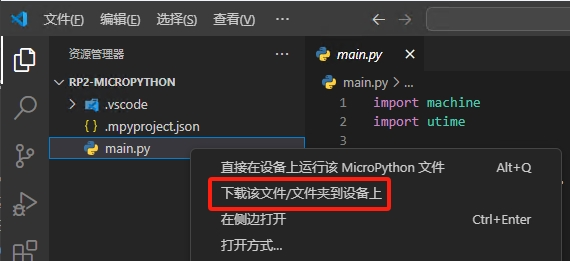

有些时候可能会将问题代码固化到 Pico 中，这时可以烧录重置 Flash 的 UF2 `flash_nuke.uf2` 清空 Flash，重置完成后还需要重新烧录 MicroPython 的 UF2，下载地址：<https://datasheets.raspberrypi.com/soft/flash_nuke.uf2>

## 参考
1. Raspberry Pi Documentation：<https://www.raspberrypi.com/documentation/microcontrollers/micropython.html>
2. Getting started with Raspberry Pi Pico：<https://projects.raspberrypi.org/en/projects/getting-started-with-the-pico>
3. 树莓派 Pico 实验室：<https://pico.nxez.com>
