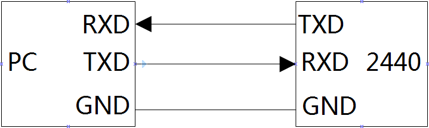
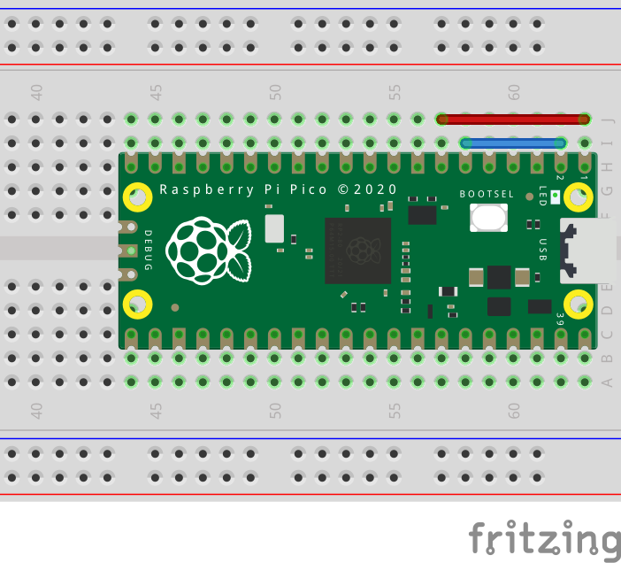

[TOC]

## 什么是串口
串口是串行接口的简称，这是一个非常大的概念，在嵌入式中串口通常指 **UART**（Universal Asynchronous Receiver/Transmitter，通用异步收发器）。使用串口进行的通信叫做串行通信，与之相对的一个概念是并行通信。串行通信是指数据一位一位的按顺序传输，而并行通信则是多位数据同时传输。如下图所示，`DATA BUS` 到 `UART 1` 之间是并行通信，`UART 1` 到 `UART 2` 之间是串行通信。


串口通信的数据帧格式如下图所示，通常一帧共包括 10 位：1 个起始位，8 个数据位和 1 个停止位。有一些特殊的数据帧在停止位前面包含 1 位的奇偶校验位，还有的停止位有 2 个比特。其中**起始位为低电平**（0），标志着数据传输的开始；**停止位为高电平**（1），表示数据帧传输结束；数据位则为实际发送的数据，使用高低电平来表示二进制信息，如果发送的内容是文本，那么这段数据为字符的二进制编码（ASCII、UTF-8等）。数据传输的速率我们使用**波特率**（Baud Rate）来表示，即每秒钟传送的码元符号的个数。比如数据传输速率为 9600 字符/s，那么这时的波特率为 9600。


设备进行串口通信时，设备的连线如下图所示，两个设备的信号线，即发送端（TXD）与接收端（RXD）交叉相连，并且需要共地。在 Raspberry Pi Pico 的引脚上共引出了 2 组串口，即 `UART0` 与 `UART1`。



## 使用方法

使用 MicroPython 控制 GPIO 要使用 `machine` 包中的 `UART` 类。

```py
from machine import UART
```

通过构造函数实例化获取串口对象。

```py
UART(id: int, baudrate: int = 115200, ...)
```

* `id` 指串口的编号。对于 Pico 而言只能是 0 或 1。
* `baudrate` 用于设置波特率。
* `tx`、`rx` 参数指定要使用的 tx、rx 引脚。
* `parity` 设置校验位。`None` 无，`0` 偶数，`1` 奇数。
* `stop` 设置停止位的长度。
* `timeout` 设置读取超时时间，单位为毫秒。

使用 `init()` 方法可以修改串口的设置，方法参数与构造函数的参数一致。常见的用法参考下面的例子：

```py
uart0 = UART(0, 9600)   # 实例化串口 0，波特率为 9600
uart0.init(115200, bits=8, parity=None, stop=1) # 修改串口 0 设置
uart1 = UART(1, baudrate=9600, tx=Pin(8), rx=Pin(9))    # 实例化串口 1 并指定引脚
```

实例化串口对象后，使用 `write(buf: bytearray)` 方法发送数据，发送成功会返回字节数，失败则返回 `None`。

```py
data = b'hello world'
uart0.write(data)
```

接收数据使用 `read(nbytes: Optional[int] = None)` 方法，`nbytes` 设置接收的字节数，读取成功会返回一个字节对象，读取超时则返回 `None`。也可以使用 `readline()` 方法读取一行。

```py
data = bytes()
data = uart0.read(10)
print(data.decode('utf-8')) # 解码成 utf-8 字符串
print(uart0.readline()) # 从串口读取一行
```

有些时候需要判断串口中有没有数据，可以使用 `any()` 方法。

```py
while uart0.any() > 0:
    print(uart0.readline())
```

使用 `deinit()` 方法可关闭串口。

```py
uart0.deinit()
```

## 板载串口相互通信

Pico 上有两组串口 `UART0` 与 `UART1`，因此可以使用这两组串口相互通信。

### 硬件需求

| 名称 | 数量 |
| :-: | :-: |
| 杜邦线 | 若干 |

### 电路



* UART0 RX(GP1) - UART1 TX(GP4)
* UART0 TX(GP0) - UART1 RX(GP5)

### 代码

```py
from machine import UART, Pin
import utime

# 初始化串口
uart0 = UART(0, baudrate=9600, tx=Pin(0), rx=Pin(1))
uart1 = UART(1, baudrate=9600, tx=Pin(4), rx=Pin(5))
# 串口 1 发送数据
txData = b'hello world'
uart1.write(txData)
utime.sleep_ms(100)
# 串口 2 检测接收数据
rxData = bytes()
while uart0.any() > 0:
    rxData += uart0.read(1)
# 解码并打印
print(rxData.decode('utf-8'))
```

## 参考
1. Universal asynchronous receiver-transmitter - Wikipedia：<https://en.wikipedia.org/wiki/Universal_asynchronous_receiver-transmitter>
2. Serial Communication - Wikipedia：<https://en.wikipedia.org/wiki/Serial_communication>
3. BASICS OF UART COMMUNICATION：<http://www.circuitbasics.com/basics-uart-communication/>
4. 波特率 - 百度百科：<https://baike.baidu.com/item/%E6%B3%A2%E7%89%B9%E7%8E%87>
5. MicroPython documentation：<https://docs.micropython.org/en/latest/library/machine.UART.html>