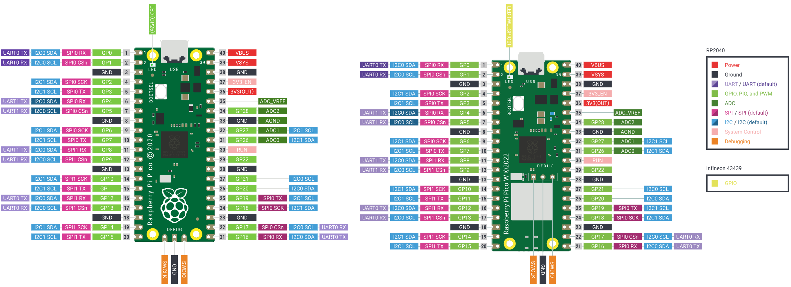
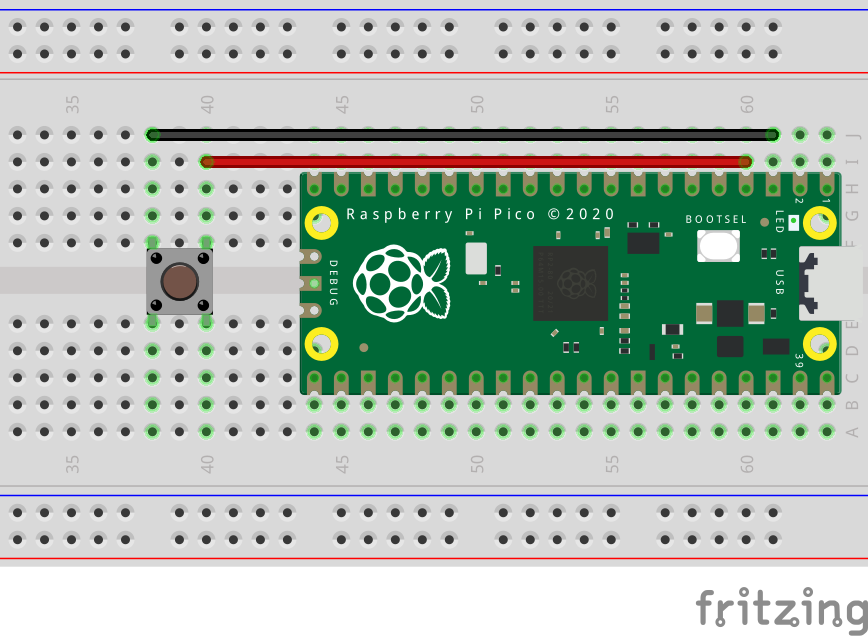

[TOC]

## 什么是 GPIO

GPIO 是 General Purpose Input Output 的缩写，即“通用输入输出”。 Raspberry Pi Pico 左右两侧各有一列 GPIO 引脚， Pico 通过这两列引脚进行一些硬件上的扩展，与传感器进行交互等等。



简单的讲，每一个 GPIO 引脚都有两种模式：**输出模式**（OUTPUT）和**输入模式**（INPUT）。输出模式类似于一个电源，Pico 可以控制这个电源是否向外供电，比如打开外部的 LED 小灯，当然最有用的还是向外部设备发送信号。和输出模式相反，输入模式是接收外部设备发来的信号。GPIO 通常采用标准逻辑电平，即高电平和低电平，用二进制 0 和 1 表示。在这两个值中间还有阈值电平，即高电平和低电平之间的界限。Arduino 会将 -0.5 ~ 1.5 V 读取为低电平，3 ~ 5.5 V 读取为高电平， Pico 未查到相关资料。GPIO 还可用于中断请求，即设置 GPIO 为输入模式，值达到相应的要求时进行中断。

输入模式还包含两种特殊的输入模式：**上拉输入**（INPUT_PULLUP）和**下拉输入**（INPUT_PULLDOWN）。上拉输入就是芯片内部的电阻连接 VCC ，将该引脚设置为高电平状态。在没有外部信号输入的情况下，上拉输入可以保持引脚处于高电平状态，从而避免了信号的不确定性。在上拉输入模式中，如果外部输入了低电平信号，由于电阻的存在，引脚会读取到低电平，但不会产生大电流。这样，单片机可以轻易稳定地读取低电平信号。上拉输入的优势在于它可以提供稳定的高电平状态，直到检测到明确的低电平输入。下拉输入则相反，是将芯片内部的电阻连接 GND，将引脚设置为低电平状态，也是为了避免了信号的不确定性。上拉、下拉输入模式适用于一些特定场合，例如需要检测按钮按压（通常连接到低电平）或其他二进制开关状态。

## 使用方法

使用 MicroPython 控制 GPIO 要使用 `machine` 包中的 `Pin` 类。

```py
from machine import Pin
```

要获取引脚对象，我们先来看一看构造函数有哪些参数。

```py
Pin(id: Any, mode: int = -1, pull: int = -1, *, value: Optional[int] = None, drive: Optional[int] = None, alt: Optional[int] = None)
```

* `id` 是指引脚的编号。对于 Pico 而言就是引脚图中 `GPxx` 中的数字编号，这个参数是必填的。
* `mode` 是指引脚的模式。常用的有 `Pin.IN` 输入模式，`Pin.OUT` 输出模式。
* `pull` 用来设置引脚输入的模式。`Pin.PULL_UP` 上拉输入，`Pin.PULL_DOWN` 下拉输入，`None` 不设置。
* `value` 设置输出引脚的默认状态。参数可以是任何转换为​​布尔值的变量，`1` 默认输出高电平，`0` 默认输出低电平。
* `drive` 指定引脚的输出功率。参数可以是 `Pin.LOW_POWER`、`Pin.MED_POWER`、`Pin.HIGH_POWER`，实际的输出功率还是取决于具体的引脚。

常见的用法参考下面的例子：

```py
pin0 = Pin(0, mode=Pin.IN)  # 设置 0 号引脚为输入模式
pin1 = Pin(1, mode=Pin.IN, pull=Pin.PULL_UP)   # 设置 1 号引脚为上拉输入模式
pin2 = Pin(2, mode=Pin.OUT, value=0)   # 设置 2 号引脚为输出模式，默认输出低电平
```

在获取到引脚对象后，可以使用 `Pin.value(x: Optional[int] = None)` 方法设置或读取引脚的值。参数 `x` 可以是任何转换为​​布尔值的变量，`1` 输出高电平，`0` 输出低电平。当不传递参数 `x` 时，方法为读取引脚的值。

```py
pin2.value(1)   # 设置 2 号引脚输出高电平
print(pin1.value()) # 读取 1 号引脚的输入值
```

当想要重新改变引脚的设置时，除了重新实例化对象之外，还可以使用 `Pin.init(value: int, drive: int, alt: int, mode: int = -1, pull: int = -1)`、`Pin.mode(mode: Optional[int])`、`Pin.pull(pull: Optional[int])` 对引脚重新设置。

```py
pin0.mode(Pin.OUT)  # 设置 0 号引脚为输出模式
pin1.pull(Pin.PULL_DOWN)  # 设置 1 号引脚为下拉输入模式
pin2.init(mode=Pin.IN, pull=Pin.PULL_UP)    # 设置 2 号引脚为上拉输入模式
```

有些时候当外部输入信号发生改变时，单片机需要执行一些操作，比如按下开关时亮灯。这就需要用到**中断**，中断是来自设备的一个信号，通知处理器暂停当前正在执行的任务，以优先处理该信号代表的工作，在处理完中断请求后，处理器才会恢复之前的任务。要设置引脚的中断，可以使用 `Pin.irq(handler: Callable[[Pin], Any] = None, trigger: int = (IRQ_FALLING | IRQ_RISING), priority: int = 1, wake: int = None)` 方法。


* `handler` 是中断触发时要调用的方法。
* `trigger` 用来设置触发中断的条件。`Pin.IRQ_FALLING` 下降沿（高电平变低电平）触发，`Pin.IRQ_RISING` 上升沿（低电平变高电平）触发，`Pin.IRQ_LOW_LEVEL` 低电平触发，`Pin.IRQ_HIGH_LEVEL` 高电平触发。这些值可以一起进行或运算，从而设置多条件触发。
* `priority` 中断的优先级，值越大优先级越高。
* `wake` 设置中断唤醒系统的电源模式。`machine.IDLE` 空闲状态，可以快速恢复设备的运行，`machine.SLEEP` 浅睡眠状态，唤醒后从请求睡眠的点恢复执行，`machine.DEEPSLEEP` 深睡眠状态，唤醒后类似硬重置，程序从头执行。

```py
# 设置 0 号引脚为上拉输入模式
pin = Pin(0, machine.Pin.IN, machine.Pin.PULL_UP)   
# 定义一个中断处理函数
def irq_handler(pin, event):
    print(pin, event)
# 设置引脚的中断，触发条件为下降沿
pin.irq(handler=irq_handler, trigger=machine.Pin.IRQ_FALLING)
```

## 使用微动开关点亮板载 LED

给 Pico 接入一个外部开关，当按下开关时，板载的 LED 小灯点亮。

### 硬件需求

| 名称 | 数量 |
| :-: | :-: |
| 微动开关 | x1 |
| 杜邦线 | 若干 |

### 电路



微动开关
* 引脚 1 - GP2
* 引脚 2 - GND

### 代码

将 Pico 的 `GP2` 引脚配置成上拉输入模模式，将开关的一端与 `GP2` 连接。由于上拉输入在没有外部输入时读取始终为高电平信号，因此开关的另一段需要连接 `GND`。当按下开关时 `GP2` 引脚会检测到低电平信号。那么怎样去不断检测开关是否被按下？最简单的一种方式，可以使用 while 循环，在循环体内不停读取 `GP2` 的值，从而判断开关的状态。具体的代码如下。

```py
from machine import Pin

# 初始化引脚
button = Pin(2, mode=Pin.IN, pull=Pin.PULL_UP)
led = Pin('LED', mode=Pin.OUT)

# 在循环体内不停读取，当检测到低电平信号时，表明开关被按下
while True:
  if not button.value():
    led.value(1)
  else:
    led.value(0)
```

这个程序虽然能够实现效果，但也有一个致命问题：不断的循环使得程序只能检测开关是否被按下，而做不了任何其他事情。使用中断可以将检测与 CPU 处理完全分离，无需不断扫描引脚的值。当硬件检测到信号更改时，中断都会在信号变化后触发功能执行。具体的代码如下。

```py
from machine import Pin

# 初始化引脚
button = Pin(2, mode=Pin.IN, pull=Pin.PULL_UP)
led = Pin('LED', mode=Pin.OUT)

# 定义一个中断服务方法，当检测到低电平信号时，改变 LED 的状态
def button_isr(pin):
  led.value(not led.value())

# 配置中断，下降沿触发
button.irq(trigger=Pin.IRQ_FALLING, handler=button_isr)

while True:
  pass  # 可以做一些其他事情
```

在运行上面的代码时，你可能已经注意到，按下按钮后 LED 存在闪烁的现象，这是为什么？是代码的错误吗？这是因为按钮并不是一个完美的开关，由于机械触点的弹性作用，一个按键开关在闭合时不会马上稳定地接通，在断开时也不会一下子断开，因而在闭合及断开的瞬间均伴随有一连串的“抖动”。信号从稳定状态移动，经过不稳定的过渡状态，最终到达新的稳定状态，如下图所示。


针对这种抖动现象，可以通过硬件进行去除，比如利用电容的充放电平滑的补偿信号的抖动。也可以利用软件进行去抖，信号抖动的状态有时间限制，添加一个短暂的延时再去检测电平信号。

```py
from machine import Pin
import utime

last_time = 0 # 记录按下的时间

# 初始化引脚
button = Pin(2, mode=Pin.IN, pull=Pin.PULL_UP)
led = Pin('LED', mode=Pin.OUT)

# 定义一个中断服务方法，当检测到低电平信号时，改变 LED 的状态
def button_isr(pin):
  global last_time
  new_time = utime.ticks_ms()
  # 延时
  if (new_time - last_time) > 50: 
    led.value(not led.value())
    last_time = new_time

# 配置中断，下降沿触发
button.irq(trigger=Pin.IRQ_FALLING, handler=button_isr)

while True:
  pass  # 可以做一些其他事情
```

## 参考

1. MicroPython documentation：<https://docs.micropython.org/en/latest/library/machine.Pin.html>
2. MicroPython for Kids：<https://www.coderdojotc.org/micropython/advanced-labs/02-interrupt-handlers>
