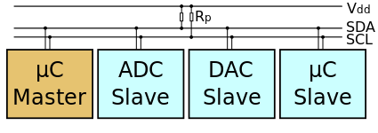

[TOC]

## 什么是 I<sup>2</sup>C 总线

I<sup>2</sup>C 总线（Inter-Integrated Circuit Bus）是设备与设备间通信方式的一种。它是一种串行通信总线，由飞利浦公司在 1980 年代为了让主板、嵌入式系统或手机用以连接低速周边设备而发展。I<sup>2</sup>C 总线包含两根信号线，一根为信号线 SDA ，另一根为时钟线 SCL 。总线上可以挂载多个设备，以 7 位 I<sup>2</sup>C 地址为例，总线上最多可以挂载 2<sup>7</sup> - 1 个设备，即 127 个，地址 `0x00` 不用（类似于网络中的广播地址）。I<sup>2</sup>C 还包括一个子集 SMBus （System Management Bus），是 1995 年由 Intel 提出的。为什么说是子集，是因为 SMBus 是 I<sup>2</sup>C 的简化版，电气特性和传输速率等方面上略有不同。下图展示了一个 I<sup>2</sup>C 主设备和三个 I<sup>2</sup>C 从设备的示意图，总线上只能有一个主设备，而通常情况下你的主机（如 Raspberry Pi，Arduino）就是主设备，传感器为从设备。



在 I2C 设备的数据手册中有两种常见的地址形式，一种是 7 位地址，一种是 8 位地址。7 位地址用于标识从设备，8 位地址在 7 位地址的基础上包括了读/写位，第 8 位 0 表示写 1 表示读。例如某设备的 7 位地址为 0x49(0b0100_1001)，想要向该设备写入数据，8 位写操作地址为 0x93(0b1001_0011)，从该设备读取数据，8 位读操作地址为 0x92(0b1001_0010)。在编程时通常会使用 7 位地址标识设备，读写操作的地址转换由程序进行处理，若数据手册中给的是 8 位 I2C 地址需要右移 1 位使用。

I<sup>2</sup>C 总线也并不是那么完美。因为 I<sup>2</sup>C 只有两根信号线，与 SPI 的四根信号线相比，传输速率上并不占优，而且数据在同一时间内只能向一个方向传输。但反过来看，I<sup>2</sup>C 总线的最大优点是只需要占用两个 IO 接口，在 IO 接口数量较少的设备上也是一种优势。在 Raspberry Pi Pico 的引脚上共引出了 2 组I<sup>2</sup>C 接口，即 `I2C0` 与 `I2C1`。I<sup>2</sup>C 总线需要使用上拉电阻才可以正确的运行，电阻的阻值在 1k-10kΩ 之间，通常上拉电阻已经内置在单片机的芯片当中，例如 Raspberry Pi 的 I<sup>2</sup>C 引脚中内置了一个 1.8kΩ 的上拉电阻，在使用 I<sup>2</sup>C 总线时不必再连接一个额外的上拉电阻。

## 使用方法

使用 MicroPython 控制 I<sup>2</sup>C 要使用 `machine` 包中的 `I2C` 类。其也提供了软件 I2C 类 `SoftI2C`，可通过任意引脚模拟 I2C 通信。

```py
from machine import I2C
```

通过构造函数实例化获取 I2C 对象。

```py
I2C(id: int, scl: Pin = None, sda: Pin = None, freq: int = 400000)
```

* `id` 指 I2C 的编号。对于 Pico 而言只能是 0 或 1。
* `scl`、`sda` 参数指定要使用的 SCL、SDA 的引脚。
* `freq` 用于设置 SCL 的频率。

使用 `init()` 方法可以修改 I2C 的设置，常见的用法参考下面的例子：

```py
i2c = I2C(1, sda=Pin(2), scl=Pin(3), freq=400000)   # 实例化 I2C1
i2c.init(sda=Pin(2), scl=Pin(3), freq=500000) # 修改 I2C1 设置
```

若不清楚 I2C 总线上设备的地址，可以使用 `scan()` 方法，扫描 0x08 至 0x77 间的 I2C 地址，并返回响应的地址列表。

```py
addr = i2c.scan()
```

`I2C` 类提供了原始 I2C 总线操作，将方法组合在一起可以进行任何 I2C 事务。通常情况下与 I2C 设备通信，只是读取和写入相关的寄存器。使用 `readfrom_mem(addr: int, memaddr: int, nbytes: int)` 读取寄存器，`addr` 为从设备的 7 位地址，`memaddr` 为寄存器地址，`nbytes` 设置读取数据的长度。使用 `writeto_mem(addr: int, memaddr: int, buf)` 写入寄存器，`addr` 为从设备的 7 位地址，`memaddr` 为寄存器地址，`buf` 为要写入的数据。

```py
address = 0x53 # I2C 地址
register = 0x32 # 寄存器地址

i2c.writeto_mem(address, register, bytearray([0x08, 0x09]))   # 向寄存器写入两个字节的数据
data = i2c.readfrom_mem(address, register, 2)   # 从寄存器读取两个字节的数据
```

## 参考

1. I2C - Wikipedia：<https://en.wikipedia.org/wiki/I%C2%B2C>
2. I2C总线 - 百度百科：<https://baike.baidu.com/item/I2C总线/918424>
3. SMBus - 百度百科：<https://baike.baidu.com/item/SMBus/1190006>
