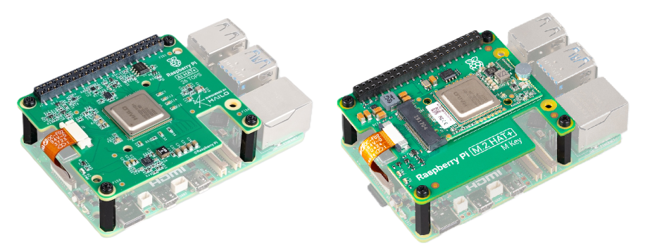
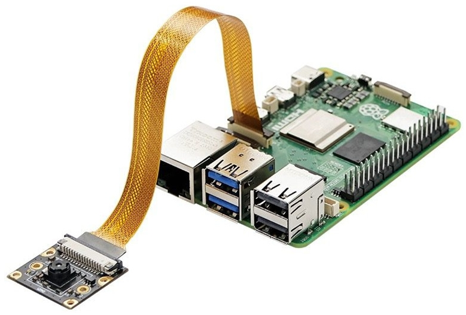
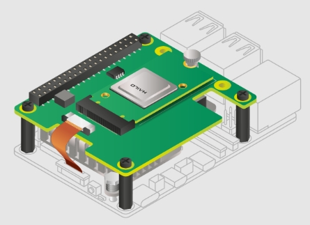
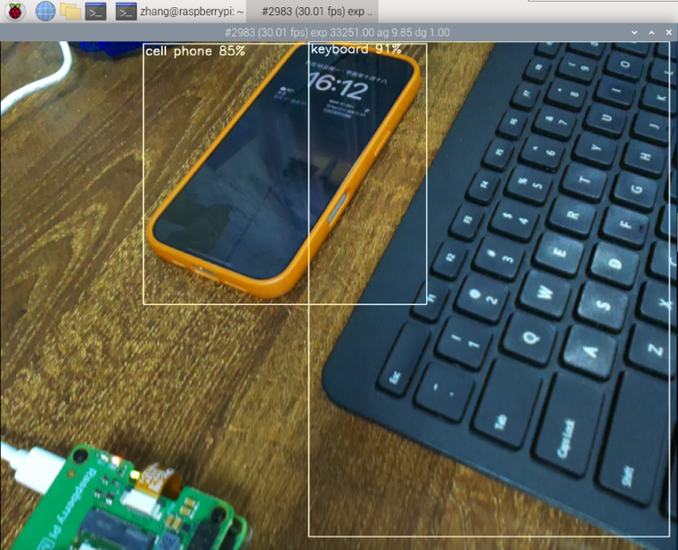

[TOC]

2024 年 6 月，Raspberry Pi AI Kit 发布，将 M.2 HAT+ 与 Hailo-8 AI 加速模块捆绑在一起，使 Raspberry Pi 具有了运行 AI 程序的能力。Hailo-8 是由以色列公司 Hailo 开发的一款高性能边缘 AI 处理器（NPU），它专为低功耗、高效率的深度学习推理任务设计，可以提供高达 26 TOPS 的计算能力，适用于各种边缘计算场景。本文主要介绍 AI Kit（AI HAT+）在 Raspberry Pi 5 上的配置和使用。



## 摄像头配置

Raspberry Pi 5 的主板上有两个 CSI 接口用于接入摄像头，其位置在有线网口后。接入摄像头时将排线的**金属面朝向有线网口位置**，插入接口。



如果是官方的摄像头模块，不需要做任何配置，即插即用。如果是第三方摄像头模块，需要修改 `/boot/firmware/config.txt` 配置文件。找到 `camera-auto-detect=1` 语句，修改为 `camera_auto_detect=0` 在文件结尾，根据摄像头型号加入以下设置语句：

| 型号 | 设置语句 |
| :-: | :-: |
| OV9281 | dtoverlay=ov9281 |
| IMX290/IMX327 | dtoverlay=imx290,clock-frequency=37125000 |
| IMX378 | dtoverlay=imx378 |
| IMX219 | dtoverlay=imx219 |
| IMX477 | dtoverlay=imx477 |
| IMX708 | dtoverlay=imx708 |

如果需要同时接入两路摄像头，可以在对应的摄像头配置语句后面加入 `cam0` 和 `cam1` 指定摄像头，例如 `dtoverlay=imx219,cam0`。

配置完成后重启，运行命令，预览摄像头并将摄像头画面显示在屏幕上。

```shell
rpicam-hello -t 0
``` 

## AI Kit 配置

Raspberry Pi 5 主板上有一个 PCIe 接口，其位置在 SD 卡槽上方。接入模块时将排线的**金属面朝向有线网口位置**，插入接口。



安装完成后需要更新系统软件以及固件。

```shell
sudo apt update && sudo apt full-upgrade
sudo rpi-eeprom-update
``` 

使用 `raspi-config` 工具启用 PCIe Gen 3.0 确保 NPU 获得最佳性能。

```shell
sudo raspi-config  # 选择 Advanced Options -> 选择 PCIe Speed -> 选择 Yes
``` 

安装 NPU 所需的软件包。

```shell
sudo apt install hailo-all
```

重启后可运行命令，检查 NPU 是否正常运行。

```shell
hailortcli fw-control identify
```

看到类似于以下内容的输出，则表示已成功。

```
Executing on device: 0000:01:00.0
Identifying board
Control Protocol Version: 2
Firmware Version: 4.18.0 (release,app,extended context switch buffer)
Logger Version: 0
Board Name: Hailo-8
Device Architecture: HAILO8L
Serial Number: HLDDLBB243301512
Part Number: HM21LB1C2LAE
Product Name: HAILO-8L AI ACC M.2 B+M KEY MODULE EXT TMP
```

## 测试

通过克隆官方的仓库 `rpicam-apps` 来运行示例程序。`rpicam` 程序实现了一个后处理框架（post-processing framework），可以使用 JSON 处理从摄像头中获取的图像。

```shell
git clone --depth 1 https://github.com/raspberrypi/rpicam-apps.git ~/rpicam-apps
```

仓库提供了对象检测、图像分割、姿态识别等主流模型的应用案例，例如使用如下命令运行 YOLOv8 的对象检测模型。

```shell
rpicam-hello -t 0 --post-process-file ~/rpicam-apps/assets/hailo_yolov8_inference.json --lores-width 640 --lores-height 640
```



## 参考
1. AI software - Raspberry Pi Documentation：<https://www.raspberrypi.com/documentation/computers/ai.html>
2. AI Kit - Raspberry Pi Documentation：<https://www.raspberrypi.com/documentation/accessories/ai-kit.html>
3. 树莓派摄像头使用方法 Camera教程：<https://www.raspi.cc/index.php?c=read&id=53&page=1>
