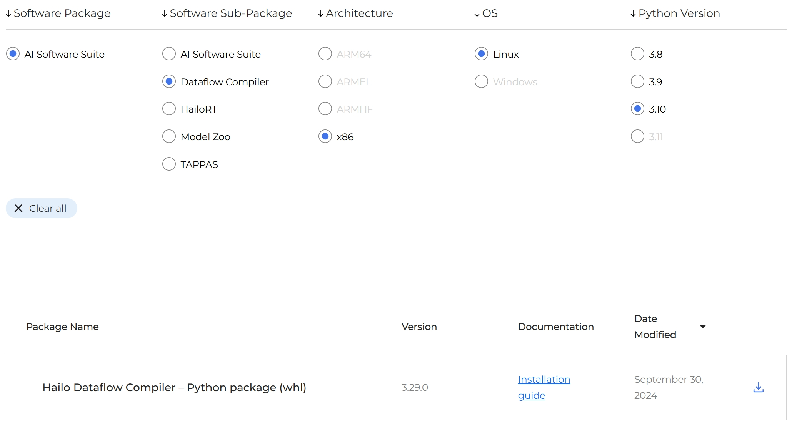
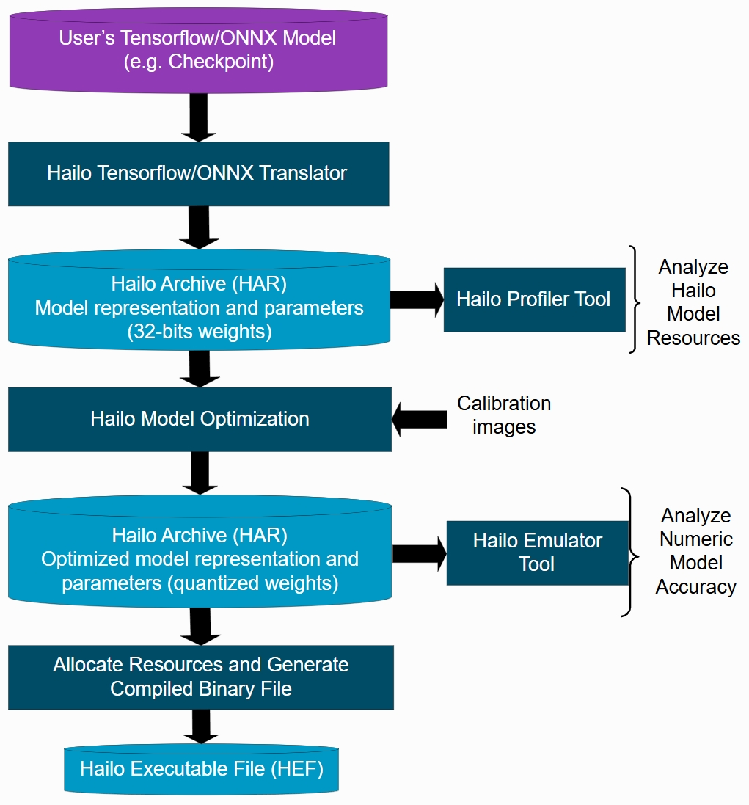

[TOC]

在上一篇博客中，探讨了如何使用 Python 和 `hailo_model_zoo` 中预编译的模型来实现目标检测。本篇博客将深入介绍如何将用户自定义训练的模型转换并优化为能够在 Hailo NPU 上高效运行的 `.hef` 模型。

## Python 环境配置

为了将自定义模型编译为 `.hef` 模型，需要安装 **Hailo Dataflow Compiler**（DFC） 工具。登录 Hailo 的网站 <https://hailo.ai/developer-zone/software-downloads>，找到对应 Python 版本的 `.whl` 文件，并按照下面的步骤创建虚拟环境并安装必要的软件包：



```shell
conda create -n hailo-model python=3.10  # 创建虚拟环境
conda activate hailo-model  # 激活虚拟环境
sudo apt install libgraphviz-dev
pip install hailo_dataflow_compiler-3.29.0-py3-none-linux_x86_64.whl  # 安装 Hailo Dataflow Compiler Python 包
```

将自定义模型转换为 `.hef` 模型需要三步：
1. 将 Tensorflow 或 ONNX 模型转换成 Hailo Archive 模型（`.har`）。
2. 将 `.har` 模型进行量化。
3. 编译为 Hailo Executable File 模型（`.hef`）。



## 转换

Tensorflow 与 ONNX 模型都可以进行转换，这里以 `yolov8n` 的 ONNX 模型为例，首先引入软件包并定义相关变量。

```python
from hailo_sdk_client import ClientRunner
import os
import cv2
import numpy as np

input_size = 640  # 模型输入的尺寸
chosen_hw_arch = "hailo8l"  # 要使用的 Hailo 硬件架构，这里是 Hailo-8L
onnx_model_name = "yolov8n"  # 模型的名字
onnx_path = "yolov8n.onnx"  # 模型的路径
hailo_model_har_path = f"{onnx_model_name}_hailo_model.har"  # 转换后模型的保存路径
hailo_quantized_har_path = f"{onnx_model_name}_hailo_quantized_model.har"  # 量化后模型的保存路径
hailo_model_hef_path = f"{onnx_model_name}.hef"  # 编译后模型的保存路径
```

接着实例化 `ClientRunner` 类，并调用 `translate_onnx_model()` 方法进行转换。

```python
runner = ClientRunner(hw_arch=chosen_hw_arch)
hn, npz = runner.translate_onnx_model(model=onnx_path, net_name=onnx_model_name)  # 将 onnx 模型转为 har
runner.save_har(hailo_model_har_path)  # 保存转换后的模型
```

在模型结构较为简单时，通常不会报错。当模型结构较为复杂时，会存在 Hailo NPU 不支持的算子，从而报错导致转换失败。NPU 支持的算子可以查询官网的数据手册，或者查看下文参考中的链接。例如在转换 YOLOv8 模型时会提示以下错误信息：

```log
hailo_sdk_client.model_translator.exceptions.ParsingWithRecommendationException: Parsing failed. The errors found in the graph are:
 UnsupportedShuffleLayerError in op /model.22/dfl/Reshape: Failed to determine type of layer to create in node /model.22/dfl/Reshape
Please try to parse the model again, using these end node names: /model.22/Concat_3
```

出现错误时有两种解决方案。一是根据报错信息，使用 Netron <https://netron.app> 查看模型结构，并修改原始模型，移除或替换 Hailo NPU 不支持的算子。二是报错信息中会推荐解决方法，在转换时绕过不支持的算子，那么 `translate_onnx_model()` 方法则需要传递额外的参数：

- `start_node_names`：原始模型中开始转换的节点（对应新模型的输入）的名称。
- `end_node_names`：原始模型中停止转换的节点（对应新模型的输出）的名称。
- `net_input_shapes`：`start_node_names` 输入的尺寸，如常见的 `[b, c, h, w]`。

节点的名称可以使用 Netron 查看，或者使用下面的程序遍历打印节点的名称。

```python
import onnx

onnx_path = "yolov8n.onnx"
model = onnx.load(onnx_path)

print("Input Nodes:")
for input in model.graph.input:
    print(input.name)
print("Output Nodes:")
for output in model.graph.output:
    print(output.name)
print("Nodes:")
for node in model.graph.node:
    print(node.name)
```

根据上面的错误信息提示，要将停止转换的节点修改为 `/model.22/Concat_3`，修改后的程序如下。

```python
hn, npz = runner.translate_onnx_model(model=onnx_path, net_name=onnx_model_name, start_node_names=["images"], end_node_names=["/model.22/Concat_3"], net_input_shapes={"images": [1, 3, input_size, input_size]})
```

程序执行后并未报错，但在最后一步编译时会出现 Hailo NPU 内存不够的情况，我们再观察一下转换时输出的日志：

```log
[info] Translation started on ONNX model yolov8n
[info] Restored ONNX model yolov8n (completion time: 00:00:00.06)
[info] Extracted ONNXRuntime meta-data for Hailo model (completion time: 00:00:00.21)
[info] NMS structure of yolov8 (or equivalent architecture) was detected.
[info] In order to use HailoRT post-processing capabilities, these end node names should be used: /model.22/cv2.0/cv2.0.2/Conv /model.22/cv3.0/cv3.0.2/Conv /model.22/cv2.1/cv2.1.2/Conv /model.22/cv3.1/cv3.1.2/Conv /model.22/cv2.2/cv2.2.2/Conv /model.22/cv3.2/cv3.2.2/Conv.
...
```

日志建议将停止转换的节点修改为 `/model.22/cv2.0/cv2.0.2/Conv /model.22/cv3.0/cv3.0.2/Conv /model.22/cv2.1/cv2.1.2/Conv /model.22/cv3.1/cv3.1.2/Conv /model.22/cv2.2/cv2.2.2/Conv /model.22/cv3`。即在 NMS 处理前将模型切割，查阅 Hailo 开发者论坛得知，Hailo NPU 不具备进行 NMS 运算的能力，这一部分将在 CPU 上运行。Hailo 的 GitHub 仓库提供了主流模型转换时结束节点的名称，具体请查看下文参考中的链接。最终，程序修改为：

```python
hn, npz = runner.translate_onnx_model(model=onnx_path, net_name=onnx_model_name, start_node_names=["images"], end_node_names=["/model.22/cv2.0/cv2.0.2/Conv", "/model.22/cv3.0/cv3.0.2/Conv", "/model.22/cv2.1/cv2.1.2/Conv", "/model.22/cv3.1/cv3.1.2/Conv", "/model.22/cv2.2/cv2.2.2/Conv", "/model.22/cv3.2/cv3.2.2/Conv"], net_input_shapes={"images": [1, 3, input_size, input_size]})
```

## 量化

模型量化（Quantization）是将深度学习模型中的权重和激活值（输出）从高精度的浮点数（如 float32）转换为低精度的数据类型（如 int8），以减少模型的存储需求、加快推理速度并降低功耗，这一过程对于将深度学习模型部署到边缘设备中特别重要。这里使用的是训练后量化，即在已经训练好的模型上直接进行量化，无需重新训练或微调，但可能会导致一些准确性的损失。

首先需要准备好量化时使用的校准数据集。校准数据集主要用于帮助确定量化参数，以尽量减少量化过程对模型性能的影响。校准数据集的质量直接影响到量化模型的最终性能，应该尽可能涵盖所有的数据变化，以确保量化后的模型在不同条件下都能有良好的泛化能力。校准数据集不需要标签，其主要用于收集每一层激活值的统计数据，例如最小值、最大值、平均值和标准差等。这些统计信息用于确定如何最佳地映射浮点数到整数，从而保持模型性能，这个过程不需要知道输入数据对应的标签，只需要了解数据的分布特性。

本篇博客用到的 YOLOv8 模型是使用 COCO 数据集训练的，下面就以此为例进行校准数据集的准备。

```python
images_path = "data/images"  # 数据集图像路径
dataset_output_path = "calib_set.npy"  # 处理完成后的保存路径

images_list = [img_name for img_name in os.listdir(images_path) if os.path.splitext(img_name)[1] in [".jpg", ".png", "bmp"]][:1500]  # 获取图像名称列表
calib_dataset = np.zeros((len(images_list), input_size, input_size, 3))  # 初始化 numpy 数组

for idx, img_name in enumerate(sorted(images_list)):
    img = cv2.imread(os.path.join(images_path, img_name))
    resized = cv2.resize(img, (input_size, input_size))  # 调整原始图像的尺寸为模型输入的尺寸
    calib_dataset[idx,:,:,:]=np.array(resized)
np.save(dataset_output_path, calib_dataset)
```

接着实例化 `ClientRunner` 类，并调用 `optimize()` 方法进行量化。

```python
calib_dataset = np.load(dataset_output_path)
runner = ClientRunner(har=hailo_model_har_path)
runner.optimize(calib_dataset)  # 量化模型
runner.save_har(hailo_quantized_har_path)  # 保存量化后的模型
```

在量化过程中还可以添加一些脚本对参数进行设置，例如 `model_optimization_flavor()` 设置量化的级别、`resources_param()` 设置模型能够使用的资源量等。`hailo_model_zoo` 仓库提供了主流模型的参数设置脚本，具体请查看下文参考中的链接。程序示例如下。

```python
alls_lines = [
    'model_optimization_flavor(optimization_level=1, compression_level=2)',
    'resources_param(max_control_utilization=0.6, max_compute_utilization=0.6, max_memory_utilization=0.6)',
    'performance_param(fps=5)'
]
runner.load_model_script('\n'.join(alls_lines))
runner.optimize(calib_dataset)
```

## 编译

最后使用 `compile()` 方法完成模型的编译。

```python
runner = ClientRunner(har=hailo_quantized_har_path)
compiled_hef = runner.compile()
with open(hailo_model_hef_path, "wb") as f:
    f.write(compiled_hef)
```

完整程序如下。

```python
from hailo_sdk_client import ClientRunner
import os
import cv2
import numpy as np

input_size = 640  # 模型输入的尺寸
chosen_hw_arch = "hailo8l"  # 要使用的 Hailo 硬件架构，这里是 Hailo-8L
onnx_model_name = "yolov8n"  # 模型的名字
onnx_path = "yolov8n.onnx"  # 模型的路径
hailo_model_har_path = f"{onnx_model_name}_hailo_model.har"  # 转换后模型的保存路径
hailo_quantized_har_path = f"{onnx_model_name}_hailo_quantized_model.har"  # 量化后模型的保存路径
hailo_model_hef_path = f"{onnx_model_name}.hef"  # 编译后模型的保存路径
images_path = "data/images"  # 数据集图像路径

# 将 onnx 模型转为 har
runner = ClientRunner(hw_arch=chosen_hw_arch)
hn, npz = runner.translate_onnx_model(model=onnx_path, net_name=onnx_model_name, start_node_names=["images"], end_node_names=["/model.22/cv2.0/cv2.0.2/Conv", "/model.22/cv3.0/cv3.0.2/Conv", "/model.22/cv2.1/cv2.1.2/Conv", "/model.22/cv3.1/cv3.1.2/Conv", "/model.22/cv2.2/cv2.2.2/Conv", "/model.22/cv3.2/cv3.2.2/Conv"], net_input_shapes={"images": [1, 3, input_size, input_size]})
runner.save_har(hailo_model_har_path)

# 校准数据集准备
images_list = [img_name for img_name in os.listdir(images_path) if os.path.splitext(img_name)[1] in [".jpg", ".png", "bmp"]][:1500]  # 获取图像名称列表
calib_dataset = np.zeros((len(images_list), input_size, input_size, 3))  # 初始化 numpy 数组
for idx, img_name in enumerate(sorted(images_list)):
    img = cv2.imread(os.path.join(images_path, img_name))
    resized = cv2.resize(img, (input_size, input_size))  # 调整原始图像的尺寸为模型输入的尺寸
    calib_dataset[idx,:,:,:]=np.array(resized)

# 量化模型
runner = ClientRunner(har=hailo_model_har_path)
alls_lines = [
    'model_optimization_flavor(optimization_level=1, compression_level=2)',
    'resources_param(max_control_utilization=0.6, max_compute_utilization=0.6, max_memory_utilization=0.6)',
    'performance_param(fps=5)'
]
runner.load_model_script('\n'.join(alls_lines))
runner.optimize(calib_dataset)
runner.save_har(hailo_quantized_har_path)

# 编译为 hef
runner = ClientRunner(har=hailo_quantized_har_path)
compiled_hef = runner.compile()
with open(hailo_model_hef_path, "wb") as f:
    f.write(compiled_hef)
```

## 参考

1. Supported operators - Hailo Community：<https://community.hailo.ai/t/supported-operators/5046/2>
2. hailo_model_zoo - GitHub：<https://github.com/hailo-ai/hailo_model_zoo/tree/master/hailo_model_zoo/cfg/networks>
3. Dataflow Compiler v3.29.0：<https://hailo.ai/developer-zone/documentation/dataflow-compiler-v3-29-0>
