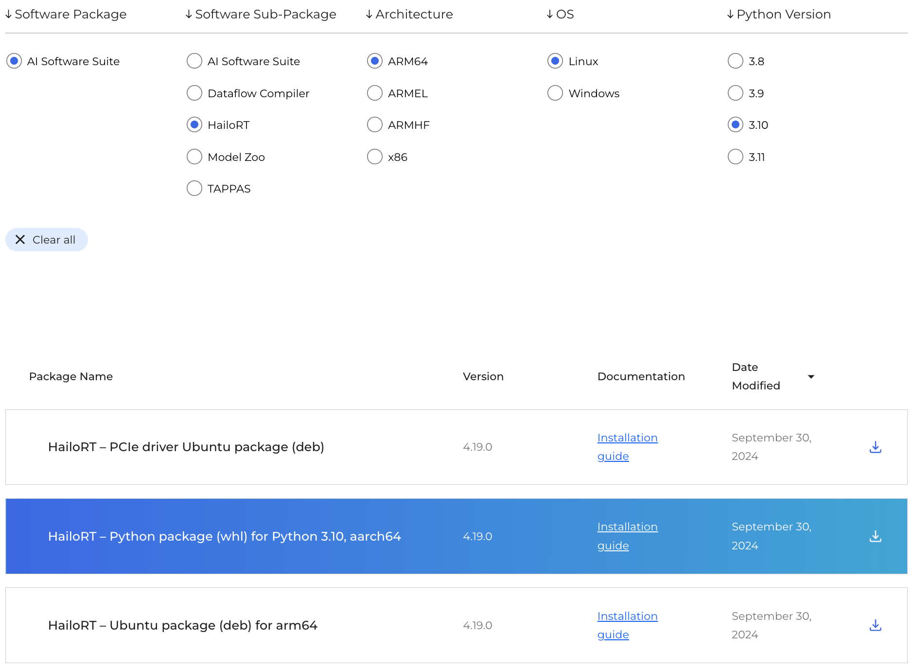
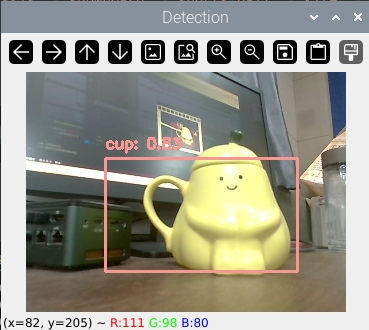

[TOC]

在上一篇博客中，探讨了使用 `rpicam-apps` 通过 JSON 文件配置并运行目标检测示例程序。虽然这种方法可以实现有效的检测，但它限制了开发者直接在代码中利用检测结果的能力。因此，在本篇博客中，将深入探讨如何借助 HailoRT Python API 调用神经处理单元（NPU），以实现在 Python 程序中的目标检测功能。

## Python 环境配置

在上一篇博客中已经安装了 `hailo-all`，这其中包含了 Hailo NPU 的所有必要组件。然而，根据硬件和操作系统需求，可能需要单独安装或更新驱动程序。对于非 Raspberry Pi 设备或当遇到驱动版本不兼容的问题时，此时可以登录 Hailo 的网站 <https://hailo.ai/developer-zone/software-downloads>，并选择适合系统的驱动程序进行下载与安装。



例如，如果正在使用基于 arm64 架构的 Ubuntu 操作系统，并且需要 4.19.0 版本的驱动，那么可以下载相应的 PCIe 驱动包和 HailoRT 包，并执行以下命令完成安装：

```shell
sudo apt purge -y hailo-all  # 卸载现有的整合包
sudo dpkg -i hailort-pcie-driver_4.19.0_all.deb  # 安装新的驱动
sudo dpkg -i hailort_4.19.0_arm64.deb  # 安装 HailoRT
```

为了能够在 Python 中调用 NPU，还需要安装 Python 相关库。同样地，在 Hailo 的官方网站中找到对应 Python 版本的 `.whl` 文件，并按照下面的步骤创建虚拟环境并安装必要的软件包：

```shell
conda create -n hailort python=3.10  # 创建虚拟环境
conda activate hailort  # 激活虚拟环境
pip install hailort-4.19.0-cp310-cp310-linux_aarch64.whl  # 安装 HailoRT Python 包
```

还需要安装 OpenCV 对图像进行处理。由于 OpenCV 无法读取 Raspberry Pi 的 CSI 摄像头，如果需要使用请额外安装 `picamera2` 和 `rpi-libcamera`。

```shell
pip install opencv-python
pip install picamera2 rpi-libcamera
```

## 实现 USB 摄像头的目标检测

为了让目标检测更加实用，需要将摄像头获取的实时视频流作为输入，并在每帧图像上应用深度学习模型来识别对象。无论是否使用 Hailo-8 进行目标检测，都需要遵循以下步骤来编写代码。

1. 打开摄像头；
2. 加载目标检测模型；
3. 处理视频流，显示结果。

这里提供一个基本的代码框架，下面将逐步完成这个代码。

```python
import cv2

# TODO: 加载模型

# 打开默认摄像头
cap = cv2.VideoCapture(0)

while True:
    # 读取帧
    ret, frame = cap.read()
    if not ret:
        break
        
    # TODO: 进行推理
        
    # 显示帧
    cv2.imshow('Detections', frame)
        
    # 按下 'q' 键退出循环
    if cv2.waitKey(1) & 0xFF == ord('q'):
        break

# 释放摄像头并关闭窗口
cap.release()
cv2.destroyAllWindows()
```

首先来完成第一个 TODO 的内容 `加载模型` 。在代码的顶部引入 HailoRT 中必要的类。

```python
import numpy as np
from hailo_platform import HEF, Device, VDevice, InputVStreamParams, OutputVStreamParams, FormatType, HailoStreamInterface, InferVStreams, ConfigureParams
```

在 Hailo NPU 上运行的是 `.hef` 的模型文件，Hailo 的 GitHub 仓库 `https://github.com/hailo-ai/hailo_model_zoo` 提供了大部分主流的预编译模型，可以直接下载使用。这里使用 YOLOv8s 作为测试。

```python
# COCO 数据集的标签
class_names = ['person', 'bicycle', 'car', 'motorcycle', 'airplane', 'bus', 'train', 'truck', 'boat', 'traffic light', 
               'fire hydrant', 'stop sign', 'parking meter', 'bench', 'bird', 'cat', 'dog', 'horse', 'sheep', 'cow', 
               'elephant', 'bear', 'zebra', 'giraffe', 'backpack', 'umbrella', 'handbag', 'tie', 'suitcase', 'frisbee', 
               'skis', 'snowboard', 'sports ball', 'kite', 'baseball bat', 'baseball glove', 'skateboard', 'surfboard', 
               'tennis racket', 'bottle', 'wine glass', 'cup', 'fork', 'knife', 'spoon', 'bowl', 'banana', 'apple', 
               'sandwich', 'orange', 'broccoli', 'carrot', 'hot dog', 'pizza', 'donut', 'cake', 'chair', 'couch', 
               'potted plant', 'bed', 'dining table', 'toilet', 'tv', 'laptop', 'mouse', 'remote', 'keyboard', 'cell phone', 
               'microwave', 'oven', 'toaster', 'sink', 'refrigerator', 'book', 'clock', 'vase', 'scissors', 'teddy bear', 
               'hair drier', 'toothbrush']
# 加载 YOLOv8s 模型
hef_path = 'yolov8s.hef'
hef = HEF(hef_path)
```

模型加载完成后，还需要对 Hailo 设备进行一些配置。

```python
# 初始化 Hailo 设备
devices = Device.scan()
target = VDevice(device_ids=devices)
# 配置网络组
configure_params = ConfigureParams.create_from_hef(hef, interface=HailoStreamInterface.PCIe)
network_group = target.configure(hef, configure_params)[0]
network_group_params = network_group.create_params()
# 获取输入输出流信息
input_vstream_info = hef.get_input_vstream_infos()[0]
output_vstream_info = hef.get_output_vstream_infos()[0]
# 创建输入输出虚拟流参数
input_vstreams_params = InputVStreamParams.make_from_network_group(network_group, quantized=False, format_type=FormatType.FLOAT32)
output_vstreams_params = OutputVStreamParams.make_from_network_group(network_group, quantized=False, format_type=FormatType.FLOAT32)
```

到这里第一个 TODO 的内容已经完成，下面来完成第二个 TODO 的内容 `进行推理` 。在推理之前，需要对输入模型中的图像进行变换，调整为模型输入的大小。

```python
# 对图像进行预处理
resized_frame = cv2.resize(frame, (input_vstream_info.shape[0], input_vstream_info.shape[1]))
input_data = {input_vstream_info.name: np.expand_dims(np.asarray(resized_frame), axis=0).astype(np.float32)}
```

图像调整完成后，使用 `infer()` 方法进行推理。`tf_nms_format` 参数控制结果的输出形式，默认为 `False`，输出 Hailo 格式的数据，一个 numpy.ndarray 列表，每个元素代表类的检测结果，其格式为 `[number_of_detections，BBOX_PARAMS]`；值为 `True` 时输出 TensorFlow 格式的数据，numpy.ndarray 类型的值，其格式为 `[class_count, BBOX_PARAMS, detections_count]`。

```python
# 创建输入输出虚拟流并推理
with InferVStreams(network_group, input_vstreams_params, output_vstreams_params, tf_nms_format = True) as infer_pipeline:
    with network_group.activate(network_group_params):
        output_data = infer_pipeline.infer(input_data)
```

推理后需要对结果进行解析，不论是哪种类型的格式，`BBOX_PARAMS` 都是归一化后的值。因此需要计算原始图像和输入图像的比例，将结果逆归一化，然后再画出检测框。

```python
colors = np.random.uniform(0, 255, size=(len(class_names), 3))

# 根据坐标画出检测框
def draw_bboxes(image, bboxes, confidences, class_ids, class_names, colors):
    for i, bbox in enumerate(bboxes):
        x1, y1, x2, y2 = bbox
        label = f'{class_names[class_ids[i]]}: {confidences[i]:.2f}'
        color = colors[class_ids[i]]
        cv2.rectangle(image, (x1, y1), (x2, y2), color, 2)
        cv2.putText(image, label, (x1, y1 - 10), cv2.FONT_HERSHEY_SIMPLEX, 0.5, color, 2)

# 图像缩放比例
scale_x = frame.shape[1] / input_vstream_info.shape[1]
scale_y = frame.shape[0] / input_vstream_info.shape[0]

# 提取检测框坐标、类别等信息，并在原始帧上绘制
for key in output_data.keys():
    num_classes, bbox_params, num_detections = output_data[key][0].shape

    boxes = []
    confidences = []
    class_ids = []

    for class_id in range(num_classes):
        for detection_id in range(num_detections):
            bbox = output_data[key][0][class_id, :, detection_id]
            if bbox[4] > 0.5:
                x1, y1, x2, y2, confidence = bbox[:5]

                x1 = int(x1 * input_vstream_info.shape[0] * scale_x)
                y1 = int(y1 * input_vstream_info.shape[1] * scale_y)
                x2 = int(x2 * input_vstream_info.shape[0] * scale_x)
                y2 = int(y2 * input_vstream_info.shape[1] * scale_y)
                    
                print(f'{class_names[class_id]}: {[x1, y1, x2, y2]} {bbox[:5]}')

                boxes.append([x1, y1, x2, y2])
                confidences.append(float(confidence))
                class_ids.append(class_id)

    draw_bboxes(frame, boxes, confidences, class_ids, class_names, colors)
```

到此，第二个 TODO 的内容也已实现，完整的程序如下：

```python
import cv2
import numpy as np
from hailo_platform import HEF, Device, VDevice, InputVStreamParams, OutputVStreamParams, FormatType, HailoStreamInterface, InferVStreams, ConfigureParams

class_names = ['person', 'bicycle', 'car', 'motorcycle', 'airplane', 'bus', 'train', 'truck', 'boat', 'traffic light', 
               'fire hydrant', 'stop sign', 'parking meter', 'bench', 'bird', 'cat', 'dog', 'horse', 'sheep', 'cow', 
               'elephant', 'bear', 'zebra', 'giraffe', 'backpack', 'umbrella', 'handbag', 'tie', 'suitcase', 'frisbee', 
               'skis', 'snowboard', 'sports ball', 'kite', 'baseball bat', 'baseball glove', 'skateboard', 'surfboard', 
               'tennis racket', 'bottle', 'wine glass', 'cup', 'fork', 'knife', 'spoon', 'bowl', 'banana', 'apple', 
               'sandwich', 'orange', 'broccoli', 'carrot', 'hot dog', 'pizza', 'donut', 'cake', 'chair', 'couch', 
               'potted plant', 'bed', 'dining table', 'toilet', 'tv', 'laptop', 'mouse', 'remote', 'keyboard', 'cell phone', 
               'microwave', 'oven', 'toaster', 'sink', 'refrigerator', 'book', 'clock', 'vase', 'scissors', 'teddy bear', 
               'hair drier', 'toothbrush']

colors = np.random.uniform(0, 255, size=(len(class_names), 3))

# 根据坐标画出检测框
def draw_bboxes(image, bboxes, confidences, class_ids, class_names, colors):
    for i, bbox in enumerate(bboxes):
        x1, y1, x2, y2 = bbox
        label = f'{class_names[class_ids[i]]}: {confidences[i]:.2f}'
        color = colors[class_ids[i]]
        cv2.rectangle(image, (x1, y1), (x2, y2), color, 2)
        cv2.putText(image, label, (x1, y1 - 10), cv2.FONT_HERSHEY_SIMPLEX, 0.5, color, 2)

# 加载YOLOv8模型
hef_path = 'yolov8s.hef'
hef = HEF(hef_path)
# 初始化Hailo设备
devices = Device.scan()
target = VDevice(device_ids=devices)
# 配置网络组
configure_params = ConfigureParams.create_from_hef(hef, interface=HailoStreamInterface.PCIe)
network_group = target.configure(hef, configure_params)[0]
network_group_params = network_group.create_params()
# 获取输入输出流信息
input_vstream_info = hef.get_input_vstream_infos()[0]
output_vstream_info = hef.get_output_vstream_infos()[0]
# 创建输入输出虚拟流参数
input_vstreams_params = InputVStreamParams.make_from_network_group(network_group, quantized=False, format_type=FormatType.FLOAT32)
output_vstreams_params = OutputVStreamParams.make_from_network_group(network_group, quantized=False, format_type=FormatType.FLOAT32)

# 使用摄像头0作为视频源
cap = cv2.VideoCapture(0)

while True:
    ret, frame = cap.read()
    if not ret:
        break

    # 对图像进行预处理
    resized_frame = cv2.resize(frame, (input_vstream_info.shape[0], input_vstream_info.shape[1]))
    input_data = {input_vstream_info.name: np.expand_dims(np.asarray(resized_frame), axis=0).astype(np.float32)}
    # 创建输入输出虚拟流并推理
    with InferVStreams(network_group, input_vstreams_params, output_vstreams_params, tf_nms_format = True) as infer_pipeline:
        with network_group.activate(network_group_params):
            output_data = infer_pipeline.infer(input_data)

    # 图像缩放比例
    scale_x = frame.shape[1] / input_vstream_info.shape[1]
    scale_y = frame.shape[0] / input_vstream_info.shape[0]

    # 提取边界框、类别等信息，并在原始帧上绘制
    for key in output_data.keys():
        num_classes, bbox_params, num_detections = output_data[key][0].shape

        boxes = []
        confidences = []
        class_ids = []

        for class_id in range(num_classes):
            for detection_id in range(num_detections):
                bbox = output_data[key][0][class_id, :, detection_id]
                if bbox[4] > 0.5:
                    x1, y1, x2, y2, confidence = bbox[:5]

                    x1 = int(x1 * input_vstream_info.shape[0] * scale_x)
                    y1 = int(y1 * input_vstream_info.shape[1] * scale_y)
                    x2 = int(x2 * input_vstream_info.shape[0] * scale_x)
                    y2 = int(y2 * input_vstream_info.shape[1] * scale_y)

                    print(f'{class_names[class_id]}: {[x1, y1, x2, y2]} {bbox[:5]}')

                    boxes.append([x1, y1, x2, y2])
                    confidences.append(float(confidence))
                    class_ids.append(class_id)

        draw_bboxes(frame, boxes, confidences, class_ids, class_names, colors)

    cv2.imshow('Detection', frame)
    if cv2.waitKey(1) & 0xFF == ord('q'):
        break

# 释放资源
cap.release()
cv2.destroyAllWindows()
```

程序效果如下：



Hailo 的 GitHub 仓库中也提供了其他类型的应用，更多用法请查看 `https://github.com/hailo-ai/Hailo-Application-Code-Examples` 以及官方文档。

## 参考

1. Hailo Documentation：<https://hailo.ai/developer-zone/documentation/>
2. Hailo Application Code Examples：<https://github.com/hailo-ai/Hailo-Application-Code-Examples>
