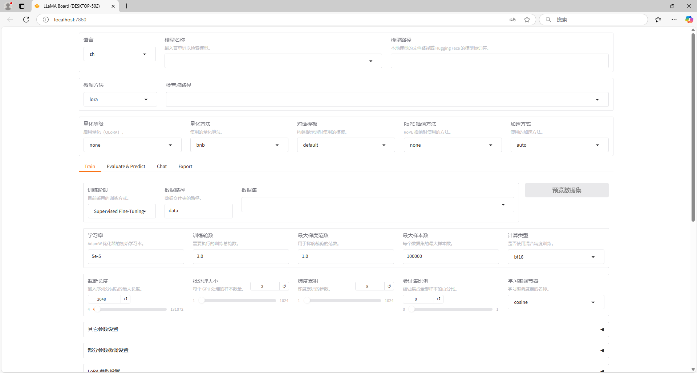
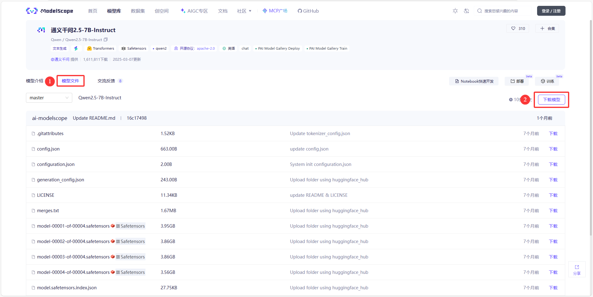
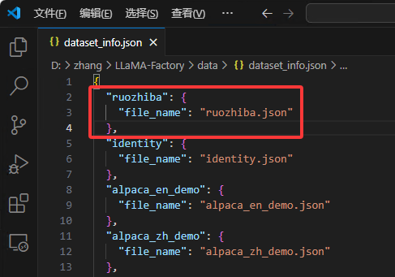
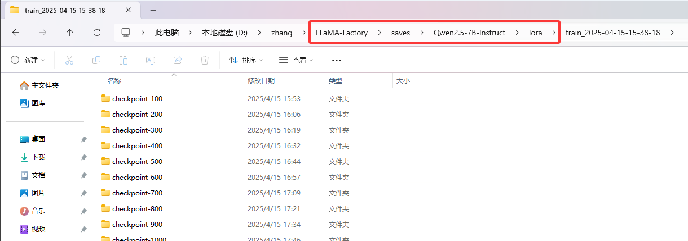
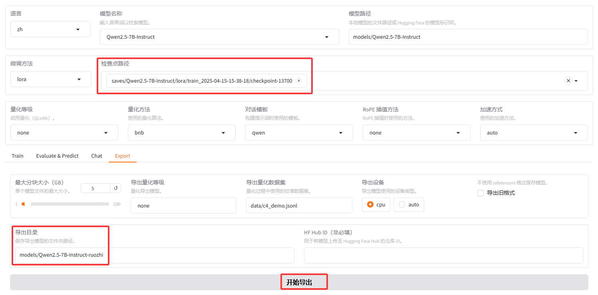
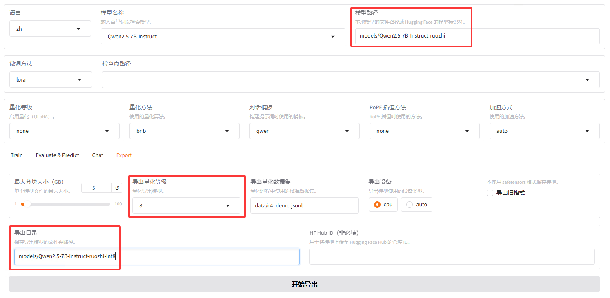
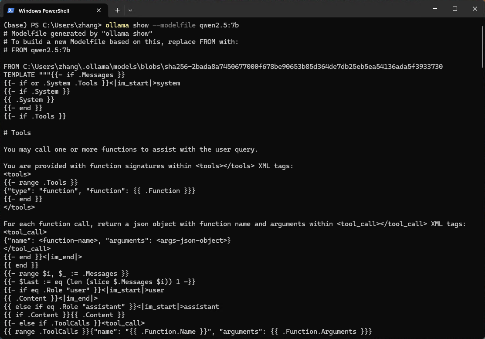
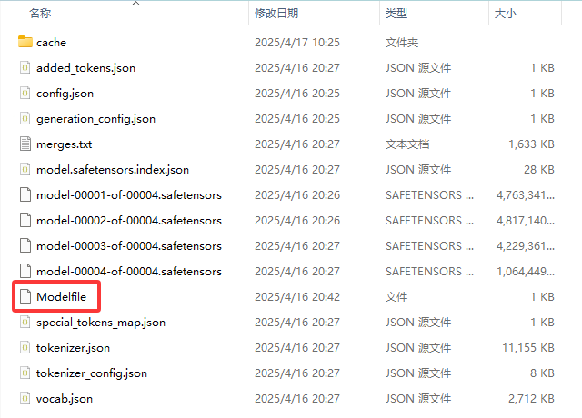
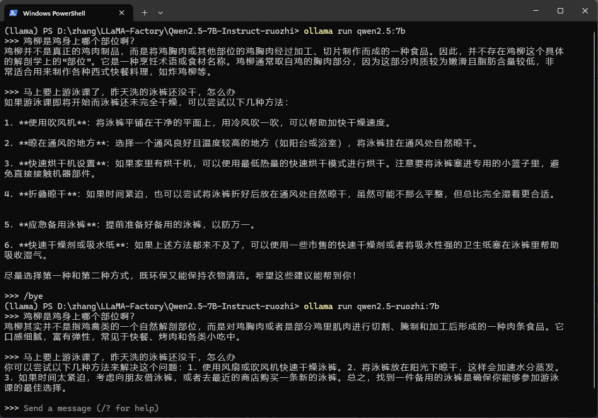

[TOC]

LLaMA Factory 是一个开源的全栈大模型微调框架，简化和加速大型语言模型的训练、微调和部署流程。它支持从预训练到指令微调、强化学习、多模态训练等全流程操作，并提供灵活的配置选项和高效的资源管理能力，适合开发者快速定制化模型以适应特定应用场景。下面通过一个简单的示例来展示如何使用 LLaMA Factory 进行模型微调并部署至 Ollama。

## 环境搭建与配置

克隆 LLaMA Factory 的 Git 仓库（https://github.com/hiyouga/LLaMA-Factory），创建 Python 虚拟环境并安装依赖。

```bash
git clone https://github.com/hiyouga/LLaMA-Factory.git
cd LLaMA-Factory
pip install -e ".[torch,metrics,gptq]"
```

安装完成后，在 Python 终端执行以下代码，检查 PyTorch 是否为 GPU 版本，如果不是则需要手动安装。

```python
import torch
print(torch.__version__)    # '2.6.0+cu126'
print(torch.cuda.is_available())    # True
```

在命令行中使用以下命令运行 LLaMA Factory。

```bash
llamafactory-cli webui
```



## 数据集准备

微调数据集使用“弱智吧数据集”（https://github.com/FunnySaltyFish/Better-Ruozhiba），从百度弱智吧上收集的一系列帖子，旨在启发人们娱乐性使用 ChatGPT 等 LLM 时的思路。微调模型使用阿里的 Qwen2.5:7B 模型。

```json
// 数据集示例
[
    {
        "instruction": "只剩一个心脏了还能活吗？",
        "output": "能，人本来就只有一个心脏。"
    },
    {
        "instruction": "爸爸再婚，我是不是就有了个新娘？",
        "output": "不是的，你有了一个继母。\"新娘\"是指新婚的女方，而你爸爸再婚，他的新婚妻子对你来说是继母。"
    }
]
```

数据集和模型可以在魔塔社区（https://www.modelscope.cn）上搜索并下载，下载可以使用魔塔社区提供的 SDK 或者 Git 命令行下载。



下面的命令可以直接下载弱智吧数据集和 Qwen2.5:7B 模型。

```bash
git clone https://www.modelscope.cn/datasets/AI-ModelScope/Better-Ruozhiba.git    # 弱智吧数据集
git clone https://www.modelscope.cn/Qwen/Qwen2.5-7B-Instruct.git    # Qwen2.5:7B 模型
```

下载好的数据集还需要在 LLaMA Factory 中进行配置。LLaMA Factory 支持 Alpaca 和 ShareGPT 两种数据格式，分别适用于指令监督微调和多轮对话任务。

- **Alpaca 格式**：适用于单轮任务，如问答、文本生成、摘要、翻译等。结构简洁，任务导向清晰，适合低成本的指令微调。
    ```json
    {
        "instruction": "计算这些物品的总费用。",
        "input": "输入：汽车 - $3000，衣服 - $100，书 - $20。",
        "output": "汽车、衣服和书的总费用为 $3000 + $100 + $20 = $3120。"
    }
    ```
- **ShareGPT 格式**：适用于多轮对话、聊天机器人等任务。结构复杂，包含多轮对话上下文，适合高质量的对话生成和人机交互任务。
    ```json
    [
        {
            "instruction": "今天的天气怎么样？",
            "input": "",
            "output": "今天的天气不错，是晴天。",
            "history": [
                [
                    "今天会下雨吗？",
                    "今天不会下雨，是个好天气。"
                ],
                [
                    "今天适合出去玩吗？",
                    "非常适合，空气质量很好。"
                ]
            ]
        }
    ]
    ```

数据集中的字段含义如下：
- instruction（必填）：明确的任务指令，模型需要根据该指令生成输出。
- input（可选）：与任务相关的背景信息或上下文。
- output（必填）：模型需要生成的正确回答。
- system（可选）：系统提示词，用于定义任务的上下文。
- history（可选）：历史对话记录，用于多轮对话任务。

将下载好的 JSON 数据集放入 `LLaMA-Factory/data` 目录下，并在 `LLaMA-Factory/data/data_info.json` 中注册数据集。



## WebUI 配置微调参数

访问 `http://localhost:7860/` ，进入 LLaMA Factory 的 WebUI 界面。WebUI 主要分为四个界面：**训练（Train）、评估与预测（Evaluate & Predict）、对话（Chat）、导出（Export）。**

先设置页面上半部分的内容。


模型名称选择为待训练的模型名称，这里设置为 `Qwen2.5-7B-Instruct`。模型路径设置为上面下载的模型路径，例如在 `LLaMA-Factory` 目录下新建一个 `models` 文件夹，将下载的模型移动到此文件夹内，可设置路径为 `models/Qwen2.5-7B-Instruct`。微调方法支持 lora/freeze/full 方法，这里选择 `lora` 方法，其他方法对计算机配置要求较高，对个人电脑来说一般不适用。
- LoRA（Low-Rank Adaptation）：通过在模型的某些层中添加低秩矩阵来实现微调。
- 全量微调（Full Fine-Tuning）：对模型的所有参数进行微调。
- 冻结微调（Freeze Fine-Tuning）：冻结模型的某些层或全部层，仅微调特定的参数。

下表描述了在训练或推理不同规模的大模型（如 7B、13B 参数模型）时，所需硬件的显存需求。**例如使用 LoRA 微调 Qwen2.5:7B 模型时，显存需求为 16GB。**

| 方法                             | 精度 |   7B  |  14B  |  30B  |   70B  |   `x`B  |
| ------------------------------- | ---- | ----- | ----- | ----- | ------ | ------- |
| Full (`bf16` or `fp16`)         |  32  | 120GB | 240GB | 600GB | 1200GB | `18x`GB |
| Full (`pure_bf16`)              |  16  |  60GB | 120GB | 300GB |  600GB |  `8x`GB |
| Freeze/LoRA/GaLore/APOLLO/BAdam |  16  |  16GB |  32GB |  64GB |  160GB |  `2x`GB |
| QLoRA                           |   8  |  10GB |  20GB |  40GB |   80GB |   `x`GB |
| QLoRA                           |   4  |   6GB |  12GB |  24GB |   48GB | `x/2`GB |
| QLoRA                           |   2  |   4GB |   8GB |  16GB |   24GB | `x/4`GB |

下面设置 Train 选项卡中的参数。


训练阶段设置为 `Supervised Fine-Tuning`。
- Supervised Fine-Tuning：监督微调是最常见的微调方法，使用标注好的数据对预训练模型进行进一步训练，以适应特定任务（如分类、问答等）。
- Reward Modeling：奖励建模是一种用于优化模型输出质量的方法，通常用于强化学习的上下文中。
- PPO（Proximal Policy Optimization）：PPO 是一种基于强化学习的微调方法，用于优化模型的输出策略。
- DPO （Direct Preference Optimization）：DPO 是一种基于人类偏好的直接优化方法，用于训练模型以生成更符合人类偏好的输出。
- Pre-Training：预训练是指从头开始训练一个大模型，通常使用大量的无监督数据（如文本语料库）。预训练的目标是让模型学习通用的语言知识和模式。

数据集选择上文注册的数据集名称，这里设置为 `ruozhiba`。训练轮次根据数据集大小调整，这里设置为 100。学习率通常设置为 1e-4 或 5e-5。计算类型设置为 `bf16`，如果你的硬件不支持，可以选择 `fp16`，基本上 2020 年之后的 GPU 都支持 `bf16`。


接着对 LoRA 参数进行设置。其中关键的参数是**秩（rank）**，秩的大小直接影响模型的性能和资源消耗。秩越大，引入的可训练参数越多，模型对新数据的适应能力越强，但也增加了计算和内存的需求，可能导致过拟合。秩越小，引入的可训练参数较少，减少了计算和内存的需求，但可能不足以充分适应新数据，影响模型性能。可以从较小的值开始（如8、10、12），逐步增加，观察模型性能的变化。

参数配置好后，点击开始，即可进行训练。训练时可以观察右侧的损失曲线，曲线长时间不下降时，即可考虑退出训练。


模型训练好后，会保存至 LLaMA-Factory 的 `saves` 文件夹中。



## 模型导出与量化

下面切换至 Export 选项卡，设置导出参数。补全检查点路径与导出目录，点击开始导出。到此为止，模型已经具备了使用能力。



大语言模型的参数通常以高精度浮点数（如32位浮点数，FP32）存储，这导致模型推理需要大量计算资源。量化技术通过将高精度数据类型存储的参数转换为低精度数据类型（如8位整数，INT8）存储，可以在不改变模型参数量和架构的前提下加速推理过程。这种方法使得模型的部署更加经济高效，也更具可行性。

量化前需要先将模型导出后再量化。修改模型路径为导出后的模型路径，导出量化等级一般选择 8 或 4，太低模型会答非所问。



## 导入 Ollama

新版的 Ollama 可以直接导入 safetensors 模型，首先需要准备 Modelfile 文件。Modelfile 文件是一个文本文件，包含了模型的基本信息和配置参数。可以在命令行中执行下面的命令，看看 Ollama 中对应的模型是怎么写的。

```bash
ollama show --modelfile qwen2.5:7b
```



当然 LLaMA Factory 导出时也已经生成了 Modelfile 文件，直接使用即可。



将命令行切换到导出模型的目录，执行下面的命令，导入模型。

```bash
ollama create qwen2.5-ruozhi:7b -f Modelfile
```

最后运行微调前和微调后的模型，比较一下效果


