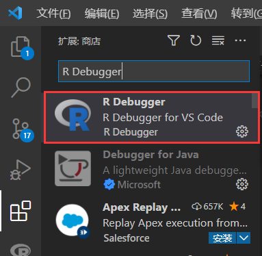
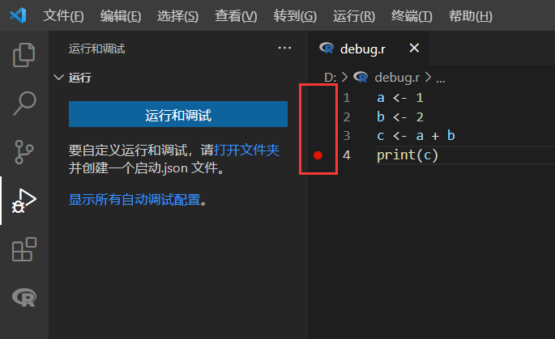
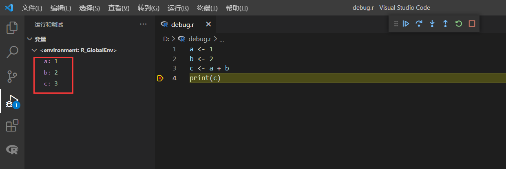

## 写在前面

3 年的硕士生涯一转眼就过去了，和社交网络也打了很长时间交道。最近突然想给自己挖个坑，想给这 3 年写个总结，画上一个句号吧。回想当时学习 R 语言时也是非常戏剧性的，开始科研生活时到处发邮件要源代码，发完最后一封本以为又是无功而返，很意外的收到了秒回的邮件，邮件中附上了由 R 语言编写的实验代码。当时过于开心，因为终于有热心的作者回复了，以至于没有仔细考虑，想都没想对着满是警告的代码开始了 R 语言学习之旅。之后的几天陆陆续续的收到了其他作者的回复，实验代码多是使用 Python 构建的，好吧只能咬咬牙继续了。当时的学习苦于资料太少，唯一的参考只有那份 R 语言实验代码，因此萌生了写一份站在社交网络分析角度的 R 语言教程。《社交网络分析的 R 基础》中所介绍的内容都是最新的技术，Visual Studio Code 在半年之前甚至无法调试 R 语言。该系列博客一共包含六篇文章，具体的目录如下：

1. [初探 R 语言]()
   * [社交网络分析]()
   * [R 简介]()
   * [R 与 Python]()
   * [安装 R]()
      * [CRAN]()
      * [Windows 设置环境变量]()
      * [在 Visual Studio Code 中进行 R 编程]()
      * [R 的调试]()
2. [变量与字符串]()
   * [变量]()
   * [字符串]()
      * [字符串的创建]()
      * [特殊字符的转义]()
      * [字符串的其他常用操作]()
3. [向量、矩阵与列表]()
   * [向量]()
      * [向量的创建]()
      * [向量元素的访问]()
      * [向量的运算]()
      * [向量的其他常用操作]()
   * [矩阵]()
      * [矩阵的创建]()
      * [矩阵元素的访问]()
      * [矩阵的运算]()
      * [矩阵的特征值与特征向量]()
   * [列表]()
      * [列表的创建]()
      * [列表元素的访问]()
4. [循环与并行]()
   * [循环语句]()
      * [while]()
      * [for]()
      * [循环控制]()
   * [apply() 系列函数]()
      * [apply()]()
      * [sapply()]()
   * [使用 parallel 包并行处理]()
      * [在本机上并行]()
      * [在多台计算机上并行]()
5. [图的导入与简单分析]()
   * [图的文件表示]()
   * [导入一个图]()
   * [生成人工网络]()
   * [图的基本分析]()
6. [绘图操作]()
   * [柱状图]()
   * [折线图]()
   * [保存绘制的图表]()

读研 3 年学到最重要的品质是谦虚，《社交网络分析的 R 基础》这一系列博客只是将我知道的东西写出来罢了，我对这些内容的评价是够用，希望能够帮助读者快速掌握 R 语言的基础，之后根据实验遇到的问题再学习其他的内容。文章在介绍每个功能点时都附带有简单的示例，每一章的最后还附有若干个小练习，希望读者可以借着练习帮助理解。

<p align="right">电脑玩家——张高兴</p>
<p align="right">2022/02/05 00:09</p>

---

* [社交网络分析]()
* [R 简介]()
* [R 与 Python]()
* [安装 R]()
  * [CRAN]()
  * [Windows 设置环境变量]()
  * [在 Visual Studio Code 中进行 R 编程]()
  * [R 的调试]()

## 社交网络分析

过去几十年信息技术的发展，现在人们已经生活在一个充满各种各样复杂网络的社会。你也许无法想象人类社会和网络有什么关系，举几个例子你就会明白，比如：使用微信或微博所涉及的社交网络；一到早晚高峰就堵车的城市交通路网；定期检修的电网与自来水管网等等。这些不同领域的背后都涉及到一个复杂的网络，而这些都属于网络科学的范畴。而社交网络分析，只是其中的一个方向。

社交网络分析有很多应用场景：
1. 最常见的是购物软件或视频应用中的推荐，通过分析一类用户的行为去推测可能喜欢的商品或视频；
2. 其次是识别社交网络中不同的圈子，俗话说物以类聚，人以群分；
3. 在将网络划分为不同圈子后，即可对不同的群体进行精准营销，或者强化消息的传播；
4. 通过分析社交网络中的关键节点，及时切断关键节点以阻止负面信息的传播等等。

## R 简介

作为一个 R 语言的初学者，没有人会关心 R 的发展历史，因为学习一门语言的最终目的还是为了将其作为一种工具使用。你问我知道吗，我当然也不知道😂。为了让本章的内容更加的充实，我从维基百科摘录了一些内容[<sup>[1]</sup>](#1)[<sup>[2]</sup>](#2)。

> R 语言是一种自由软件编程语言与操作环境，主要用于统计分析、绘图以及数据挖掘。R 本来由来自新西兰奥克兰大学的统计学家罗斯·伊哈卡和罗伯特·杰特曼开发，现在由 R 开发核心团队负责开发。伊哈卡与杰特曼两人名前缀字母都是 R，R 语言因此得名。同时，R 这个单一字母的名字也表明 R 语言与 S 语言一脉相承。通常用 S 语言编写的代码都可以不作修改地在 R 环境下运行。R 的语法来自 Scheme。R 的后台程序大多由 C 语言、FORTRAN 语言和 R 自己写成。
> 
> R 语言第一次正式发布于 1995 年。第一次正式的“稳定测试版”（v1.0）于2000年2月29日发布。

## R 与 Python

根据 StackOverflow 2021 年开发者报告[<sup>[3]</sup>](#3)的数据来看，排除掉“全世界都在写前端”的这个原因，Python 当之无愧“天下第一”的称号，曾经的“天下第一” PHP 也已经排在了第 11 名的位置，至于 R ，则排在了 20 名开外。那么这是不是就意味着我们要去学习 Python ？


当我们需要去学习一门新的编程语言时，自然是我们掌握的工具、资源已经无法满足解决新问题的需要，那么新学习的语言必然要拥有丰富的解决方案供我们使用。对于社交网络分析而言，Python 与 R 都拥有非常优秀的类库，像 Python 中的 NetworkX[<sup>[4]</sup>](#4) ， R 中的 igraph[<sup>[5]</sup>](#5) 。但 R 语言起家于统计分析，因此关于数据科学的类库也更多，对于数据分析也更优秀些。

其次要考虑学习成本。Python 作为一个万金油，加上一个“容易学习”名头，足以吸引大部分人的目光。但是我认为初学 Python 上手很慢，Python 丰富的语法糖特性很容易造成初学者理解困难。R 作为一个面向对象的语言，但由于其存在不同实现面向对象的类型（S3、S4……），某种程度上来说 R 的面向对象不强。对初学者来说，面向对象通常很难理解，而 R 语言常用的功能大部分是以函数提供的，很容易实现面向过程的编程，这样就能专注于解决问题本身，而不是去弄明白程序为什么要这么写。

最终不管是选择 R 还是 Python ，解决问题是关键，语言只不过是过程中的一个工具。如果你有 Python 基础，好好学习 NetworkX 包就能达到目的；如果你其他语言基础较弱，也不清楚什么是面向对象，那么 R 语言可能是更好的选择。

## 安装 R

### CRAN

在安装 R 之前，首先要简单了解一下 CRAN 。CRAN（Comprehensive R Archive Network）是 R 的源代码、文档以及各种包的托管，R 的安装包也需要通过 CRAN 下载。通常各所大学都会提供 CRAN 的镜像， CRAN 所有的镜像列表可通过此网站获得：https://cran.r-project.org 。选择下载相应平台的安装包即可。


<div style="display: block;position: relative;border-radius: 8px;padding: 1rem;background-color: #d2f9d2;color: #094409;margin: 10px">
    <p style="margin-top:0;font-weight: bold">💡&nbsp;提示</p>
    <p><span>Microsoft 也提供了 R 的发行版 Microsoft R Open，增强了计算性能。项目地址：https://mran.microsoft.com/open</span></p>
</div>

### Windows 设置环境变量

R 在 Windows 下安装完成是不设置环境变量的，也就是说没法随时随地在命令行中优雅的执行 R 脚本。我们需要手动设置一下：

1. Windows 搜索栏中搜索“编辑系统环境变量”，打开“环境变量”，如图中①；
2. 编辑“系统变量”中的“Path”，如图中②；
3. 新建一个环境变量，将 R 安装位置的 bin 文件夹添加进去，如图中③。


设置完成后就可以进入 R 终端了。


### 在 Visual Studio Code 中进行 R 编程

R 安装完成后会附带一个 RGui ，相对来说比较简陋，用户通常会单独安装一个 RStudio 作为 R 默认的 IDE 。这里为了轻量化，选择了 VS Code 作为 R 语言的编辑器。

1. 在安装完 VS Code 后打开“扩展”，搜索“R”，安装插件；
   
   

2. 在 R 终端中安装包“languageserver”，以提供文档和代码补全；
   ```R
   > chooseCRANmirror()    # 下载困难时可以先选择 CRAN 镜像
   > install.packages("languageserver")
   ```

    

3. 打开 VS Code，新建一个文件“hello.R”，键入；
   ```R
   print("Social Network Analysis")
   ```

4. 选中要运行的代码，按“**Ctrl+Enter**”运行代码片段。
   
   

### R 的调试

调试是发现程序错误和保证程序正确运行的一个必要环节。在 Visual Studio Code 对 R 进行调试还需要安装一个扩展 `R Debugger` 。



扩展安装完成后打开侧边栏中的“运行与调试”，并在程序想要中断的位置打上断点（行号左侧）。



点击“运行和调试”即可开始调试，左侧会展示相关变量的值。



到这里即可愉快的开启 R 语言之旅了。

<div style="display: block;position: relative;border-radius: 8px;padding: 1rem;background-color: #e0f2ff;color: #002b4d;margin: 10px">
    <p style="margin-top:0;font-weight: bold">✏️&nbsp;练习</p>
    <p><span>1. 试着安装一下网络分析包 “igraph”；</span></p>
    <p><span>2. 随便在 R 终端中写点代码，试试 <code>"a"+"b"</code> 会输出 <code>ab</code> 吗。</span></p>
</div>

## 参考

1. <a id="1" target="_blank" href="https://en.wikipedia.org/wiki/Main_Page">R (programming language) - Wikipedia</a>
2. <a id="2" target="_blank" href="https://zh.wikipedia.org/wiki/R%E8%AF%AD%E8%A8%80">R 语言 - 维基百科</a>
3. <a id="3" target="_blank" href="https://insights.stackoverflow.com/survey/2021">Stack Overflow Developer Survey 2021</a>
4. <a id="4" target="_blank" href="https://networkx.org">NetworkX</a>
5. <a id="5" target="_blank" href="https://igraph.org/r/doc">igraph</a>