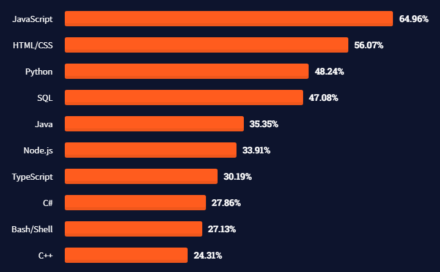
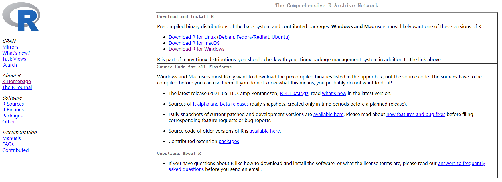
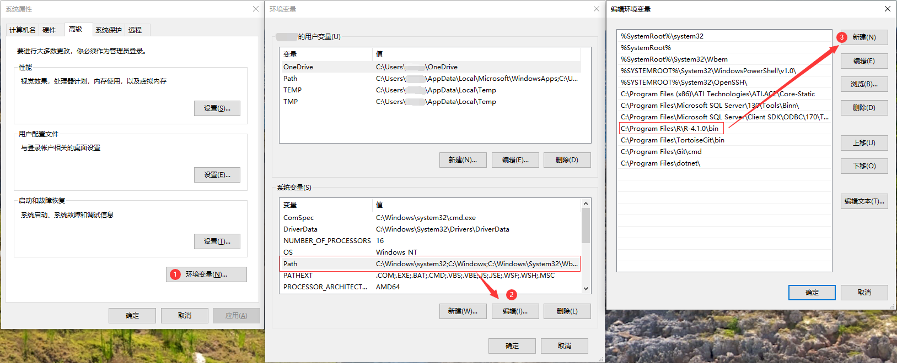
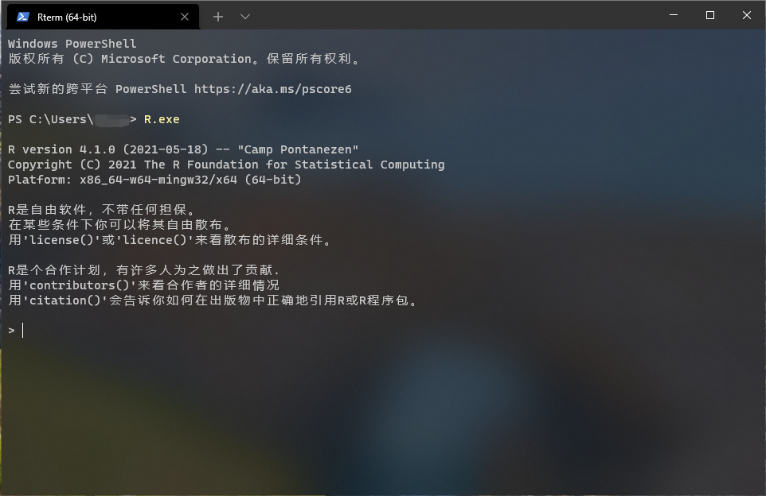
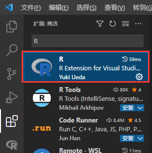
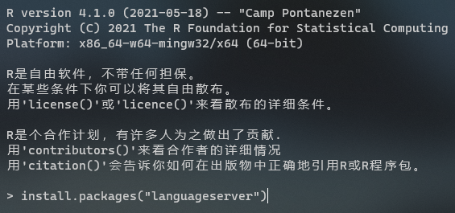
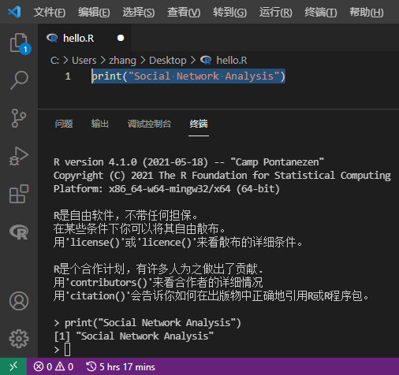

<link href="https://cdn.bootcss.com/font-awesome/4.7.0/css/font-awesome.min.css" rel="stylesheet">

## R 简介

作为一个 R 语言的初学者，没有人会关心 R 的发展历史，因为学习一门语言的最终目的还是为了将其作为一种工具进行使用。你问我知道吗，我当然也不知道😂。为了让本文的内容更加的充实，我从维基百科摘录了一些内容[<sup>[1]</sup>](#1)[<sup>[2]</sup>](#2)。

> R 语言是一种自由软件编程语言与操作环境，主要用于统计分析、绘图以及数据挖掘。R 本来由来自新西兰奥克兰大学的统计学家罗斯·伊哈卡和罗伯特·杰特曼开发，现在由 R 开发核心团队负责开发。伊哈卡与杰特曼两人名前缀字母都是 R，R 语言因此得名。同时，R 这个单一字母的名字也表明 R 语言与 S 语言一脉相承。通常用 S 语言编写的代码都可以不作修改地在 R 环境下运行。R 的语法来自 Scheme。R 的后台程序大多由 C 语言、FORTRAN 语言和 R 自己写成。
> 
> R 语言第一次正式发布于 1995 年。第一次正式的“稳定测试版”（v1.0）于2000年2月29日发布。

## R 与 Python

根据 StackOverflow 2021 年开发者报告[<sup>[3]</sup>](#3)的数据来看，排除掉“全世界都在写前端”的这个原因，Python 当之无愧“天下第一”的称号，曾经的“天下第一” PHP 也已经排在了第 11 名的位置，至于 R ，则排在了 20 名开外。那么这是不是就意味着我们要去学习 Python ？



当我们需要去学习一门新的编程语言时，自然是我们掌握的工具、资源已经无法满足解决新问题的需要，那么新学习的语言必然要拥有丰富的解决方案供我们使用。对于社交网络分析而言，Python 与 R 都拥有非常优秀的类库，像 Python 中的 NetworkX[<sup>[4]</sup>](#4) ， R 中的 igraph[<sup>[5]</sup>](#5) 。但 R 语言起家于统计分析，因此关于数据科学的类库也更多，对于数据分析也更优秀些。

其次要考虑学习成本。Python 作为一个万金油，加上一个“容易学习”名头，足以吸引大部分人的目光。但是我认为初学 Python 上手很慢，Python 丰富的语法糖特性很容易造成初学者理解困难。R 作为一个面向对象的语言，但由于其存在不同实现面向对象的类型（S3、S4……），某种程度上来说 R 的面向对象不强。对初学者来说，面向对象通常很难理解，而 R 语言常用的功能大部分是以函数提供的，很容易实现面向过程的编程，这样就能专注于解决问题本身，而不是去弄明白程序为什么要这么写。

最终不管是选择 R 还是 Python ，解决问题是关键，语言只不过是过程中的一个工具。

## 安装 R

### CRAN

在安装 R 之前，首先要简单了解一下 CRAN 。CRAN（Comprehensive R Archive Network）是 R 的源代码、文档以及各种包的托管，R 的安装包也需要通过 CRAN 下载。通常各所大学都会提供 CRAN 的镜像， CRAN 所有的镜像列表可通过此网站获得：https://cran.r-project.org 。选择下载相应平台的安装包即可。



<div style="display: block;position: relative;border-radius: 8px;padding: 1rem;background-color: #d2f9d2;color: #094409;margin: 10px">
    <p style="margin-top:0;font-weight: bold"><i class="fa fa-lightbulb-o" aria-hidden="true"></i>&nbsp;&nbsp;提示</p>
    <p><span>Microsoft 也提供了 R 的发行版 Microsoft R Open，增强了计算性能。项目地址：https://mran.microsoft.com/open</span></p>
</div>

### Windows 设置环境变量

R 在 Windows 下安装完成是不设置环境变量的，也就是说没法随时随地在命令行中优雅的执行 R 脚本。我们需要手动设置一下：

1. Windows 搜索栏中搜索“编辑系统环境变量”，打开“环境变量”，如图中①；
2. 编辑“系统变量”中的“Path”，如图中②；
3. 新建一个环境变量，将 R 安装位置的 bin 文件夹添加进去，如图中③。



设置完成后就可以进入 R 终端了。



### 在 Visual Studio Code 中进行 R 编程

R 安装完成后会附带一个 RGui ，相对来说比较简陋，用户通常会单独安装一个 RStudio 作为 R 默认的 IDE 。这里为了轻量化，选择了 VS Code 作为 R 语言的编辑器。

1. 在安装完 VS Code 后打开“扩展”，搜索“R”，安装插件；
   
   

2. 在 R 终端中安装包“languageserver”，以提供文档和代码补全；
   ```R
   chooseCRANmirror()    # 下载困难时可以先选择 CRAN 镜像
   install.packages("languageserver")
   ```

    

3. 打开 VS Code，新建一个文件“hello.R”，键入；
   ```R
   print("Social Network Analysis")
   ```

4. 选中要运行的代码，按“Ctrl+Enter”运行代码片段。
   
   

到这里即可愉快的开启 R 语言之旅了。

<div style="display: block;position: relative;border-radius: 8px;padding: 1rem;background-color: #e0f2ff;color: #002b4d;margin: 10px">
    <p style="margin-top:0;font-weight: bold"><i class="fa fa-info-circle" aria-hidden="true"></i>&nbsp;&nbsp;练习</p>
    <p><span>1. 试着安装一下网络分析包“igraph”；</span></p>
    <p><span>2. 随便在 R 终端中写点啥，试试"a"+"b"会输出“ab”吗。</span></p>
</div>

## 参考

1. <a id="1" target="_blank" href="https://en.wikipedia.org/wiki/Main_Page">R (programming language) - Wikipedia</a>
2. <a id="2" target="_blank" href="https://zh.wikipedia.org/wiki/R%E8%AF%AD%E8%A8%80">R 语言 - 维基百科</a>
3. <a id="3" target="_blank" href="https://insights.stackoverflow.com/survey/2021">Stack Overflow Developer Survey 2021</a>
4. <a id="4" target="_blank" href="https://networkx.org">NetworkX</a>
5. <a id="5" target="_blank" href="https://igraph.org/r/doc">igraph</a>