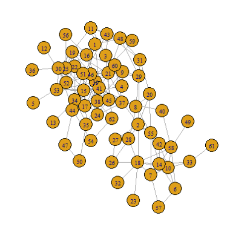
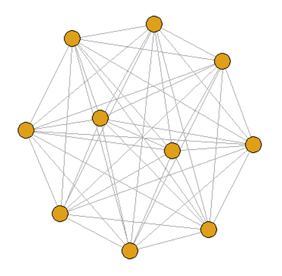
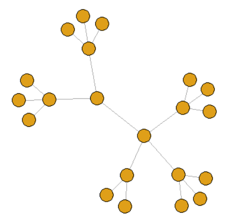
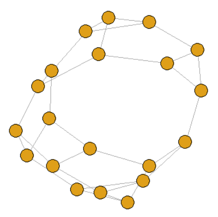
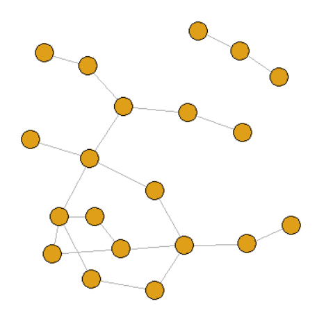
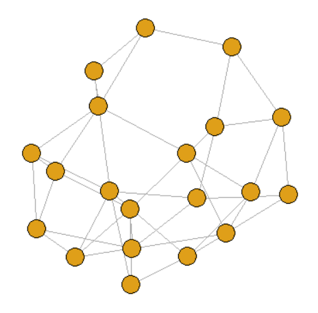

如何将存储在磁盘上的邻接矩阵输入到 R 程序中，是进行社交网络分析的起点。在前面的章节中已经介绍了基本的数据结构以及代码结构，本章将会面对一个实质性问题，学习如何导入一个图以及计算图的一些属性。

* [图的文件表示]()
* [导入一个图]()
* [生成人工网络]()
* [图的基本分析]()

## 图的文件表示

在计算机中，最常见的两种表示图的基本结构是**邻接矩阵**和**邻接表**。以最简单的无权无向图为例，邻接矩阵中第 $i$ 行第 $j$ 列的元素 $a_{ij}$ 如果等于 1，则表示顶点 $i$ 和顶点 $j$ 之间有边，即邻接矩阵将所有节点之间的关系都表示出来。邻接表则是对顶点 $i$ 建立一个单链表，这个单链表由顶点 $i$ 的所有邻居节点构成，即邻接表只是把存在关系的节点表示出来。

网络上许多公开的数据集更常使用**三元组**去表示一个图。下面是一个三元组的示例，以第一行的三元组 (1, 2, 1) 为例，它表示有一条从顶点 1 指向顶点 2 的边，并且该边的权重为 1。对于无权图而言，通常会省略三元组中的第三个元素。
```text
1	2	1
1	3	-1
2	3	-1
1	4	-1
3	4	1
```

<div style="display: block;position: relative;border-radius: 8px;padding: 1rem;background-color: #d2f9d2;color: #094409;margin: 10px">
    <p style="margin-top:0;font-weight: bold">💡&nbsp;提示</p>
    <p><span>公开数据集大多数可以从下面的网站上找到：</span></p>
    <p><span>1. Stanford Large Network Dataset Collection：http://snap.stanford.edu/data</span></p>
    <p><span>2. The KONECT Project：http://konect.cc/networks</span></p>
</div>

## 导入一个图 

下面以 [Dolphins](http://konect.cc/files/download.tsv.dolphins.tar.bz2) 网络为例，将其导入到 R 程序中。Dolphins 是一个无权无向的真实网络，描述了生活在新西兰的一个峡湾附近的宽吻海豚社区，其中节点表示海豚，边表示海豚间的社会关系。将数据集下载完成后，打开名为 `out` 的文件。
```text
% sym unweighted
9	4
10	6
10	7
11	1
......
```

在读取文件之前还需要对其进行一下修改，可以看到该文件的第一行“`% sym unweighted`”是由空格分隔的三个元素，R 语言还没有太过智能，在读取到第二行时会因为只有两个元素而报错，因此需要将第一行删除。下面使用 `read.table()` 将文件读入到 R 程序中：
```R
graph.edges <- read.table(file = "out.dolphins", header = FALSE)
```

<div style="display: block;position: relative;border-radius: 8px;padding: 1rem;background-color: #d2f9d2;color: #094409;margin: 10px">
    <p style="margin-top:0;font-weight: bold">💡&nbsp;提示</p>
    <p><span>也可以将 out 文件中的制表符（\t）替换成逗号（,），将文件更改为使用逗号分隔的 CSV 文件，并使用 <code>read.csv()</code> 函数读取。</span></p>
</div>

你也许会好奇读入的 `graph.edges` 到底是什么东西，使用 `class()` 函数来看看变量的类型：
```R
> class(graph.edges)
[1] "data.frame"
```

`data.frame` 似乎前面的章节并没有介绍，受限于研究的方向，这有可能是你唯一一次接触数据框类型，不用管它，下面将读入的数据转换为图：
```R
> library(igraph)
> graph <- graph_from_data_frame(graph.edges, directed = FALSE)
```

下面画图看看导入的 Dolphins 网络：
```R
> class(graph)
[1] "igraph"
> plot(graph)
```



输出一下 Dolphins 网络的规模：
```R
> cat(sprintf("Nodes: %s\nEdges: %s\n", length(V(graph)), length(E(graph))))
Nodes: 62
Edges: 159
```

这里使用了两个全新的函数 `V()` 和 `E()`，其中 `V()` 是获取图的点集，`E()` 是获取图的边集，今后的大部分分析是建立在这两个集合之上，这两个函数会伴随你的 R 语言旅程直到结束。

导入的网络可以保存为 R 文件，下次可以直接载入使用，使用同样的方法也可以持久化实验数据。
```R
> save(graph, file = "dolphins.RData")  # 保存 graph 变量
> load(file = "dolphins.RData")  # 导入 RData 文件中存储的变量
```

## 生成人工网络

使用人工网络验证算法的有效性也是实验中必不可少的一环，下面介绍几种常见的人工网络结构。
1. 全连接图
    ```R
    graph <- make_full_graph(10)
    ```
    
2. 树状图
    ```R
    graph <- make_tree(21, children = 3, mode = "undirected")
    ```
    
3. k-正则图
    ```R
    graph <- sample_k_regular(20, 3)
    ```
    
4. Erdos-Renyi Random
    ```R
    graph <- sample_gnp(20, 0.1)
    ```
    
5. 小世界网络
    ```R
    graph <- sample_smallworld(dim = 1, size = 20, nei = 2, p = 0.1)
    ```
    

<div style="display: block;position: relative;border-radius: 8px;padding: 1rem;background-color: #d2f9d2;color: #094409;margin: 10px">
    <p style="margin-top:0;font-weight: bold">💡&nbsp;提示</p>
    <p><span>其他人工结构请查看 igraph 文档：https://igraph.org/r/doc</span></p>
</div>

## 图的基本分析

上文从导入外部网络和生成人工网络两个角度获得了 `igraph` 图对象，下面将使用 `igraph` 包中的函数对 Dolphins 网络进行简单的分析。
1. 判断图的连通性
    ```R
    > is.connected(graph)
    [1] TRUE
    ```
2. 计算图的度
    ```R
    > degree(graph)  # 计算图中所有节点的度，其中第一行为节点的名称，第二行为节点的度
    9 10 11  ...
    6  7  5  ...
    > degree(graph, v = "9")  # 计算图中部分节点的度
    9 
    6
    ```
3. 计算图的密度
    ```R
    > edge_density(graph)
    [1] 0.0840825
    ```
4. 对图的路径分析
    ```R
    > diameter(graph, directed = FALSE, weights = NA)  # 直径
    [1] 8
    > radius(graph)  # 半径
    [1] 5
    > distances(graph, v = V(graph)$name[1], to = V(graph)$name[10], algorithm = "unweighted", weights = NA)  # 计算节点间的最短距离
      20
    9  3
    > shortest_paths(graph, from = "1", to = "6", weights = NA)  # 计算节点1到节点6的最短路径
    $vpath
    $vpath[[1]]
    + 6/62 vertices, named, from e1ce364:
    [1] 1  41 37 40 58 6
    ```
5. 计算图的聚类系数
    ```R
    > transitivity(graph, type = "average")
    [1] 0.3029323
    ```

<div style="display: block;position: relative;border-radius: 8px;padding: 1rem;background-color: #e0f2ff;color: #002b4d;margin: 10px">
    <p style="margin-top:0;font-weight: bold">✏️&nbsp;练习</p>
    <p><span>1. 试着在数据集网站中下载其他网络导入到 R 程序中；</span></p>
    <p><span>2. 试着计算导入网络的平均度；</span></p>
    <p><span>3. 查找 igraph 文档，试着计算导入网络的同配系数（Assortativity）。</span></p>
</div>
