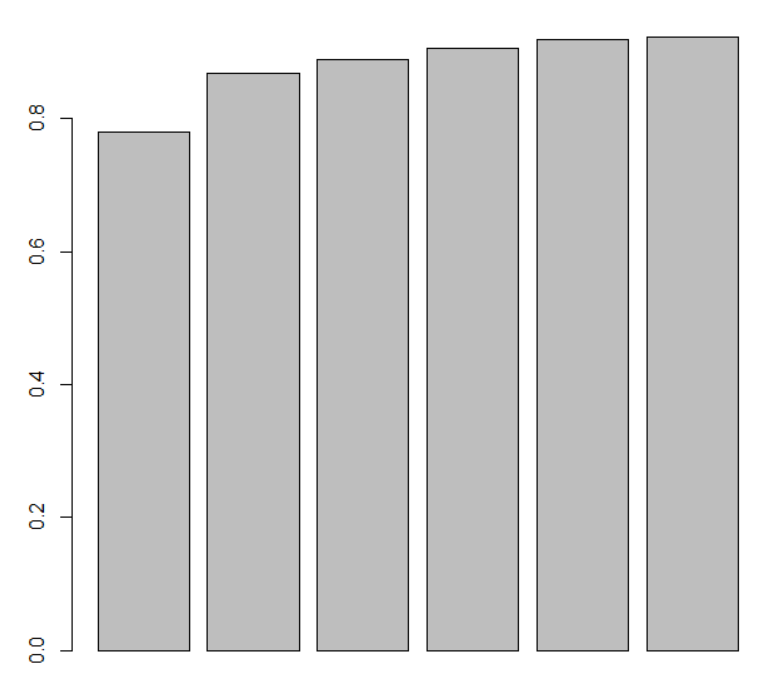
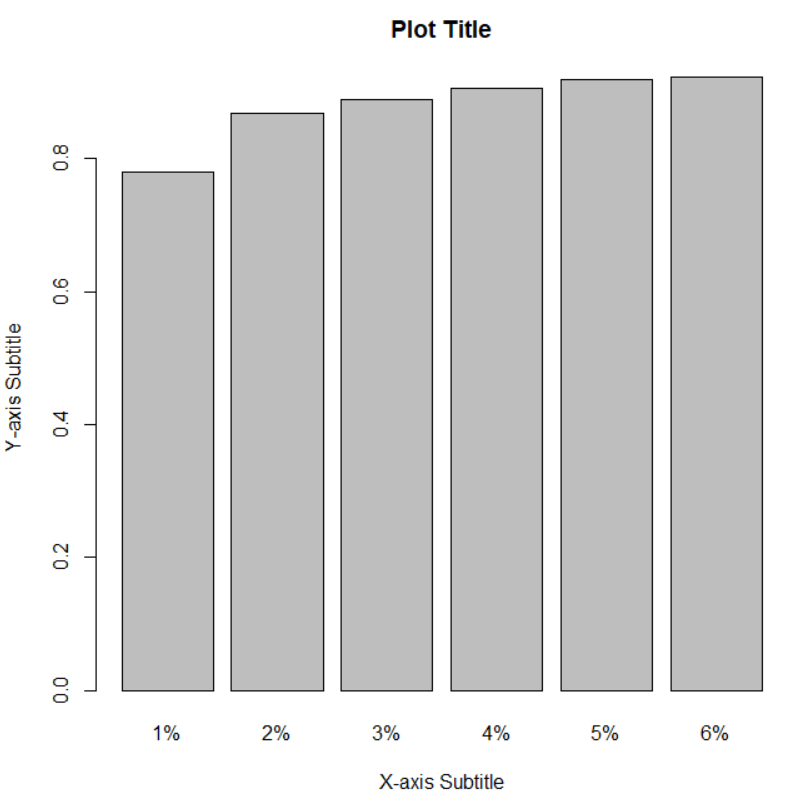
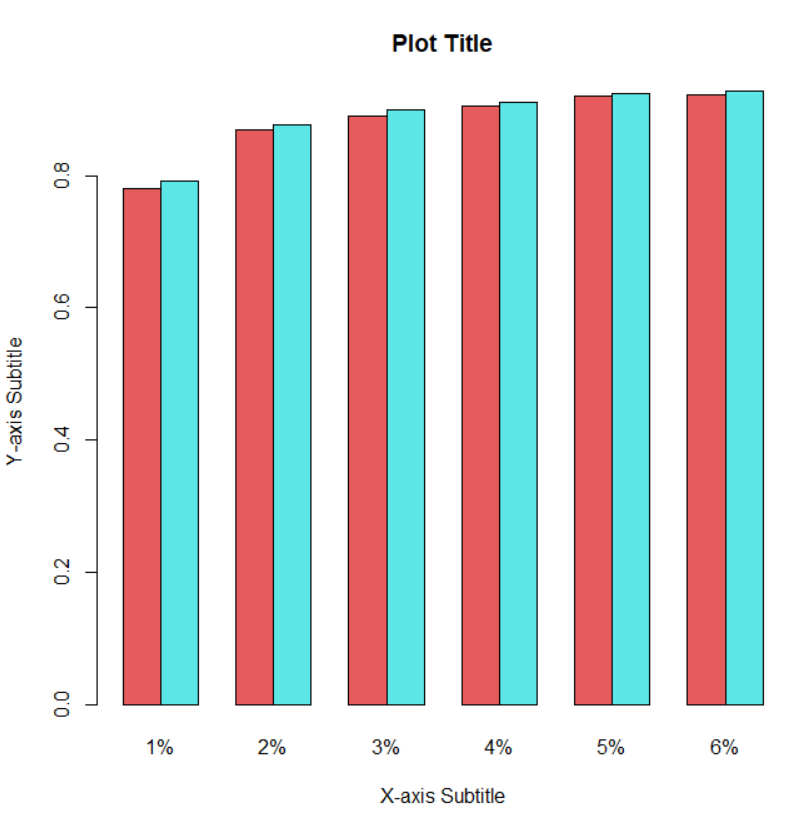
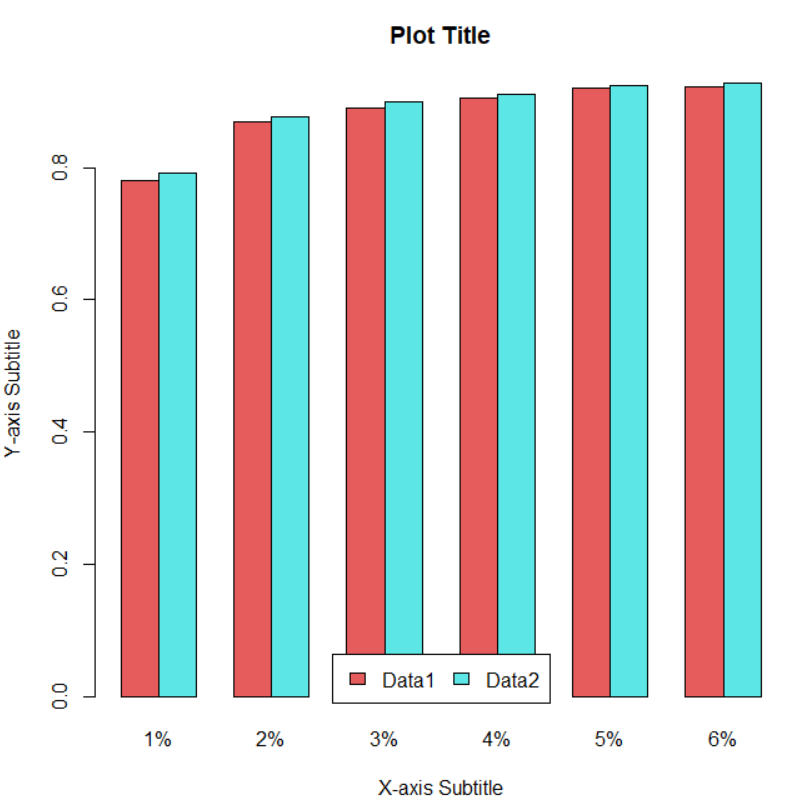
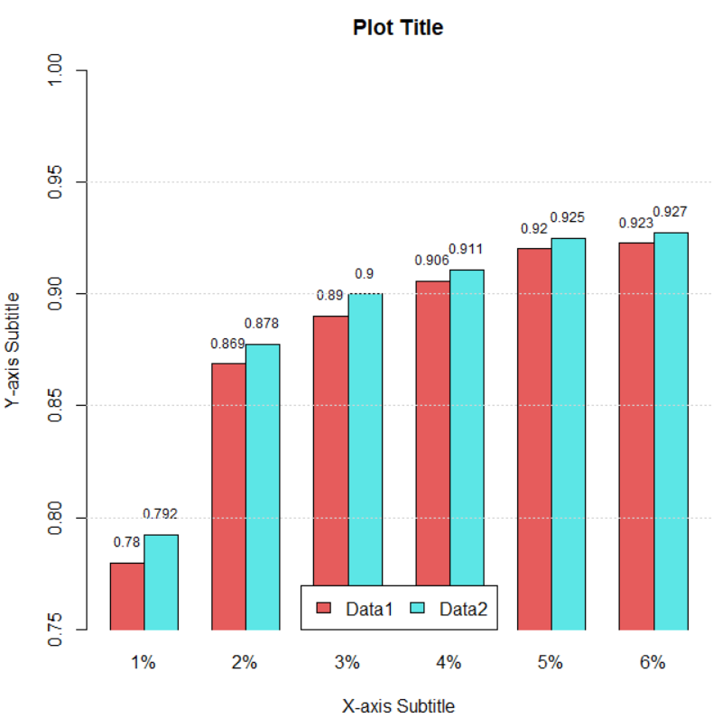
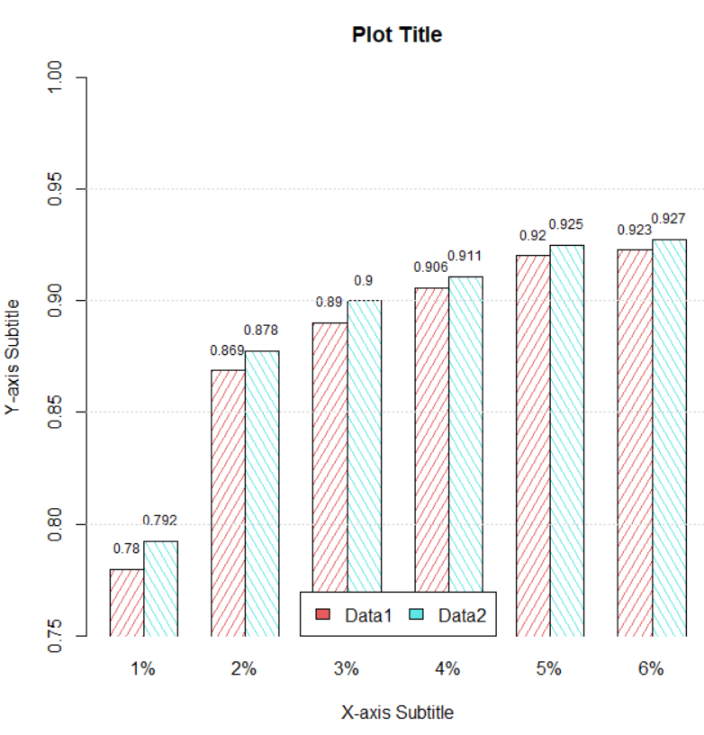
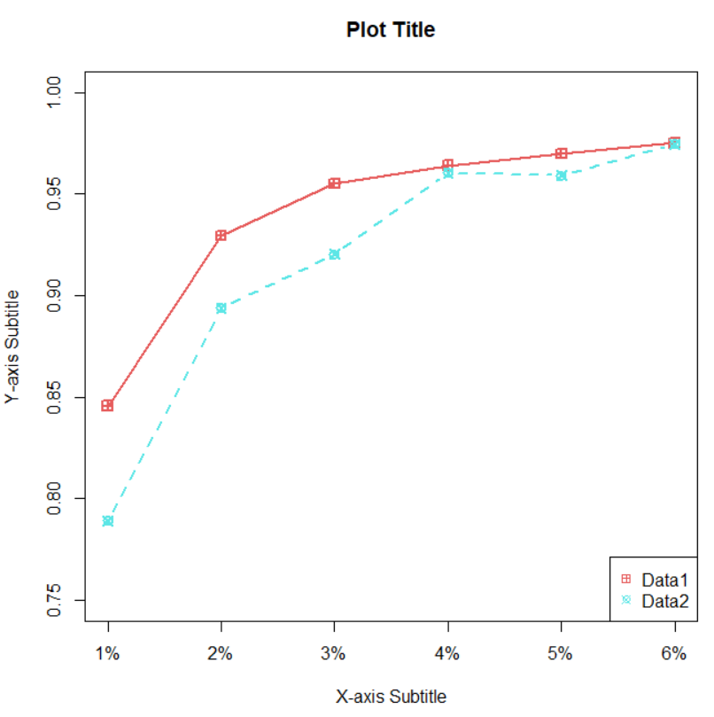
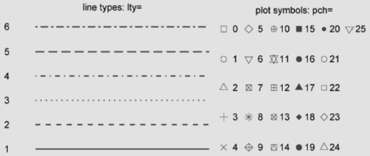
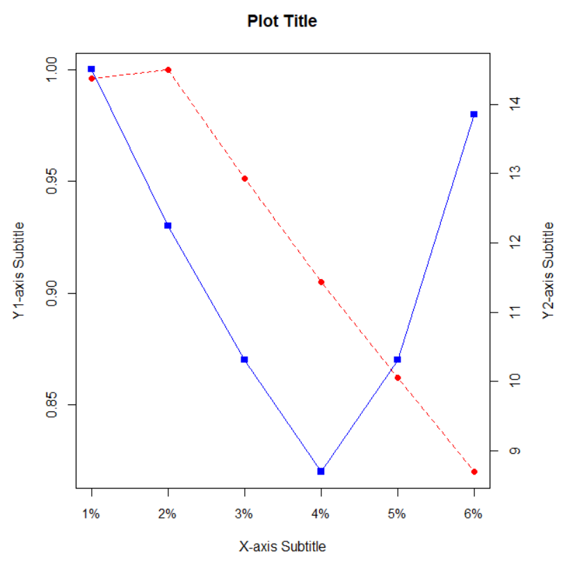

R 语言强大的可视化功能在科学研究中非常受欢迎，丰富的类库使得 R 语言可以绘制各种各样的图表。当然这些与本章内容毫无关系😅，因为笔者对绘制图表了解有限，仅限于能用的程度。接下来的内容无需额外安装任何包，仅使用 R 语言自带的绘图工具完成柱状图与折线图的绘制。如果对绘制的图表定制性要求较高，请搜索 `ggplot2` 包的相关教程。

* [柱状图]()
* [折线图]()
* [保存绘制的图表]()

## 柱状图

R 语言中使用 `barplot()` 函数来创建柱状图，下面绘制一个最简单的柱状图：
```R
> data1 <- c(0.7795875, 0.8686484, 0.8901365, 0.905844, 0.9201746, 0.9227028)
> barplot(data1)
```



为了使图表的可读性更高，还需要添加标题、x 与 y 轴的副标题：
```R
> xArgs <- c("1%", "2%", "3%", "4%", "5%", "6%")
> barplot(data1, main = "Plot Title", names.arg = xArgs, xlab = "X-axis Subtitle", ylab = "Y-axis Subtitle")
```



现在需要为现有的柱状图添加一组对比数据，并且灰色有些单调，还需要为柱状图添加一些鲜艳的颜色：
```R
> data2 <- c(0.7921935, 0.8775983, 0.8999872, 0.9109487, 0.9250147, 0.9274716)  # 第二组数据
> colors <- rainbow(2, 0.6, 0.9)  # 生成2个彩虹中的颜色并设置一下饱和度
> barplot(rbind(data1, data2), main = "Plot Title", names.arg = xArgs, xlab = "X-axis Subtitle", ylab = "Y-axis Subtitle", beside = TRUE, col = colors)
```



现在的柱状图变得稍微美观了一些，但两组数据的对比似乎还缺少图例：
```R
> legends <- c("Data1", "Data2")
> b <- barplot(rbind(data1, data2), main = "Plot Title", names.arg = xArgs, xlab = "X-axis Subtitle", ylab = "Y-axis Subtitle", beside = TRUE, col = colors)
> legend("bottom", legend = legends, fill = colors, horiz = TRUE, bg = "white")  # 图例
```



这个柱状图仍然有些不太满意，需要限制一下 y 轴的范围在 `[0.75, 1]`，还要为柱状图添加数字显示，如果能加上网格就更好了：
```R
> b <- barplot(rbind(data1, data2), main = "Plot Title", names.arg = xArgs, xlab = "X-axis Subtitle", ylab = "Y-axis Subtitle", beside = TRUE, col = colors, ylim = c(0.75, 1), xpd = FALSE)
> legend("bottom", legend = legends, fill = colors, horiz = TRUE, bg = "white")  # 图例
> text(b, y = rbind(data1, data2) + 0.01, labels = as.character(round(rbind(data1, data2), 3)), cex = 0.75)  # 柱状图文字描述
> grid(nx = 0, ny = 5, col = "lightgray")  # 网格
```



“你是来找茬的吧！”，将柱状图改成虚线填充：
```R
> angles <- c(60, 120)  # 虚线填充的角度
> b <- barplot(rbind(data1, data2), main = "Plot Title", names.arg = xArgs, xlab = "X-axis Subtitle", ylab = "Y-axis Subtitle", beside = TRUE, col = colors, ylim = c(0.75, 1), xpd = FALSE, angle = angles, density = 15)
> # 上文出现过的代码此处省略...
```



这样一个不能说是最好看的，但一定是一个功能最全的柱状图就完成了，请根据需求自由组合柱状图的外观。

## 折线图

此处折线图就不像柱状图一样一步步画了，图表的外观是通用的，柱状图中提到的外观都可以直接拿来给折线图用。下面绘制一个两条线的折线图：
```R
> data1 <- c(0.8457699, 0.9294758, 0.9550087, 0.9640443, 0.969838, 0.9750423)
> data2 <- c(0.7892351, 0.8938469, 0.9202865, 0.9603516, 0.9590848, 0.9745516)  # 两组数据
> xArgs <- c("1%", "2%", "3%", "4%", "5%", "6%")  # x 轴
> legends <- c("Data1", "Data2")  # 图例
> colors <- rainbow(2, 0.6, 0.9)  # 颜色
> ltys <- c(1, 2)  # 线条类型
> pchs <- c(12, 13)  # 点的符号
> plot(data1, main = "Plot Title", xlab = "X-axis Subtitle", ylab = "Y-axis Subtitle", 
col = colors[1], lty = ltys[1], pch = pchs[1], cex = 1.2, lwd = 2, type = "o", ylim = c(0.75, 1), xaxt = "n")
> axis(1, at = 1:6, labels = xArgs)  # x 轴
> lines(data2, type="b", cex = 1.2, lwd = 2, lty = ltys[2], col = colors[2], pch = pchs[2])  # 添加第二条线
> legend("bottomright", legend = legends, col =  colors, pch = pchs, horiz = FALSE)  # 图例
```



线条类型和点的符号见下图：



下面绘制一个双 y 轴的折线图：
```R
> data1 <- c(1, 0.93, 0.87, 0.82, 0.87, 0.98)
> data2 <- c(14.3736, 14.5011, 12.9268, 11.4347, 10.0557, 8.6953)
> xArgs <- c("1%", "2%", "3%", "4%", "5%", "6%")
> par(mar = c(5, 5, 4, 5))  # 设置图表的外边距，以便有足够的空间显示副标题
> plot(data1, main = "Plot Title", xlab = "X-axis Subtitle", ylab = "Y1-axis Subtitle", type = "o", col = "blue", pch = 15, axes = FALSE)  # 绘制第一条线
> axis(side = 2)  # 绘制第一条 y 轴
> axis(1, at = 1:6, labels = xArgs, cex.axis = 0.9)  # 绘制 x 轴
> par(new = TRUE)
> plot(data2, type = "o", xaxt = "n", yaxt = "n", ylab = "", xlab = "", col = "red", lty = 2, pch = 16, axes = FALSE)  # 绘制第二条线
> axis(side = 4)
> mtext("Y2-axis Subtitle", side = 4, line = 3)  # 绘制第二条 y 轴
> box()  # 将图表封闭
```



## 保存绘制的图表

保存为 pdf 文件：
```R
pdf(file = "plot.pdf")
plot()  # 此处绘图
dev.off()
```

保存为 png 文件：
```R
png(file = "plot.png")
plot()  # 此处绘图
dev.off()
```
