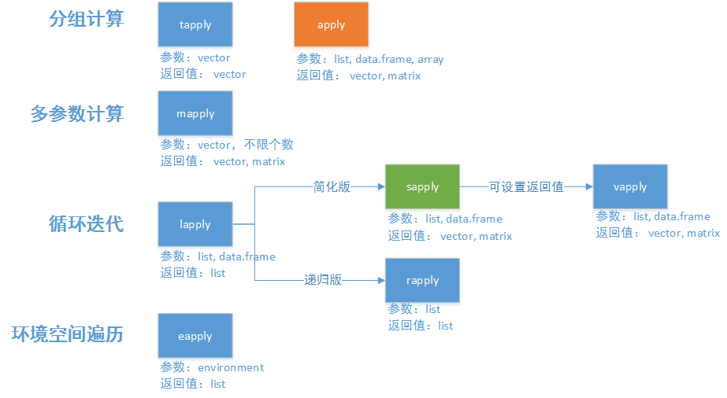
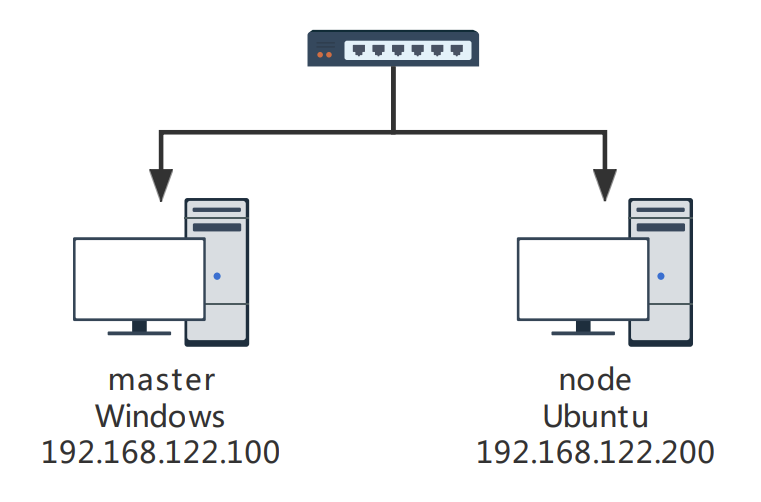

前三章中列出的大多数示例代码都很短，并没有涉及到复杂的操作。从本章开始将会把前面介绍的数据结构组合起来，构成真正的程序。大部分程序是由条件语句和循环语句控制，R 语言中的条件语句（if-else）和 C 语言中类似此处就不再介绍，循环语句包括 `for` 和 `while` 控制块。循环是社交网络分析的主旋律，比如使用 `for` 循环遍历分析网络中的每一个节点。当网络规模足够大时，并行处理又变得十分必要。熟练掌握本章的内容后，你的程序将会优雅而自然。

* [循环语句]()
  * [while]()
  * [for]()
  * [循环控制]()
* [apply() 系列函数]()
  * [apply()]()
  * [sapply()]()
* [使用 parallel 包并行处理]()
  * [在本机上并行]()
  * [在多台计算机上并行]()

## 循环语句
### while

`while` 循环作为最简单的一种循环，只要满足条件（condition 为 `TRUE`），循环将会一直进行。
```R
while (condition) {
    # TODO
}
```

在 R 语言中还存在特殊的关键字 `repeat`，在 `repeat` 控制块内的语句将会无限的执行。下面的示例代码效果是等价的：
```R
repeat {
    # TODO
}

while (TRUE) {
    # TODO
}
```

### for

R 语言中的 `for` 循环更像某些语言中的 `foreach`，本质上就是遍历向量（或其他数据结构）中的元素：
```R
for (name in vector) {
    # TODO
}
```

下面的示例将会输出向量中的元素：
```R
> v <- c("a", "b", "c")
> for (item in v) {
+     print(item)
+ }
[1] "a"
[1] "b"
[1] "c"
```

### 循环控制

有时当满足条件时，需要使用 `break` 退出循环：
```R
while (TRUE) {
    # TODO
    if (condition) {
        break
    }
}
```

或者使用 `next` 退出当前循环（类似其他语言的 `continue`）：
```R
for (name in vector) {
    # TODO
    if (condition) {
        next
    }
}
```

## apply() 系列函数

R 语言中循环语句的执行效率是无法忍受的，这是因为循环语句是基于 R 语言本身来实现的，而向量操作是基于 C 语言实现的，所以应**避免使用显式循环**，使用 `apply()` 系列函数进行替代。举个例子，_对一个矩阵的行求和，并封装一个函数_，使用 `for` 循环应该是这样：
```R
func1 <- function(matrix) {
    row_sum <- c()
    for (i in 1: nrow(matrix)) {
        row_sum[i] <- sum(matrix[i, ])  # 对每一行求和
    }

    return(row_sum)
}
```

使用 `sapply()` 可以这样简化代码：
```R
func2 <- function(matrix) {
    return(sapply(1: nrow(matrix), function(i) { return(sum(matrix[i, ])) }))
}
```

下面测试一下两种方法的性能消耗：
```R
> m <- matrix(c(1: (10000 * 10000)), nrow = 10000)  # 10000x10000 的方阵
> system.time(func1(m))
用户 系统  流逝
0.79 0.00 0.79
> system.time(func2(m))
用户 系统  流逝
0.72 0.00 0.72
```

上面的例子说明使用 `for` 循环不仅代码冗余，而且 `for` 循环实现的计算是耗时最长的，这就是为什么要了解 `apply()` 系列函数的原因。`apply()` 系列函数本身就是解决数据循环处理的问题，为了面向不同的数据类型，不同的返回值，`apply()` 函数组成了一个函数族。一般使用最多的是对矩阵处理的函数 `apply()` 以及对向量处理的函数 `sapply()`。


<p style="text-align:center;margin-bottom:25px;color:gray"><small>apply() 系列函数</small><sup><a target="_blank" href="#1">[1]</a></sup></p>

### apply()

`apply()` 函数用于多维数据的处理，比如矩阵。其本质上是对 `for` 循环的进一步封装，**并不会加快计算速度**。`apply()` 函数的定义如下：
```R
apply(X, MARGIN, FUN)
```

<div style="display: block;position: relative;border-radius: 8px;padding: 1rem;background-color: #d2f9d2;color: #094409;margin: 10px">
    <p style="margin-top:0;font-weight: bold">💡&nbsp;提示</p>
    <p><span>要查看函数的文档可以在 R 终端中键入“<code>?函数名</code>”，比如查看 apply() 的文档输入 <code>?apply</code>。</span></p>
</div>

其中 `X` 是要循环处理的数据，即矩阵；`MARGIN` 是数据处理的维度，1 是按行处理，2 是按列处理；`FUN` 是循环处理的函数。对一个矩阵的行求和使用 `apply()` 函数更简单，但效率上不如 `sapply()`。
```R
func2 <- function(matrix) {
    return(apply(matrix, 1, sum))
}
```

### sapply()

`sapply()` 函数用于循环处理一维数据，比如向量。参数上更加精简，处理完成的数据返回的结果集为向量，其定义如下：
```R
sapply(X, FUN)
```

其中 `X` 是要循环处理的数据，即向量；`FUN` 是循环处理的函数。在不使用向量运算的前提下计算向量的平方，使用 `sapply()` 函数可以这样：
```R
> v <- c(1, 2, 3)
> sapply(v, function(item) { return(item ^ 2) })
[1] 1 4 9
```

## 使用 parallel 包并行处理

现代 CPU 通常拥有 4 个以上的核心，为了使计算机更努力的“工作”，将任务并行化处理变得很有意义。充分利用多核 CPU，运行速度可能会快四倍，这样我们等待实验的时间更少，并且可以运行更多的实验。在开始将任务并行化之前，首先需要问自己一个问题：任务是否能够并行？要回答这个问题，你需要思考任务是否具有“重复性”，即每个子任务可以保持计算的独立性，只有可重复的任务才能分配到多个 CPU 上运行。回到上文中“对一个矩阵的行求和”这个问题上，“求和”是一个可重复的任务，矩阵的行数决定了“求和”的次数，对矩阵中某一行向量的求和并不会干扰其他行向量的求和，因此该问题可以进行并行处理。或者更简单的说，包含在循环控制块内的代码基本都可以进行并行处理。

在 R 语言中并行计算有 `snow` 和 `parallel` 两个包可选，两个包功能上一样，这里使用 `parallel`，最直接的原因是 R 语言集成了这个包，无需额外安装。并行函数的用法基本等同于 `apply()` 系列函数，比如：`apply()` 对应的并行计算函数为 `parApply()`、`sapply()` 对应的并行计算函数为 `parSapply()` 等等。

### 在本机上并行

在本机上处理并行计算的概念很好理解，就是将需要并行处理的任务分配到计算机的多个 CPU 内核中，这也是最常见的场景。继续以“对一个矩阵的行求和”为例，采用并行的方式解决这个问题。首先需要创建一个并行集群：
```R
> library(parallel)
> parallel.cores <- detectCores()  # 检测本机的内核数
> cl <- makeCluster(parallel.cores)  # 创建集群，从机的数量为内核数
```

<div style="display: block;position: relative;border-radius: 8px;padding: 1rem;background-color: #d2f9d2;color: #094409;margin: 10px">
    <p style="margin-top:0;font-weight: bold">💡&nbsp;提示</p>
    <p><span>通常创建集群的从机数量不要超过 <b>最大内核数 - 1</b>，最好保留 1~2 个内核供系统调度以及其他任务使用。</span></p>
</div>

如果没有任何错误提示的话，则本机集群创建完成，可以将创建的集群打印出来以查看信息。
```R
> print(cl)
socket cluster with 16 nodes on host 'localhost'
```

<div style="display: block;position: relative;border-radius: 8px;padding: 1rem;background-color: #d2f9d2;color: #094409;margin: 10px">
    <p style="margin-top:0;font-weight: bold">💡&nbsp;提示</p>
    <p><span>本机集群的创建错误通常和端口占用有关，处理该问题可以查看端口的占用情况并结束程序，或者重启计算机。</span></p>
</div>

紧接着调用 `parApply()` 进行并行计算，并行计算的 `parApply()` 系列方法仅仅需要在第一个参数将创建的集群传递进去即可。
```R
func3 <- function(cluster, matrix) {
    return(parApply(cluster, matrix, 1, sum))
}
```

下面来测试一下并行计算的时间开销：
```R
> system.time(func3(cl, m))
用户 系统  流逝
3.43 0.47 4.86
```

测试的结果似乎与想象的有些不同，时间变得更慢了。这是由于 `parallel` 创建的是套接字集群，从机之间的通信速度是较慢的，由于求和这个任务本身就很简单，通信的开销远远大于计算的时间消耗，因此导致了计算速度并没有变得更快。这也告诉我们过于“轻松”的任务，并不需要并行执行。

最后在并行计算完成后需要及时关闭集群：
```R
> stopCluster(cl)
```

由于集群是一个独立的环境，本地环境所引入的包、拥有的变量在集群内是无法访问的。在进行更复杂的并行任务时，需要将包或者变量传递至集群中：
```R
> clusterEvalQ(cl, { library(igraph) })  # 为集群引入包
> clusterExport(cl, c("graph", "subgraph"), envir = environment())  # 为集群引入本地变量
```

### 在多台计算机上并行

由于 `parallel` 创建的是套接字集群，这使得将并行任务分配至多台计算机成为可能。当然这并不意味着计算机越多就能获得更快的计算速度。`parallel` 分配任务的方式类似均分，如果计算机之间单核的性能差距过大，那么会出现一台计算机分配的任务已经完成而等待其他计算机的现象，这样反而会出现计算速度的下降。并且并行计算的速度还与计算机之间的通信速度有关，从机的变量共享来自于主机，当网络情况不佳时，通信的消耗也是不容忽视的。因此在多台计算机上进行并行任务时需要谨慎考虑。在多台计算机上并行与在本机上并行的区别仅在于集群的创建，因此本小节将只介绍集群创建的不同。

这里使用两台计算机进行模拟实验，主机的操作系统为 Windows 10，从机的操作系统为 Ubuntu 20.04，使用两台安装了不同操作系统的计算机模拟了最复杂的情况，拓扑图如下所示。



<div style="display: block;position: relative;border-radius: 8px;padding: 1rem;background-color: #d2f9d2;color: #094409;margin: 10px">
    <p style="margin-top:0;font-weight: bold">💡&nbsp;提示</p>
    <p><span>计算机之间的通信需要 SSH，Windows 10 请在“可选功能”中添加“OpenSSH 服务器”，Ubuntu Desktop 请运行命令 <code>apt install openssh-server</code>。</span></p>
    <p><span>同时为了避免在创建集群时手动输入 SSH 登录密码，请配置 SSH 密钥登录。</span></p>
</div>

首先创建一个列表，用于配置集群计算机的信息。其中 `host` 为计算机的地址；`user` 为 SSH 登录的用户名；`rscript` 为 Rscript 程序的路径，当主从机的操作系统相同时该字段可以省略；`ncore` 为分配的 CPU 内核数。
```R
> master <- '192.168.122.100'
> addresses <- list(
+     list(host = master, user = "zhang", rscript = "C:/Program Files/R/R-4.0.5/bin/Rscript", ncore = 4),
+     list(host = "192.168.122.200", user = "zhang", rscript = "/usr/lib/R/bin/Rscript", ncore = 4)
+ )
```

由于 `parallel` 是将一个 CPU 内核作为从机，而上面的配置是按照计算机进行的，因此还需要根据 `ncore` 字段创建分配 CPU 内核数的从机：
```R
> spec <- lapply(addresses, function(machine) {
+     rep(list(list(host = machine$host, user = machine$user, rscript = machine$rscript)), machine$ncore)
+ })
> spec <- unlist(spec, recursive = FALSE)
```

可以将创建的 `spec` 变量打印出来，观察是否创建了 8 个从机的信息。
```R
> length(addresses)
[1] 2
> length(spec)     
[1] 8
```

紧接着就可以调用 `makeCluster()` 创建集群，此过程根据计算机的数量可能需要数分钟。其中 `manual` 为是否手动激活从机，当创建集群出现问题时，可以将该字段设置为 `TRUE`，根据提示手动激活从机，以此来观察哪一台计算机出现了问题；`outfile` 为日志文件的存储地址，当创建集群出现问题时，也可以查看该文件。
```R
cl <- makeCluster(type = "PSOCK", master = master, spec = spec, manual = FALSE, outfile = "log.txt")
```

此时如果没有提示任何错误，那么一个由多台计算机组成的集群已经创建完成。现在可以使用 `parApply()` 系列函数将任务并行的在多台计算机上运行。
```R
> print(cl)
socket cluster with 8 nodes on hosts
                    '192.168.122.100', '192.168.122.200'
```

<div style="display: block;position: relative;border-radius: 8px;padding: 1rem;background-color: #d2f9d2;color: #094409;margin: 10px">
    <p style="margin-top:0;font-weight: bold">💡&nbsp;提示</p>
    <p><span>多台计算机集群的创建错误通常与 SSH 登录和包的引用有关。SSH 登录的错误根据提示信息进行处理，包引用的错误请确保计算机之间的 R 语言版本、包的版本一致。</span></p>
</div>

<div style="display: block;position: relative;border-radius: 8px;padding: 1rem;background-color: #e0f2ff;color: #002b4d;margin: 10px">
    <p style="margin-top:0;font-weight: bold">✏️&nbsp;练习</p>
    <p><span>1. 使用 for 循环倒序输出 0~100；</span></p>
    <p><span>2. 定义一个函数，使用 apply() 系列函数，求一个矩阵列向量的平均值。</span></p>
</div>

## 参考

1. <a id="1" target="_blank" href="http://blog.fens.me/r-apply/">掌握R语言中的apply函数族 | 粉丝日志</a>
2. <a id="2" target="_blank" href="https://win-vector.com/2016/01/22/running-r-jobs-quickly-on-many-machines/">Running R jobs quickly on many machines – Win Vector LLC</a>

